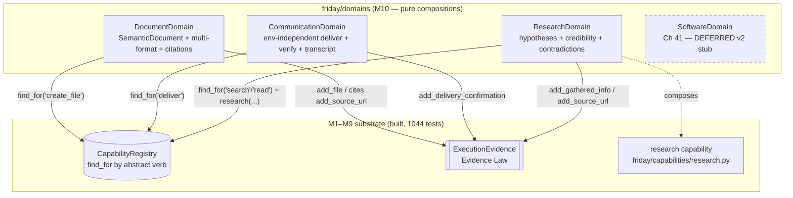

# Design Document: M10 — Domain Depth as Pure Capability Compositions

## Overview

Milestones 1–9 built and verified (1044 tests passing) a persistent, event-driven cognitive
substrate: a `CognitiveKernel` (clock / event bus / event store / checkpoints), a `WorldModel`, a
`GoalManager` over a `GoalGraph`, a `Deliberator`, uniform `EnvironmentContract` / `RuntimeContract`
runtimes, an evidence-backed `CapabilityRegistry` (`find_for`, confidence-ranked), a
`UnifiedVerificationEngine`, the M8 learning-signal loop, and the M9 learning / temporal /
long-horizon / background subsystems. FRIDAY already has a reusable `research(...)` *capability*
composition (`friday/capabilities/research.py`) that proves the pattern: a domain task is satisfied
by **composing existing capabilities**, never by a bespoke application pipeline.

What M10 adds is **domain depth expressed purely as compositions**. The FRIDAY Architecture Spec
(Ch 37 Research, Ch 39 Communication, Ch 40 Documents, Ch 41 SWE) describes rich domain behaviour —
hypotheses and credibility ranking and contradiction detection (research), environment-independent
delivery with verification and conversation memory (communication), a semantic document model with
multi-format export and citations (documents). The binding architectural constraint (HANDOFF
Section 12/13, Axiom 15) is that these domains must **own no durable state and hardcode no
application or site name**. A domain module is a *pure function over the `CapabilityRegistry` and the
evidence bundle* — it discovers capabilities by abstract verb (`find_for("search")`,
`find_for("read")`, `find_for("create_file")`, `find_for("deliver")`), composes them, and records
`ExecutionEvidence`. It holds no beliefs, no memory, no goals; all durable cognition stays in M1–M9.

The **defining gate** of M10: *deleting any single domain module leaves every capability intact and
every other domain still importable and runnable.* Domains are leaves that depend downward on
capabilities; nothing depends upward on a domain. This is enforced structurally by an AST isolation
test (mirroring `test_m9_isolation.py`) plus a runtime gate test that removes a domain from
`sys.modules` and re-exercises the capability registry.

M10 introduces one new top-level package, `friday/domains/`:

1. **Research** (`friday/domains/research.py`) — Ch 37. A `ResearchDomain` that composes the existing
   `research(...)` capability with **hypothesis tracking**, **source credibility ranking**, and a
   **contradiction detector** over gathered claims. It produces a `ResearchFinding` (hypotheses +
   ranked sources + detected contradictions) purely from evidence already gathered; it invents no
   facts and stores nothing durable.

2. **Communication** (`friday/domains/communication.py`) — Ch 39. A `CommunicationDomain` that is
   **environment-independent**: it composes whatever `deliver`-verb capability the registry offers
   (email, chat, message — never a hardcoded app), verifies delivery via the Evidence Law
   (`DELIVERY_CONFIRMATION`), and threads a **conversation memory** passed in by the caller (the
   domain does not own it — it returns an updated transcript value).

3. **Documents** (`friday/domains/documents.py`) — Ch 40. A `DocumentDomain` built on a **semantic
   document model** (`SemanticDocument` → sections → blocks) that renders to multiple formats
   (Markdown / HTML / plaintext, and DOCX/PDF when a `create_file`-verb capability supports them) and
   carries **citations** linking produced content back to gathered `SOURCE_URL` evidence.

4. **SWE** (Ch 41) — **explicitly deferred to v2** per HANDOFF Section 9. M10 ships only a thin
   `SoftwareDomain` stub docstring documenting the deferral so the package surface is complete and the
   deferral is discoverable; no SWE behaviour is implemented.

Every domain is a pure composition: constructed with a `CapabilityRegistry` (and, where relevant, a
browser/tool controller passed through to the underlying capability), exposing synchronous or async
methods that return frozen value objects and populate an `ExecutionEvidence`. Domains **never**
subscribe to kernel events, **never** hold mutable cross-call state, and **never** name an
application or site (Axiom 15). All new modules carry `"""Ch NN — ..."""` docstrings, and all tests
run under `FRIDAY_DRY_RUN=1` so the 1044 existing tests stay green.

---

## Architecture

Domains sit **above** capabilities and **below** nothing. They are pure composition leaves: a domain
imports the `CapabilityRegistry` contract surface and the `ExecutionEvidence` bundle, discovers
capabilities by abstract verb, and composes them. No M1–M9 subsystem imports a domain; deleting a
domain file cannot break anything upstream.



**Isolation rule (Ch 52 + Axiom 15).** Arrows all point *downward* into the substrate. A domain never
holds a reference to another domain, never subscribes to the kernel bus, and never mutates state that
survives a call. The only inputs are the arguments to each method (query, message, content, an
optional caller-owned transcript); the only outputs are a returned frozen value plus artifacts
appended to the caller's `ExecutionEvidence`.

---

## How M10 Plugs Into M1–M9 (real signatures)

M10 depends only on already-shipped, verified surfaces.

**CapabilityRegistry (M1/M6) — `friday/capabilities/registry.py`**
```python
class CapabilityRegistry:
    def find_for(self, abstract_verb: str, min_confidence: float = 0.0) -> List[CapabilityContract]
    def get(self, capability_id: str) -> Optional[CapabilityContract]
    @property
    def capability_count(self) -> int
```
Domains call `find_for("search")`, `find_for("read")`, `find_for("deliver")`, `find_for("create_file")`
to discover capabilities by abstract verb. When no capability matches, the domain degrades gracefully
(returns a result flagged unavailable) rather than raising — mirroring `research(...)`'s
"No browser available" path.

**research capability (M6) — `friday/capabilities/research.py`**
```python
def research(query, browser_controller, evidence, *, max_sources=3, max_chars_per_source=2500) -> ResearchResult
class ResearchResult:  # query, sources_read, source_urls, gathered_text, blocked, error; .success
```
`ResearchDomain` composes this to gather raw material, then layers hypotheses / credibility /
contradictions on top of the `ResearchResult` and evidence — it does not re-implement gathering.

**ExecutionEvidence + Evidence Law (M0) — `friday/verification/evidence_law.py`**
```python
class ExecutionEvidence:
    def add_gathered_info(self, text, source="") -> None
    def add_source_url(self, url) -> None
    def add_generated_content(self, text) -> None
    def add_file(self, path, size) -> None
    def add_delivery_confirmation(self, detail) -> None
    def of_kind(self, kind) -> List[EvidenceArtifact]
    def has(self, kind) -> bool
class EvidenceKind(str, Enum): GATHERED_INFO, SOURCE_URL, GENERATED_CONTENT, FILE_ARTIFACT, DELIVERY_CONFIRMATION, ...
```
Domains satisfy the Evidence Law honestly: research records `GATHERED_INFO`/`SOURCE_URL`, documents
record `FILE_ARTIFACT` and `GENERATED_CONTENT`, communication records `DELIVERY_CONFIRMATION`.
Generated text can NEVER satisfy a gather/deliver demand — the domains preserve that guarantee.

**FileTool (actions) — `friday/actions/file_tool.py`** (a `create_file`-verb capability the document
domain may compose when present in the registry)
```python
class FileTool:
    def create_file(self, filename, content="") -> ActionResult   # infers .docx/.html/.csv/... from extension
```
`DocumentDomain` renders a `SemanticDocument` to a string, then delegates persistence to whatever
`create_file`-verb capability the registry exposes (it does not hardcode `FileTool`).

**ActionResult (actions) — `friday/actions/result.py`** — the uniform return of every capability
`execute`. Domains read `.is_success`, `.message`, `.evidence.raw` to thread results into evidence.

---

## Components and Interfaces

### Component 1: ResearchDomain (`friday/domains/research.py`)

**Purpose**: Ch 37 research depth as a pure composition — hypotheses, source credibility ranking, and
contradiction detection layered over the existing `research(...)` capability. Owns no durable state.

**Interface**:
```python
class ResearchDomain:
    """Ch 37 — research depth as a pure capability composition (no durable state)."""

    def __init__(self, registry: "CapabilityRegistry", browser_controller: Any = None) -> None: ...

    def investigate(
        self,
        query: str,
        evidence: "ExecutionEvidence",
        *,
        hypotheses: Tuple[str, ...] = (),
        max_sources: int = 3,
    ) -> "ResearchFinding":
        """Gather via research(...), rank sources by credibility, score hypotheses against gathered
        claims, and detect contradictions. Pure over its inputs: same gathered evidence → same
        finding. Records nothing durable; all artifacts go to the passed evidence bundle."""

    def rank_sources(self, source_urls: Tuple[str, ...]) -> Tuple["RankedSource", ...]:
        """Score/sort sources by a domain-agnostic credibility heuristic (authority class of the
        host, not a literal site name — Axiom 15). Deterministic and stable."""

    def detect_contradictions(self, claims: Tuple["Claim", ...]) -> Tuple["Contradiction", ...]:
        """Find pairs of claims that assert opposing polarity about the same subject."""

    def score_hypotheses(
        self, hypotheses: Tuple[str, ...], claims: Tuple["Claim", ...]
    ) -> Tuple["HypothesisScore", ...]:
        """Support score in [0,1] per hypothesis = supporting_claims / total_relevant_claims."""
```

**Responsibilities**:
- Compose `research(...)` for gathering; never re-implement gathering or fabricate sources.
- Rank sources by an authority *class* heuristic (`.gov`/`.edu`/`.org` > generic) — never by literal
  site identity (Axiom 15).
- Extract lightweight `Claim`s from gathered text (subject + polarity) and detect opposing pairs.
- Produce a deterministic `ResearchFinding`: identical gathered evidence yields an identical finding.
- **Import boundary**: imports only `friday.capabilities.*`, `friday.verification.evidence_law`, and
  stdlib. No kernel, no memory, no goals, no other domain.

### Component 2: CommunicationDomain (`friday/domains/communication.py`)

**Purpose**: Ch 39 environment-independent communication — compose whatever `deliver`-verb capability
exists, verify delivery via the Evidence Law, and thread a caller-owned conversation transcript. No
hardcoded application/site name.

**Interface**:
```python
class CommunicationDomain:
    """Ch 39 — environment-independent delivery + verification + conversation memory."""

    def __init__(self, registry: "CapabilityRegistry") -> None: ...

    async def deliver(
        self,
        recipient: str,
        message: str,
        evidence: "ExecutionEvidence",
        world: Any = None,
    ) -> "DeliveryOutcome":
        """Discover a deliver-verb capability via find_for('deliver'), execute it, and confirm via the
        Evidence Law. Returns UNAVAILABLE (not an exception) when no capability matches. On observed
        success records a DELIVERY_CONFIRMATION artifact; generated text alone never confirms."""

    def verify_delivery(self, evidence: "ExecutionEvidence") -> bool:
        """True iff the evidence bundle carries a real DELIVERY_CONFIRMATION artifact (Evidence Law)."""

    def append_turn(
        self, transcript: "Conversation", speaker: str, text: str
    ) -> "Conversation":
        """Return a NEW Conversation with the turn appended (transcript is caller-owned & immutable —
        the domain stores nothing)."""
```

**Responsibilities**:
- Select the delivery capability by abstract verb only; degrade gracefully when none exists.
- Gate "delivered" on a real `DELIVERY_CONFIRMATION` artifact — never on message generation (Axiom 5 /
  Evidence Law).
- Treat conversation memory as an immutable value threaded by the caller; return updated copies.
- **Import boundary**: imports only `friday.capabilities.*`, `friday.verification.evidence_law`,
  `friday.actions.result`, and stdlib. No hardcoded app/site name (Axiom 15).

### Component 3: DocumentDomain (`friday/domains/documents.py`)

**Purpose**: Ch 40 documents as a semantic model with multi-format export and citations, composing a
`create_file`-verb capability for persistence.

**Interface**:
```python
class DocumentDomain:
    """Ch 40 — semantic document model, multi-format export, citations (pure composition)."""

    def __init__(self, registry: "CapabilityRegistry") -> None: ...

    def render(self, document: "SemanticDocument", fmt: "DocumentFormat") -> str:
        """Pure render of the semantic model to text for MARKDOWN / HTML / PLAINTEXT. Deterministic:
        same document + format → identical bytes."""

    async def export(
        self,
        document: "SemanticDocument",
        filename: str,
        fmt: "DocumentFormat",
        evidence: "ExecutionEvidence",
        world: Any = None,
    ) -> "ExportOutcome":
        """Render then persist via a create_file-verb capability discovered from the registry. Records
        a FILE_ARTIFACT and GENERATED_CONTENT on success; UNAVAILABLE when no capability matches."""

    def cite(self, document: "SemanticDocument", evidence: "ExecutionEvidence") -> "SemanticDocument":
        """Return a new document whose citations reference the SOURCE_URL artifacts in evidence,
        linking produced content back to gathered sources (Evidence Law provenance)."""
```

**Responsibilities**:
- Own a `SemanticDocument` value model (title → ordered `Section`s → ordered `Block`s + `Citation`s).
- Render deterministically to Markdown/HTML/plaintext; delegate binary formats to the `create_file`
  capability (which infers DOCX/PDF/etc. from the extension).
- Link citations to real `SOURCE_URL` evidence; never invent a citation without backing evidence.
- **Import boundary**: imports only `friday.capabilities.*`, `friday.verification.evidence_law`,
  `friday.actions.result`, and stdlib.

### Component 4: SoftwareDomain (`friday/domains/software.py`) — DEFERRED (Ch 41, v2)

**Purpose**: Placeholder documenting that full Ch 41 software-engineering depth is deferred to v2
(HANDOFF Section 9). Exposes a `capabilities()` describing the verbs a future SWE domain would
compose, and every action returns a `DeferredOutcome` — no behaviour is implemented.

**Interface**:
```python
class SoftwareDomain:
    """Ch 41 — software engineering domain. DEFERRED to v2 (HANDOFF Section 9); stub only."""

    DEFERRED = True

    def __init__(self, registry: "CapabilityRegistry") -> None: ...

    def status(self) -> "DeferredOutcome":
        """Return a DeferredOutcome documenting the v2 deferral and the verbs a future SWE domain
        would compose (edit / run / test) — no implementation."""
```

---

## Data Models

```python
from dataclasses import dataclass, field
from enum import Enum
from typing import Tuple

# ---- Research (Ch 37) ------------------------------------------------------

@dataclass(frozen=True)
class RankedSource:
    """A gathered source with a domain-agnostic credibility score in [0, 1]."""
    url: str
    authority_class: str        # "primary" | "reference" | "general" — NEVER a literal site name
    credibility: float          # clamped [0, 1]

@dataclass(frozen=True)
class Claim:
    """A lightweight assertion extracted from gathered text."""
    subject: str
    polarity: bool              # True = asserts, False = negates
    source_url: str = ""

@dataclass(frozen=True)
class Contradiction:
    """Two claims about the same subject with opposing polarity."""
    subject: str
    positive_source: str
    negative_source: str

@dataclass(frozen=True)
class HypothesisScore:
    """Support for a hypothesis in [0, 1] derived from gathered claims."""
    hypothesis: str
    support: float              # clamped [0, 1]
    supporting: int
    total: int

@dataclass(frozen=True)
class ResearchFinding:
    """The full outcome of an investigation — derived purely from gathered evidence."""
    query: str
    sources_read: int
    ranked_sources: Tuple[RankedSource, ...] = ()
    hypotheses: Tuple[HypothesisScore, ...] = ()
    contradictions: Tuple[Contradiction, ...] = ()
    blocked: bool = False
    error: str = ""

    @property
    def success(self) -> bool:
        return self.sources_read > 0 and not self.blocked

# ---- Communication (Ch 39) -------------------------------------------------

class DeliveryStatus(str, Enum):
    CONFIRMED = "confirmed"     # real DELIVERY_CONFIRMATION artifact present
    FAILED = "failed"           # capability ran but delivery not confirmed
    UNAVAILABLE = "unavailable" # no deliver-verb capability in the registry

@dataclass(frozen=True)
class Turn:
    speaker: str
    text: str
    logical_index: int

@dataclass(frozen=True)
class Conversation:
    """Immutable, caller-owned transcript. The domain returns updated copies; it stores nothing."""
    turns: Tuple[Turn, ...] = ()

    def with_turn(self, speaker: str, text: str) -> "Conversation":
        return Conversation(turns=self.turns + (Turn(speaker, text, len(self.turns)),))

@dataclass(frozen=True)
class DeliveryOutcome:
    recipient: str
    status: DeliveryStatus
    capability_id: str = ""
    detail: str = ""

    @property
    def confirmed(self) -> bool:
        return self.status is DeliveryStatus.CONFIRMED

# ---- Documents (Ch 40) -----------------------------------------------------

class DocumentFormat(str, Enum):
    MARKDOWN = "markdown"
    HTML = "html"
    PLAINTEXT = "plaintext"
    DOCX = "docx"
    PDF = "pdf"

@dataclass(frozen=True)
class Citation:
    marker: str                 # e.g. "[1]"
    source_url: str

@dataclass(frozen=True)
class Block:
    text: str
    style: str = "body"         # "body" | "bullet" | "code"

@dataclass(frozen=True)
class Section:
    heading: str
    blocks: Tuple[Block, ...] = ()

@dataclass(frozen=True)
class SemanticDocument:
    title: str
    sections: Tuple[Section, ...] = ()
    citations: Tuple[Citation, ...] = ()

@dataclass(frozen=True)
class ExportOutcome:
    filename: str
    fmt: DocumentFormat
    bytes_written: int = 0
    success: bool = False
    error: str = ""

# ---- Software (Ch 41, deferred) --------------------------------------------

@dataclass(frozen=True)
class DeferredOutcome:
    domain: str
    reason: str
    would_compose: Tuple[str, ...] = ()   # abstract verbs a v2 SWE domain would use
    deferred: bool = True
```

---

## Correctness Properties

These are the invariants M10 must uphold, verified with Hypothesis property tests under
`FRIDAY_DRY_RUN=1`.

### Property 1: Domains own no durable state

Constructing a domain and invoking any pure method twice with the same arguments yields equal results,
and no attribute of the domain instance mutates across calls (frozen inputs, frozen outputs).
**Validates: Requirements 1.1, 4.1**

### Property 2: Deleting a domain leaves capabilities intact

For any domain module, removing it from `sys.modules` and deleting its symbol does not change
`CapabilityRegistry.capability_count` nor the results of `find_for(verb)` for any verb.
**Validates: Requirements 4.2, 4.3**

### Property 3: Research findings are deterministic in gathered evidence

`rank_sources`, `detect_contradictions`, and `score_hypotheses` are pure functions: identical inputs
always produce identical, stably-ordered outputs.
**Validates: Requirements 1.2, 1.3, 1.4**

### Property 4: Credibility scores are bounded and authority-ordered

Every `RankedSource.credibility` is in `[0, 1]`, ranking is a stable total order, and a primary
authority class never scores below a general one for the same URL shape.
**Validates: Requirements 1.2**

### Property 5: Contradiction detection is symmetric and subject-scoped

A contradiction is reported iff two claims share a subject and have opposing polarity; swapping the
input order yields the same set of contradictions.
**Validates: Requirements 1.3**

### Property 6: Hypothesis support is a bounded ratio

Each `HypothesisScore.support` equals `supporting / total` (0 when `total == 0`) and lies in `[0, 1]`.
**Validates: Requirements 1.4**

### Property 7: Delivery requires real confirmation evidence

`CommunicationDomain.verify_delivery(evidence)` is True iff the bundle carries a real
`DELIVERY_CONFIRMATION` artifact; a bundle containing only generated content is never confirmed.
**Validates: Requirements 2.2, 2.3**

### Property 8: Conversation memory is immutable and append-only

`append_turn` / `Conversation.with_turn` returns a new value whose turns equal the old turns plus one;
the original conversation is unchanged and turn `logical_index` is strictly increasing.
**Validates: Requirements 2.4**

### Property 9: Document render round-trips structure

`render(document, MARKDOWN)` contains the title and every section heading and block text in document
order; rendering is deterministic (same document → identical string).
**Validates: Requirements 3.1, 3.2**

### Property 10: Citations reference only real gathered sources

Every `Citation` produced by `cite(...)` maps to a `SOURCE_URL` artifact present in the evidence
bundle; no citation is emitted without backing evidence.
**Validates: Requirements 3.3**

### Property 11: Domains hardcode no application or site name

No domain module contains a banned application/site name literal or a URL scheme literal in code
(AST-scanned, docstrings excluded) — domain behaviour is environment-independent (Axiom 15).
**Validates: Requirements 4.4, 5.3**

---

## Error Handling

- **No matching capability**: every domain method that composes a capability calls `find_for(verb)`
  and, when the result is empty, returns an `UNAVAILABLE`/failed outcome value (never raises). This
  mirrors `research(...)`'s "No browser available" degradation and keeps domains safe to call in any
  environment, including `FRIDAY_DRY_RUN`.
- **Capability execution failure**: a composed capability that returns a failed `ActionResult` is
  surfaced as a failed domain outcome with the underlying error category preserved; no partial success
  is ever reported as success (Axiom 5 / Evidence Law).
- **Blocked / empty gathering**: `ResearchDomain.investigate` propagates `ResearchResult.blocked` and
  empty-gather states into `ResearchFinding.blocked` / `error`, with `success` False.
- **Delivery not confirmed**: if a delivery capability runs but no `DELIVERY_CONFIRMATION` artifact
  appears, the outcome is `FAILED`, never `CONFIRMED` — generated text cannot fake delivery.
- **Export persistence failure**: a failing `create_file` capability yields `ExportOutcome(success=
  False, error=...)`; no `FILE_ARTIFACT` is recorded unless a real file with `bytes_written > 0`
  exists.
- **Missing optional format libraries**: DOCX/PDF export degrades through the underlying `create_file`
  capability's own fallback (e.g. FileTool writes plaintext alongside) — the domain does not assume a
  library is installed.
- **Malformed / empty inputs**: empty query, empty hypotheses, empty document, or empty message are
  handled as valid no-op-ish inputs returning well-formed empty outcomes, never exceptions.
- **Deferred SWE**: every `SoftwareDomain` action returns a `DeferredOutcome(deferred=True)`; it never
  pretends to perform software engineering work.

---

## Testing Strategy

- **Unit tests** (`tests/friday/test_m10_units.py`): construct each domain against a small in-memory
  `CapabilityRegistry` seeded with stub capabilities (a `deliver` stub, a `create_file` stub); assert
  data-model immutability, render output, ranking heuristics, and graceful `UNAVAILABLE` degradation.
- **Property tests** (`tests/friday/test_m10_properties.py`): the 11 correctness properties above via
  Hypothesis, all under `FRIDAY_DRY_RUN=1`.
- **Isolation tests** (`tests/friday/test_m10_isolation.py`): AST scan mirroring `test_m9_isolation.py`
  — each domain module (a) carries a `"""Ch NN — ..."""` docstring, (b) imports no other domain, no
  kernel, no memory, no goals, (c) contains no banned app/site name or URL scheme literal (Axiom 15).
- **Integration test** (`tests/friday/test_m10_integration.py`): a research → document → (dry-run)
  deliver flow that gathers stub evidence, builds a cited `SemanticDocument`, exports it via a stub
  `create_file` capability, and confirms the Evidence Law artifacts line up end-to-end.
- **Gate test** (`tests/friday/test_m10_gate.py`): the defining M10 gate — delete each domain module
  (pop from `sys.modules`, remove the file symbol) and assert the `CapabilityRegistry` and remaining
  domains are unaffected; assert no capability lives inside `friday/domains/`.
- **Regression**: full suite stays green (≥ 1044 + new tests) under
  `python -m pytest tests/friday/ -q`.
