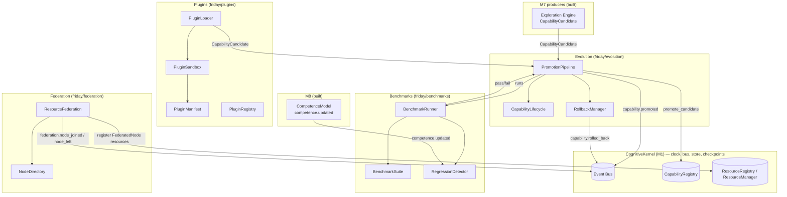

# Design Document: M11 — Capability Evolution, Plugins, Benchmarks & Federation

## Overview

Milestones 1–10 built and verified (1097 tests passing) the full FRIDAY cognitive substrate: a
`CognitiveKernel` (clock / event bus / event store / checkpoints), a `WorldModel`, a `GoalManager`
over a `GoalGraph`, a `Deliberator`, uniform `EnvironmentContract` / `RuntimeContract` runtimes, an
evidence-backed `CapabilityRegistry`, a `UnifiedVerificationEngine`, the M8 learning-signal loop, the
M9 learning / temporal / long-horizon / background subsystems, the M4 safety / resources / identity
layer, and the M10 pure-composition domains. What FRIDAY still cannot do is **extend its own
competence safely, measure whether it is improving, load competence it did not ship with, or run one
mind across more than one machine.**

M11 closes those four gaps with four kernel-event-driven subsystems that **wire, wrap, and extend**
existing code — never rewriting it (binding constraint, HANDOFF Section 12/13):

1. **Capability Evolution** (`friday/evolution/`) — Ch 27. A `CapabilityLifecycle` state machine
   (`DRAFT → EXPERIMENTAL → VERIFIED → STABLE → DEPRECATED → ARCHIVED`) plus a `PromotionPipeline`
   (`candidate → sandbox → benchmark → promote`) and a `RollbackManager`. It consumes the existing
   `CapabilityCandidate` distilled by the M7 exploration engine
   (`friday/environments/unknown/`), the `CapabilityRegistry.promote_candidate` seam, and the
   `CompetenceModel` evidence, and it **never** promotes a capability that fails its benchmark or
   regresses competence. Promotion emits `capability.promoted`; rollback emits `capability.rolled_back`.

2. **Benchmarks** (`friday/benchmarks/`) — Ch 55. A `BenchmarkSuite` of goal-completion scenarios
   (not token metrics) with a `BenchmarkRunner` producing a `BenchmarkReport` (goal completion, latency,
   recovery, evidence quality) and a `RegressionDetector` that fails a candidate whose score drops
   below the incumbent. Benchmarks gate every promotion (Ch 27.9) and run under `FRIDAY_DRY_RUN`.

3. **Plugins** (`friday/plugins/`) — Ch 54. A `PluginManifest` + `PluginLoader` +
   `PluginSandbox` + `PluginRegistry` that adopt externally-supplied capabilities through the same
   lifecycle and safety gates as evolved ones. Plugins **never** touch the kernel, world model, goal
   graph, safety engine, or verification engine directly (Ch 54.5); a plugin is just another source of
   `CapabilityCandidate`s that must pass sandbox + benchmark + permission review before install.

4. **Federation** (`friday/federation/`) — Ch 47. A `ResourceFederation` that registers remote
   `FederatedNode`s (each exposing resources, not applications) into the M4 `ResourceRegistry`, and a
   `NodeDirectory` that tracks node health. One `GoalGraph` can then be advanced by resources on more
   than one node. Federation emits `federation.node_joined` / `federation.node_left`; it transmits no
   project code or secrets unless explicitly configured (safety hard boundary).

Plus **Frontends** (Ch 57) is scoped to a thin, kernel-API-only surface documentation stub — the
kernel already exposes `submitGoal` / `queryGoals` / `health`; M11 documents the client contract
without building a UI (deferred, like M10's SWE stub).

Every subsystem communicates **only** through kernel-published events (Ch 52). Capability Evolution
never imports plugin internals; plugins never import the kernel; federation imports only the resource
contracts + events. All new modules carry `"""Ch NN — ..."""` docstrings; no hardcoded app/site names
or URLs (Axiom 15); and all tests run under `FRIDAY_DRY_RUN=1` so the 1097 existing tests stay green.

---

## Architecture

M11 slots beneath the Kernel exactly like every prior milestone. Capability Evolution, Benchmarks, and
Federation are kernel-attached subsystems (they `attach(kernel)` and subscribe/publish events); Plugins
is a loader that feeds `CapabilityCandidate`s into the evolution pipeline. Nothing in M11 is on the
foreground critical path.



**Isolation rule (Ch 52).** Arrows into the bus are `publish_event`; arrows out are `subscribe`. No
M11 module holds a reference to another M11 module's internals. The pipeline promotes through the
existing `CapabilityRegistry.promote_candidate` seam so the registry remains the single owner of
executable capabilities.

---

## How M11 Plugs Into M1–M10 (real signatures)

**CapabilityRegistry (M6) — `friday/capabilities/registry.py`**
```python
class CapabilityRegistry:
    def register(self, capability: CapabilityContract) -> None
    def unregister(self, capability_id: str) -> None
    def get(self, capability_id: str) -> Optional[CapabilityContract]
    def promote_candidate(self, candidate: Any) -> CapabilityContract   # the sanctioned evolution seam
    def find_for(self, abstract_verb: str, min_confidence: float = 0.0) -> List[CapabilityContract]
    @property
    def capability_count(self) -> int
```

**CapabilityCandidate (M7) — `friday/environments/unknown/object_graph.py`** (duck-typed input to the pipeline)
```python
@dataclass
class CapabilityCandidate:
    proposed_id: str
    affordance: Affordance          # .capability (abstract verb), .expected_effect, .risk
    procedure: Optional[Procedure]
    evidence_count: int
    confidence: float
```

**CompetenceModel (M8) — `friday/competence/model.py`** — evidence-only competence the regression
detector reads (never fabricated).
```python
class CompetenceModel:
    def confidence(self, key: Tuple[str, str]) -> float
    def effective_confidence(self, key, now_tick: int) -> float
```

**ResourceRegistry / ResourceManager (M4) — `friday/resources/`** — federation registers remote node
resources here.
```python
class ResourceRegistry:
    def register(self, resource: Resource) -> str
    def unregister(self, resource_id: str) -> None
    def by_kind(self, kind: ResourceKind) -> List[Resource]
class Resource(ResourceContract):
    id: str; kind: ResourceKind; exclusive: bool; cost: float; healthy: bool
```

**Event / make_event (M1) — `friday/events/event.py`**
```python
def make_event(event_type, source, logical_time, payload=None, correlation_id="", parent_id=None, wall_time=None) -> Event
```

---

## Components and Interfaces

### Component 1: CapabilityLifecycle (`friday/evolution/lifecycle.py`)

**Purpose**: Ch 27.18/16.21 — the state machine every capability moves through. Enforces legal
transitions and never lets an unverified capability be used for irreversible actions.

**Interface**:
```python
class LifecycleState(str, Enum):
    DRAFT = "draft"
    EXPERIMENTAL = "experimental"
    VERIFIED = "verified"
    STABLE = "stable"
    DEPRECATED = "deprecated"
    ARCHIVED = "archived"

class CapabilityLifecycle:
    """Ch 27 — the capability lifecycle state machine (legal transitions only)."""

    def state_of(self, capability_id: str) -> LifecycleState: ...
    def can_transition(self, frm: LifecycleState, to: LifecycleState) -> bool:
        """True iff (frm → to) is a legal forward step or a sanctioned rollback."""
    def transition(self, capability_id: str, to: LifecycleState) -> LifecycleState:
        """Advance a capability; raises ValueError on an illegal transition."""
    def is_usable_for(self, capability_id: str, risk: str) -> bool:
        """DRAFT/EXPERIMENTAL capabilities may not perform irreversible-risk actions."""
```

**Responsibilities**:
- Encode the legal transition graph (forward promotion + `→ DEPRECATED`/`→ ARCHIVED` + rollback to the
  prior stable state).
- Gate risky use: a capability below `VERIFIED` is never usable for an `irreversible` action.
- Own no capability code — it tracks state keyed by capability id only.

### Component 2: PromotionPipeline (`friday/evolution/pipeline.py`)

**Purpose**: Ch 27.9/27.10 — take a `CapabilityCandidate` (from exploration or a plugin) through
`sandbox → benchmark → promote`, promoting **only** on a passing benchmark and non-regressing
competence. Emits `capability.promoted`; on failure emits `capability.rejected`.

**Interface**:
```python
class PromotionOutcome(str, Enum):
    PROMOTED = "promoted"
    REJECTED = "rejected"

@dataclass(frozen=True)
class PromotionResult:
    outcome: PromotionOutcome
    capability_id: str
    benchmark_score: float
    reason: str = ""

class PromotionPipeline:
    """Ch 27 — candidate → sandbox → benchmark → promote (evidence-gated)."""

    def __init__(self, registry, lifecycle, runner, *, min_benchmark_score: float = 0.6) -> None: ...
    def attach(self, kernel) -> None:
        """Subscribe to capability.candidate (Ch 52)."""
    def submit(self, candidate) -> PromotionResult:
        """Pure core: sandbox → run benchmark → gate → (promote via registry | reject).
        Deterministic wrt inputs; promotes only when score >= min_benchmark_score and
        the candidate does not regress the incumbent. Emits the corresponding event when attached."""
```

**Responsibilities**:
- Never promote a candidate whose benchmark score is below the floor or below the incumbent's score
  (Regression => reject).
- Promote via `CapabilityRegistry.promote_candidate`, then advance lifecycle `DRAFT → EXPERIMENTAL`.
- **Import boundary**: imports only `friday.capabilities.*`, `friday.evolution.*`,
  `friday.benchmarks.*`, `friday.events.*`, stdlib. Never imports plugins or the kernel internals.

### Component 3: RollbackManager (`friday/evolution/rollback.py`)

**Purpose**: Ch 27.12 — restore the previously-stable version of a capability when a promotion later
underperforms. Competence never regresses permanently.

**Interface**:
```python
class RollbackManager:
    """Ch 27.12 — restore the last-known-good capability version."""

    def record_stable(self, capability_id: str, snapshot: Any) -> None:
        """Remember a known-good snapshot before promoting a replacement."""
    def can_rollback(self, capability_id: str) -> bool: ...
    def rollback(self, capability_id: str) -> Any:
        """Return the last-known-good snapshot and mark the current version reverted.
        Raises LookupError if no snapshot exists."""
```

### Component 4: BenchmarkSuite + BenchmarkRunner (`friday/benchmarks/`)

**Purpose**: Ch 55 — measure **goal completion**, not tokens. A suite of scenarios, each with a
scoring function; a runner producing a `BenchmarkReport`; a `RegressionDetector` comparing to the
incumbent.

**Interface**:
```python
@dataclass(frozen=True)
class BenchmarkScenario:
    id: str
    description: str
    weight: float = 1.0          # relative importance in the aggregate score

@dataclass(frozen=True)
class BenchmarkReport:
    capability_id: str
    score: float                 # weighted goal-completion score in [0, 1]
    scenarios_run: int
    scenarios_passed: int
    latency_ms: float = 0.0

class BenchmarkSuite:
    """Ch 55 — a set of goal-completion scenarios (not token metrics)."""
    def scenarios(self) -> Tuple[BenchmarkScenario, ...]: ...
    def add(self, scenario: BenchmarkScenario) -> None: ...

class BenchmarkRunner:
    """Ch 55 — run a candidate against a suite; produce a BenchmarkReport."""
    def run(self, capability_id: str, evaluate) -> BenchmarkReport:
        """evaluate(scenario) -> bool is called per scenario (DRY_RUN-safe stub in tests).
        Score = sum(weight for passed) / sum(weight); [0,1]; deterministic wrt evaluate."""

class RegressionDetector:
    """Ch 55 — a candidate must not score below the incumbent."""
    def is_regression(self, incumbent: float, candidate: float, *, tolerance: float = 0.0) -> bool:
        """True iff candidate < incumbent - tolerance."""
```

### Component 5: Plugins (`friday/plugins/`)

**Purpose**: Ch 54 — adopt externally supplied capabilities through the same lifecycle + safety gates.
A plugin is just a manifest describing `CapabilityCandidate`s; loading routes them through the
promotion pipeline. Plugins never touch protected subsystems.

**Interface**:
```python
@dataclass(frozen=True)
class PluginManifest:
    name: str
    version: str
    author: str
    capabilities: Tuple[str, ...]     # abstract verbs the plugin proposes (NO app/site names)
    permissions: Tuple[str, ...]      # requested permission levels (reviewed before install)
    signature: str = ""

class PluginSandbox:
    """Ch 54.5 — validate a manifest declares no forbidden permission and names no protected subsystem."""
    def validate(self, manifest: PluginManifest) -> Tuple[bool, str]:
        """Return (ok, reason). Rejects manifests requesting kernel/world/safety/verification access."""

class PluginLoader:
    """Ch 54 — turn a validated manifest's declared capabilities into CapabilityCandidates."""
    def __init__(self, sandbox: PluginSandbox) -> None: ...
    def load(self, manifest: PluginManifest) -> Tuple["LoadedPlugin", ...] | LoadFailure: ...

class PluginRegistry:
    """Ch 54 — track installed plugins by name+version (never overrides a capability directly)."""
    def install(self, manifest: PluginManifest) -> str: ...
    def uninstall(self, name: str) -> None: ...
    def get(self, name: str) -> Optional[PluginManifest]: ...
```

**Responsibilities**:
- Reject any manifest requesting access to `kernel`, `world`, `goals`, `safety`, or `verification`
  (Ch 54.5 hard boundary).
- Feed accepted candidates into the `PromotionPipeline` (never into the registry directly).
- **Import boundary**: imports only `friday.evolution.*`, `friday.capabilities.*`, `friday.events.*`,
  stdlib. Never imports the kernel, world, goals, safety, or verification.

### Component 6: ResourceFederation + NodeDirectory (`friday/federation/`)

**Purpose**: Ch 47 — register remote nodes' resources into the M4 `ResourceRegistry` so one
`GoalGraph` can be advanced across machines. Nodes expose resources, not applications.

**Interface**:
```python
@dataclass(frozen=True)
class FederatedNode:
    node_id: str
    resources: Tuple[Resource, ...]   # M4 Resource values the node offers
    healthy: bool = True

class NodeDirectory:
    """Ch 47 — track federated nodes and their health."""
    def add(self, node: FederatedNode) -> None: ...
    def remove(self, node_id: str) -> None: ...
    def healthy_nodes(self) -> Tuple[FederatedNode, ...]: ...

class ResourceFederation:
    """Ch 47 — federate remote node resources into the local ResourceRegistry."""
    def __init__(self, registry, directory: NodeDirectory) -> None: ...
    def attach(self, kernel) -> None: ...
    def join(self, node: FederatedNode) -> None:
        """Register the node's resources (namespaced by node_id) and emit federation.node_joined."""
    def leave(self, node_id: str) -> None:
        """Unregister the node's resources and emit federation.node_left."""
```

**Responsibilities**:
- Namespace remote resource ids by `node_id` so two nodes never collide.
- Register/unregister through the existing `ResourceRegistry` — federation owns no scheduling.
- Transmit no project code or secrets (safety hard boundary; only `Resource` descriptors cross).
- **Import boundary**: imports only `friday.resources.*`, `friday.events.*`, stdlib.

---

## Event Vocabulary

| Event type | Direction | Producer → Consumer | Key payload fields |
|---|---|---|---|
| `capability.candidate` | consumed | Exploration/Plugins → PromotionPipeline | `proposed_id, capability, confidence` |
| `capability.promoted` | produced | PromotionPipeline | `capability_id, benchmark_score` |
| `capability.rejected` | produced | PromotionPipeline | `capability_id, reason` |
| `capability.rolled_back` | produced | RollbackManager | `capability_id, reason` |
| `competence.updated` | consumed | CompetenceModel → RegressionDetector | `capability, environment, confidence` |
| `federation.node_joined` | produced | ResourceFederation | `node_id, resource_count` |
| `federation.node_left` | produced | ResourceFederation | `node_id` |

---

## Data Models

```python
from dataclasses import dataclass, field
from enum import Enum
from typing import Any, Optional, Tuple

# ---- Evolution (Ch 27) -----------------------------------------------------

class LifecycleState(str, Enum):
    DRAFT = "draft"; EXPERIMENTAL = "experimental"; VERIFIED = "verified"
    STABLE = "stable"; DEPRECATED = "deprecated"; ARCHIVED = "archived"

class PromotionOutcome(str, Enum):
    PROMOTED = "promoted"; REJECTED = "rejected"

@dataclass(frozen=True)
class PromotionResult:
    outcome: PromotionOutcome
    capability_id: str
    benchmark_score: float
    reason: str = ""

# ---- Benchmarks (Ch 55) ----------------------------------------------------

@dataclass(frozen=True)
class BenchmarkScenario:
    id: str
    description: str
    weight: float = 1.0

@dataclass(frozen=True)
class BenchmarkReport:
    capability_id: str
    score: float                 # [0, 1]
    scenarios_run: int
    scenarios_passed: int
    latency_ms: float = 0.0

# ---- Plugins (Ch 54) -------------------------------------------------------

@dataclass(frozen=True)
class PluginManifest:
    name: str
    version: str
    author: str
    capabilities: Tuple[str, ...] = ()
    permissions: Tuple[str, ...] = ()
    signature: str = ""

@dataclass(frozen=True)
class LoadFailure:
    manifest_name: str
    reason: str

# ---- Federation (Ch 47) ----------------------------------------------------

@dataclass(frozen=True)
class FederatedNode:
    node_id: str
    resources: Tuple[Any, ...] = ()   # M4 Resource values
    healthy: bool = True
```

---

## Correctness Properties

Verified with Hypothesis property tests under `FRIDAY_DRY_RUN=1`.

### Property 1: Lifecycle transitions are legal-only

`CapabilityLifecycle.transition` accepts a transition iff `can_transition(frm, to)` is True; every
illegal transition raises and leaves state unchanged. The forward path is monotonic through
`DRAFT → EXPERIMENTAL → VERIFIED → STABLE`.
**Validates: Requirements 1.1, 1.2**

### Property 2: Unverified capabilities cannot perform irreversible actions

For any capability in `DRAFT` or `EXPERIMENTAL`, `is_usable_for(id, "irreversible")` is False; for
`VERIFIED`/`STABLE` it may be True.
**Validates: Requirements 1.3**

### Property 3: Promotion requires a passing benchmark

`PromotionPipeline.submit` returns `PROMOTED` only when the benchmark score is `>= min_benchmark_score`;
any score below the floor yields `REJECTED` and the registry capability count is unchanged.
**Validates: Requirements 2.1, 2.2**

### Property 4: Promotion never regresses the incumbent

When an incumbent capability exists with score `S`, a candidate scoring below `S` (beyond tolerance) is
`REJECTED`. `RegressionDetector.is_regression` is monotonic: lower candidate scores are always at least
as likely to be flagged.
**Validates: Requirements 2.3, 2.4**

### Property 5: Benchmark score is a bounded weighted ratio

`BenchmarkRunner.run` produces `score = passed_weight / total_weight` in `[0, 1]`, equal to `0.0` when
no scenarios run, and deterministic for a deterministic `evaluate`.
**Validates: Requirements 2.1**

### Property 6: Rollback restores the last-known-good snapshot

After `record_stable(id, A)` then promoting `B`, `rollback(id)` returns `A`; with no recorded snapshot
`can_rollback` is False and `rollback` raises.
**Validates: Requirements 1.4**

### Property 7: Plugins cannot request protected subsystems

`PluginSandbox.validate` returns `(False, reason)` for any manifest whose `permissions` reference
`kernel`, `world`, `goals`, `safety`, or `verification`; otherwise `(True, "")`.
**Validates: Requirements 3.2, 3.3**

### Property 8: Plugin capabilities enter only through the pipeline

A loaded plugin yields `CapabilityCandidate`-shaped objects; installing a plugin never calls
`CapabilityRegistry.register`/`promote_candidate` directly — candidates flow through `PromotionPipeline`.
**Validates: Requirements 3.1, 3.4**

### Property 9: Federation namespaces resources and is reversible

After `join(node)`, every registered resource id is prefixed by `node_id`; after `leave(node_id)`, the
`ResourceRegistry` contains exactly the resources it had before the join (join then leave is identity).
**Validates: Requirements 4.1, 4.2, 4.3**

### Property 10: Federation transmits only resource descriptors

A `FederatedNode` carries only `Resource` value descriptors; no code object, secret, or callable is
registered. `NodeDirectory.healthy_nodes` returns exactly the nodes flagged healthy.
**Validates: Requirements 4.4, 4.5**

### Property 11: M11 modules hardcode no application or site name

No M11 module contains a banned application/site name literal or a URL scheme literal in code
(AST-scanned, docstrings excluded).
**Validates: Requirements 5.3, 5.4**

---

## Error Handling

- **Illegal lifecycle transition**: `transition` raises `ValueError` and leaves state unchanged; the
  caller (pipeline) treats it as a rejection rather than crashing the tick loop.
- **Benchmark evaluate throws**: the runner treats a throwing scenario as a failed scenario (not a
  crash), so a flaky candidate scores lower rather than aborting the run.
- **Empty benchmark suite**: `run` returns `score = 0.0` (no evidence of competence ⇒ not promotable),
  never a divide-by-zero.
- **Promotion of a regressing candidate**: rejected with a reason; the registry is untouched.
- **Rollback with no snapshot**: `rollback` raises `LookupError`; `can_rollback` guards callers.
- **Plugin manifest requesting protected access**: rejected by the sandbox with a reason; the plugin is
  never loaded and no candidate is produced.
- **Malformed / unsigned plugin manifest**: `load` returns a `LoadFailure`; nothing is installed.
- **Federated node id collision**: joining a node whose id already exists replaces its resource set
  atomically (leave-then-join semantics) so ids never double-register.
- **Federated node unhealthy**: excluded from `healthy_nodes`; its resources remain registered but the
  scheduler simply never selects an unhealthy resource (M4 fail-safe).
- **Event handlers**: every `attach`ed handler reads payload fields defensively with `.get(...)` and
  never raises into the kernel tick loop (mirrors M8/M9).

---

## Testing Strategy

- **Unit tests** (`tests/friday/test_m11_units.py`): lifecycle transition table, benchmark scoring
  edge cases (empty suite, all-pass, all-fail, throwing scenario), plugin sandbox accept/reject,
  federation join/leave, and data-model immutability.
- **Property tests** (`tests/friday/test_m11_properties.py`): the 11 correctness properties via
  Hypothesis, all under `FRIDAY_DRY_RUN=1`.
- **Isolation tests** (`tests/friday/test_m11_isolation.py`): AST scan mirroring
  `test_m10_isolation.py` — each M11 module carries a `"""Ch NN — ..."""` docstring; evolution imports
  no plugin internals; plugins import no kernel/world/goals/safety/verification; federation imports only
  resources + events; no banned app/site name or URL scheme literal (Axiom 15).
- **Integration test** (`tests/friday/test_m11_integration.py`): a real `CognitiveKernel` +
  `CapabilityRegistry`; a `CapabilityCandidate` flows exploration → pipeline → benchmark → promotion,
  emitting `capability.promoted`; a plugin manifest flows loader → sandbox → pipeline; a `FederatedNode`
  joins and its namespaced resources appear in the `ResourceRegistry`.
- **Gate test** (`tests/friday/test_m11_gate.py`): the M11 gate — a capability is promoted only via
  `sandbox → benchmark → promote`, a regressing candidate is rejected and rolled back, and a goal-graph
  resource requirement is satisfiable by a federated node. Assert determinism: identical inputs produce
  identical ordered M11 event types.
- **Regression**: full suite stays green (≥ 1097 + new tests) under `python -m pytest tests/friday/ -q`.
