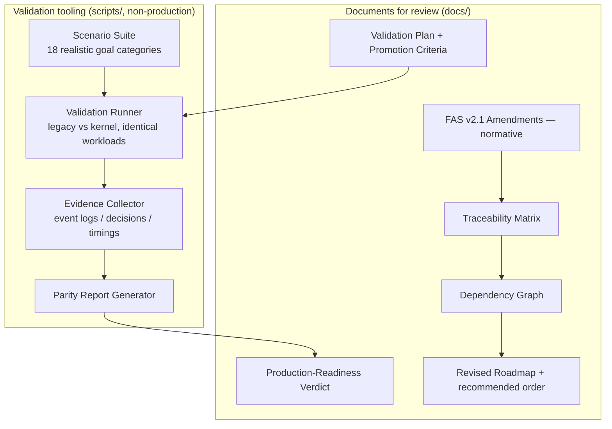

# Design Document: M13 — Production Validation & Architecture v2.1

## Overview

M12 built a kernel-backed execution path that delegates to the proven Operator, wired behind the
opt-in `FRIDAY_USE_KERNEL_EXECUTION` flag (default off), and proved behavioral parity with the legacy
path via an automated harness (1227 tests green). The remaining work — flipping the production default
— must **not** happen on the strength of automated tests alone. M13 has two equally-weighted
objectives, neither of which changes any production default or implements a new subsystem:

**Part 1 — Production Validation.** Build the tooling, evidence-collection framework, parity report,
and explicit promotion criteria required to answer one question: *"Is the Cognitive Kernel
production-ready?"* Validation runs under `FRIDAY_USE_KERNEL_EXECUTION=1` against **realistic
end-to-end goals** (browser, desktop, multi-environment, research, file generation, long-running,
interruption/resume, crash/browser-failure recovery, unknown-app, concurrent goals, human
confirmation, replay, checkpoint restore, memory/world-model/goal-graph consistency, deterministic
replay). The milestone's terminal output is a readiness verdict; if **no**, it states exactly why; if
**yes**, it produces a rollback strategy and a single isolated commit that flips the default.

**Part 2 — Architecture v2.1.** Before any further implementation, amend the Architecture Specification
with the engineering improvements identified during review — as **normative sections** — covering:
World Model belief freshness/provenance/staleness; Environment Intelligence (fingerprints, capability
invalidation, version-aware adaptation); an expanded Deliberation utility function + rollback/undo
recovery contracts; the Capability lifecycle + statistical competence; the Skill Evolution pipeline; a
dedicated Resource Manager; a Retrieval Router; a strengthened Exploration Engine; layered Reflection;
seven-tier Memory; and a Cognitive State Manager. Then update the traceability matrix, dependency
graph, affected-milestone analysis, and a revised implementation roadmap with a recommended order.

**Implementation Philosophy (binding):** update the architecture and planning artifacts first; do NOT
implement the new subsystems in M13. Implementation resumes only after the revised architecture is
reviewed and approved. Preserve the invariants: one Kernel, one World Model, one Goal Graph, one
Competence Model; general mechanisms over task-specific logic; no app-specific logic, no hardcoded
workflows, no shortcuts.

**Honesty constraint (environment reality):** the real-world validation runs (live browser/desktop,
network, GPUs) can only execute on the user's machine — this sandboxed agent runs under
`FRIDAY_DRY_RUN=1` with no real Chrome/APIs. M13 therefore delivers (a) the runnable validation
harness + evidence schema + promotion criteria, (b) an honest *current* readiness assessment that is
explicitly gated on the user executing the harness, and (c) the full Architecture v2.1 document set.
M13 does not fabricate real-world results it cannot produce.

---

## Architecture

M13 adds no runtime subsystems. It adds:



The validation runner reuses the **existing** M12 seam (`GoalExecutionRuntime` + bridge flag) and the
**existing** legacy path; it changes neither. It runs each workload twice (flag off = legacy, flag on
= kernel) and diffs the observable results + collected evidence.

---

## Components and Interfaces

### Part 1

1. **Scenario Suite** (`scripts/kernel_validation/scenarios.py`) — declarative catalog of the 18
   validation categories, each a `ValidationScenario(id, category, goal_text, expectations, risk,
   requires_live)`. `requires_live=True` scenarios (real browser/desktop/network) are marked so they
   run only on a real machine, not in `FRIDAY_DRY_RUN`.

2. **Validation Runner** (`scripts/kernel_validation/runner.py`) — executes each scenario on both
   paths with identical inputs, capturing the result string, event log slice, timings, and any
   raised error. Never mutates production defaults; sets the flag per-run in-process.

3. **Evidence Collector** (`scripts/kernel_validation/evidence.py`) — subscribes to the kernel bus and
   records event logs, goal transitions, decision/verification artifacts, resource/scheduler signals,
   and performance metrics into a structured `ValidationEvidence` record (JSON-serializable).

4. **Parity Report Generator** (`scripts/kernel_validation/report.py`) — compares legacy vs kernel
   per scenario across behavior, correctness, reliability, performance, recovery quality, determinism;
   emits a Markdown report + a machine-readable summary.

5. **Documents**: `docs/validation/KERNEL_PRODUCTION_VALIDATION_PLAN.md` (plan + evidence schema +
   explicit promotion criteria), and `docs/validation/KERNEL_READINESS_VERDICT.md` (the verdict, with
   the rollback strategy + isolated-commit plan only if criteria are met).

### Part 2

6. **FAS v2.1 Amendments** (`docs/architecture/FAS_v2.1_AMENDMENTS.md`) — normative sections for all
   twelve concept areas listed in the milestone, each written to the constitution's style (definition,
   properties, invariants, integration points), cross-referenced to existing FAS chapters.

7. **Traceability Matrix** (`docs/architecture/TRACEABILITY_MATRIX_v2.1.md`) — maps each v2.1 concept →
   FAS chapter(s) → existing code (built / partial / absent) → owning milestone.

8. **Dependency Graph + Revised Roadmap** (`docs/architecture/ROADMAP_v2.1.md`) — the build-order DAG
   for the new/expanded subsystems, affected-milestone analysis, and the recommended implementation
   order with rationale.

---

## Data Models

```python
from dataclasses import dataclass, field
from typing import Tuple

@dataclass(frozen=True)
class ValidationScenario:
    id: str
    category: str                 # one of the 18 validation categories
    goal_text: str
    expectations: str = ""        # human-readable success expectation
    risk: str = "low"
    requires_live: bool = False   # needs real browser/desktop/network/GPU

@dataclass(frozen=True)
class ValidationEvidence:
    scenario_id: str
    path: str                     # "legacy" | "kernel"
    result: str                   # "pass" | "fail" | "skipped"
    output: str = ""
    event_types: Tuple[str, ...] = ()
    latency_ms: float = 0.0
    error: str = ""
```

## Correctness Properties

Verified with tests under `FRIDAY_DRY_RUN=1`.

### Property 1: Validation runner changes no production default

Running the harness never mutates process-global defaults after completion; the bridge's
`use_kernel_execution` default remains False and env is restored.
**Validates: Requirements 1.1**

### Property 2: Identical workload on both paths

For a scenario, the runner submits the identical `goal_text` to both the legacy and kernel paths and
records both results without cross-contamination.
**Validates: Requirements 1.2**

### Property 3: Evidence is structured and serializable

Every `ValidationEvidence` record is JSON-serializable and captures the required fields (events,
timings, result, errors).
**Validates: Requirements 1.3**

### Property 4: Live-only scenarios are skipped safely in DRY_RUN

Scenarios flagged `requires_live` are reported as SKIPPED (not failed, not fabricated) when run under
`FRIDAY_DRY_RUN=1`.
**Validates: Requirements 1.4**

### Property 5: Parity report is deterministic for deterministic inputs

Given identical recorded evidence, the report generator produces identical output.
**Validates: Requirements 2.1**

---

## Error Handling

- A scenario whose path raises is recorded as a FAILED result with the error captured — never crashes
  the runner (mirrors the M12 fail-safe philosophy).
- `requires_live` scenarios in a non-live environment are SKIPPED with a clear reason, never marked
  pass or fail (no fabricated results).
- Evidence serialization failures degrade to a best-effort record with a note, never abort the run.
- The runner restores `FRIDAY_USE_KERNEL_EXECUTION` and any bridge state after each run.

---

## Testing Strategy

- **Unit/property tests** (`tests/friday/test_m13_validation_tooling.py`): the 5 correctness
  properties — runner restores defaults, identical workload dispatch, evidence serializable, live-only
  skip, deterministic report — all under `FRIDAY_DRY_RUN=1` using stub operators (no real I/O).
- **Document lint**: the architecture/plan documents are prose deliverables reviewed by the user, not
  executable; they are checked for completeness against the milestone's required concept list.
- **Regression**: full suite stays green (≥ 1227 + new tooling tests).
- **No real-world results are asserted** by automated tests — those come only from the user running
  the harness on a real machine, by design.
