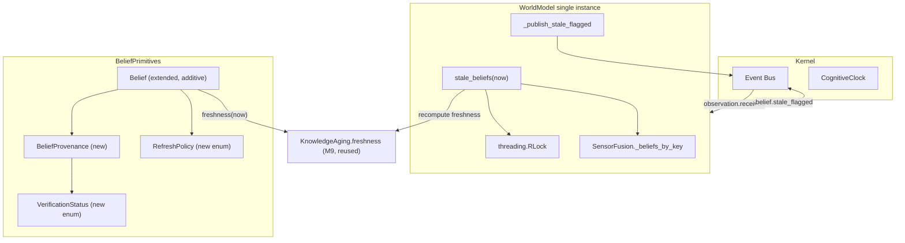
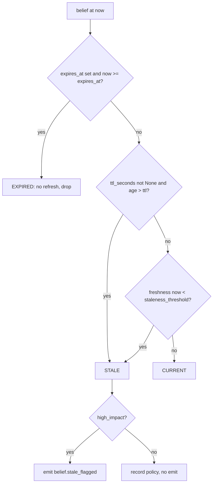

# Design Document

M15 — World Model v2 (Belief Freshness, TTL, Provenance, Staleness)

## Overview

M15 extends the existing `Belief` and `WorldModel` primitives with four additive capabilities specified
in FAS v2.1 §A2.1:

1. **Belief Freshness** — a `[0, 1]` half-life freshness score per belief, computed deterministically
   from `observed_at`, `now`, and a configurable `half_life_seconds`, delegating to the M9
   `KnowledgeAging.freshness` decay curve.
2. **TTL and Refresh Policy** — a per-belief time-to-live and a declared refresh strategy
   (`on_read` / `on_stale` / `periodic` / `never`) plus a refresh cost estimate.
3. **Provenance and Evidence Graph** — a composable `BeliefProvenance` record capturing supporting and
   contradicting observation IDs, an ordered `derivation_chain` (DAG-enforced), and a
   `verification_status` enum.
4. **Staleness Sweep** — a `WorldModel.stale_beliefs(now)` scan that recomputes freshness under the
   existing `RLock`, flags high-impact stale beliefs, and emits a `belief.stale_flagged` kernel event.

### Scope Boundary (important)

M15 **signals** that refresh is needed; it does **not execute** refresh. No refresh source exists yet in
the codebase — there is no component that can re-acquire a belief from its origin. Accordingly:

- `refresh_policy` and `refresh_cost` are **declarations** carried on the belief. They describe *how* and
  *how expensively* a belief could be refreshed, for a future milestone to act on.
- The staleness sweep and query path **flag / signal** refresh need (via return value and kernel event).
  They never call out to a refresh source, never mutate the belief to "refreshed", and never block.
- Actual refresh execution (invoking a source, updating `observed_at`) is explicitly **out of scope** and
  deferred to a later milestone.

This boundary keeps M15 additive and side-effect-light while laying down the complete data model and the
detection/signalling machinery a refresh executor will later consume.

### Design Principles (binding invariants)

- **Additive-only.** Every existing `Belief` and `WorldModel` public method keeps its exact signature,
  defaults, and return type. Every new `Belief` field has a default so `Belief(description, confidence,
  source)` still constructs. (Req 5)
- **Reuse M9, do not duplicate the decay curve.** Freshness delegates to `KnowledgeAging.freshness`. There
  is exactly one implementation of `0.5 ** (elapsed / half_life)` in the codebase. (Req 1.5)
- **Reality outranks belief.** Stale beliefs are downgraded (excluded from "current knowledge" query
  results and flagged), never silently trusted. (Req 2.5, 4.3)
- **Determinism / replay-safety.** All time-dependent methods take `now: float` explicitly and never call
  `time.time()`. (Req 1.8, 6.2, 6.3)
- **Kernel-mediated.** One `WorldModel` per kernel; it communicates outward only via kernel events. (Req 5.9)
- **No new heavy dependencies.** stdlib (`dataclasses`, `enum`, `threading`) plus existing modules only.
- **No production defaults changed.** `WorldModel(decay_rate=0.01)` and all `Belief` defaults are untouched;
  new config (`staleness_threshold`) has its own default and does not alter existing behaviour.

## Architecture

M15 touches three existing modules additively and reuses one M9 module unchanged. It introduces one small
new module for the provenance model and the verification-status enum.



### Module Map

| Module | Change | Purpose |
| --- | --- | --- |
| `friday/world/belief.py` | extend | Add M15 fields + `freshness(now)`, `is_stale(now)`, `add_supporting_observation`, `add_contradicting_observation`, `derive_from`. Preserve `dataclasses.replace()` behaviour. |
| `friday/world/provenance.py` | **new** | `BeliefProvenance` dataclass, `VerificationStatus` enum, `RefreshPolicy` enum, DAG-enforcing helpers. |
| `friday/world/world_model.py` | extend | Add `staleness_threshold` ctor param (default `0.1`), `stale_beliefs(now)`, kernel reference from `attach()`, `_publish_stale_flagged`. |
| `friday/temporal/aging.py` | **reused unchanged** | `KnowledgeAging.freshness` is the single decay-curve implementation. |

### Communication / Event Flow

The current `WorldModel` only *subscribes* (via `attach(kernel)` → `kernel.subscribe("observation.received", ...)`).
It has no outbound path. M15 gives it one by **capturing the kernel reference in `attach()`**:

- `attach(kernel)` stores `self._kernel = kernel` (in addition to the existing subscribe call).
- To emit, `WorldModel` builds a signed `Event` with `make_event(...)` and calls `kernel.publish_event(event)`.
  This is the exact precedent used by `EnvironmentRuntime.publish` and other runtimes, which route through
  `kernel.publish_event()` so events flow through persistence + broadcast.
- The logical time for the event comes from the kernel clock: `kernel._clock.now()` returns `(logical, wall)`.
  To avoid reaching into a private attribute, `WorldModel` uses the public `kernel.publish_event()` which
  itself does `self._clock.update(event.logical_time)`. We construct the event with a best-effort logical
  time obtained from `kernel.query_world()["logical_time"]` (public) and let `publish_event` merge it via the
  Lamport `update`. If no kernel is attached (unit-test / detached mode), emission is skipped silently — the
  sweep still returns its results, so detection never depends on a live bus.

This keeps `WorldModel` a pure belief store that talks to the outside world exclusively through kernel
events (Req 5.9), and never blocks or raises into the caller if the bus is unavailable.

## Components and Interfaces

### 1. `Belief` extensions (`friday/world/belief.py`)

New fields (all defaulted, appended after existing fields to preserve construction ergonomics):

```python
half_life_seconds: float = 86400.0        # Req 1.7 — one day
ttl_seconds: Optional[float] = None       # Req 2.1 — None = non-expiring
refresh_policy: RefreshPolicy = RefreshPolicy.ON_STALE   # Req 2.3
refresh_cost: float = 0.0                 # Req 2.4 — clamped [0,1]
high_impact: bool = False                 # Req 4.3
provenance: BeliefProvenance = field(default_factory=BeliefProvenance)  # Req 3.1
```

New / changed methods:

```python
def freshness(self, now: float) -> float:
    """Delegate to KnowledgeAging(half_life_seconds=self.half_life_seconds).freshness(observed_at, now)."""

def is_stale(self, now: float, staleness_threshold: float = 0.1) -> bool:
    """True if TTL exceeded (and ttl not None) OR freshness(now) < threshold.
       ttl_seconds <= 0 => stale for any now > observed_at."""

def add_supporting_observation(self, observation_id: str) -> "Belief":
    """Return a new Belief with the obs id appended to provenance.supporting_observations
       AND mirrored into legacy supporting_evidence; recompute verification_status."""

def add_contradicting_observation(self, observation_id: str) -> "Belief":
    """Symmetric; mirrors into legacy contradicting_evidence; recompute verification_status."""

def derive_from(self, parents: List["Belief"]) -> "Belief":
    """Return a new Belief whose provenance.derivation_chain is the merged, de-duplicated,
       order-preserving ancestor path of the parents, with self-id and cycles rejected, max 20."""
```

`__post_init__` gains additive clamping only (never changing existing confidence clamp):
- clamp `refresh_cost` to `[0.0, 1.0]` (Req 2.4);
- validate `ttl_seconds` is `None` or `> 0` — a non-None `ttl_seconds <= 0` is retained but treated as
  "instantly stale" by `is_stale` (Req 2.1 / 7.7 wording: zero/negative → immediately stale). We keep the
  value rather than raising, so construction never breaks.

**Preserving `dataclasses.replace()` (Req 5.4).** `reinforce()` and `contradict()` already call
`replace(self, ...)`. Because `replace()` copies every field not named in its keyword args, all M15 fields
(`half_life_seconds`, `ttl_seconds`, `refresh_policy`, `refresh_cost`, `high_impact`, `provenance`) are
carried through unchanged automatically. We add **no** new keyword args to the existing `replace()` calls in
`reinforce`/`contradict`, so their behaviour and the M15 field values are preserved. `reinforce()` continues
to reset `observed_at = now`, which naturally returns freshness to `1.0` at that instant (Req 1.6).

To satisfy Req 3.9 (mirror writes) without changing `reinforce`/`contradict` signatures, the *observation*
mirroring lives in the new `add_supporting_observation` / `add_contradicting_observation` methods. The legacy
`reinforce`/`contradict(evidence_id=...)` path keeps writing only to the legacy lists (unchanged behaviour);
the new provenance-aware methods write both sides. This avoids altering the tested behaviour of
`reinforce`/`contradict` while providing the mirrored path M15 requires.

### 2. `BeliefProvenance`, `VerificationStatus`, `RefreshPolicy` (`friday/world/provenance.py` — new)

```python
class VerificationStatus(str, Enum):
    UNVERIFIED = "unverified"
    VERIFIED = "verified"
    CONTRADICTED = "contradicted"

class RefreshPolicy(str, Enum):
    ON_READ = "on_read"
    ON_STALE = "on_stale"
    PERIODIC = "periodic"
    NEVER = "never"

MAX_DERIVATION_CHAIN = 20

@dataclass
class BeliefProvenance:
    supporting_observations: List[str] = field(default_factory=list)
    contradicting_observations: List[str] = field(default_factory=list)
    derivation_chain: List[str] = field(default_factory=list)   # root -> immediate parent
    verification_status: VerificationStatus = VerificationStatus.UNVERIFIED
```

Provenance is a plain (non-frozen) dataclass so it composes into `Belief` and survives `replace()` by
reference. Because `Belief.reinforce`/`contradict` return new instances, we take care that provenance-mutating
helpers build a **new** `BeliefProvenance` (copying lists) rather than mutating in place, preserving the
"return a new Belief" contract and keeping the original untouched.

Helper functions (module-level, pure, domain-agnostic per Axiom 15):

```python
def derive_verification_status(supporting: List[str], contradicting: List[str],
                               current: VerificationStatus) -> VerificationStatus:
    """Req 3.6: contradicting>0 AND supporting==0 => CONTRADICTED.
       Req 3.3: adding support promotes UNVERIFIED -> VERIFIED.
       Otherwise preserve current."""

def build_derivation_chain(parent_chains_and_ids: List[Tuple[List[str], str]],
                           own_id: str) -> List[str]:
    """Merge parents' chains + parent ids, preserve order root->parent, de-duplicate,
       reject own_id (no self-ref, Req 3.7), reject cycles, truncate to MAX_DERIVATION_CHAIN (Req 3.1/3.8)."""
```

### 3. `WorldModel` extensions (`friday/world/world_model.py`)

```python
def __init__(self, decay_rate: float = 0.01, staleness_threshold: float = 0.1) -> None:
    # existing fields unchanged; add:
    self._staleness_threshold = staleness_threshold
    self._kernel: Optional[Any] = None

def attach(self, kernel: Any) -> None:
    self._kernel = kernel                      # NEW: capture for outbound events
    kernel.subscribe("observation.received", self._on_observation_event)   # unchanged

def stale_beliefs(self, now: float) -> List[Belief]:
    """Scan all beliefs under RLock; recompute freshness at `now` via KnowledgeAging;
       collect beliefs that are stale (TTL exceeded OR freshness < staleness_threshold);
       for each high_impact stale belief, emit belief.stale_flagged; return list in a
       stable, deterministic order."""

def _publish_stale_flagged(self, belief: Belief, freshness: float) -> None:
    """Build a signed Event(belief.stale_flagged, payload={belief_id, freshness}) and route
       via self._kernel.publish_event(); no-op if no kernel attached; never raises."""
```

`stale_beliefs(now)` iteration source is `self._fusion.beliefs` (the authoritative belief collection). The
entire scan — read, freshness recompute, collect, order — happens inside `with self._lock:` (Req 4.6, 6.1),
and the `RLock` is reentrant so nested acquisition is safe (Req 6.5). Event emission is performed **after**
building the result list but still deterministically ordered; emission failures are swallowed so the sweep
result is never compromised.

**Determinism & ordering (Req 6.4).** The result is ordered by a stable key: `(observed_at, id)`. Since the
belief set and `now` are fixed for a given call, and freshness is a pure function of `(observed_at, now,
half_life)`, repeated calls yield identical elements in identical order — idempotent and order-stable.

### Interaction: query path downgrade (Req 2.5, 2.9)

`observed_world(apply_decay)` remains signature-unchanged and continues to return decayed beliefs. The
"exclude stale from current knowledge" behaviour (Req 2.5) is expressed through `stale_beliefs(now)` +
`is_stale(now)`: a consumer asking "what do I currently know" filters out `is_stale` beliefs. Because M15 must
not change `observed_world`'s signature/return type (Req 5.2), the staleness filter is offered as the new
`stale_beliefs`/`is_stale` API rather than by mutating `observed_world`. Signalling for `on_read` (signal on
query of a stale belief), `on_stale` (signal on detection), and `periodic` (signal at `ttl_seconds` intervals)
is realized by the `belief.stale_flagged` emission during the sweep; the policy value on the belief tells a
future refresh executor *when* to act. `never` beliefs are still classified stale but no refresh is initiated
(Req 2.6) — M15 emits the flag only for `high_impact` beliefs and records the policy for downstream use.

## Data Models

### Extended `Belief` (conceptual shape)

```
Belief
├── description: str                         (existing)
├── confidence: float [0,1]                  (existing, clamped)
├── source: str                              (existing)
├── id: str                                  (existing, uuid4)
├── observed_at: float                       (existing) — freshness anchor
├── expires_at: Optional[float]              (existing) — hard expiry, outranks stale (Req 2.8)
├── supporting_evidence: List[str]           (existing) — legacy, mirrored (Req 3.9)
├── contradicting_evidence: List[str]        (existing) — legacy, mirrored (Req 3.9)
├── dependencies: List[str]                  (existing)
├── last_updated: float                      (existing)
├── half_life_seconds: float = 86400.0       (M15, Req 1.7)
├── ttl_seconds: Optional[float] = None      (M15, Req 2.1/2.7)
├── refresh_policy: RefreshPolicy = ON_STALE (M15, Req 2.3)
├── refresh_cost: float = 0.0 [0,1]          (M15, Req 2.4)
├── high_impact: bool = False                (M15, Req 4.3)
└── provenance: BeliefProvenance             (M15, Req 3.1)
        ├── supporting_observations: List[str]
        ├── contradicting_observations: List[str]
        ├── derivation_chain: List[str]  (root→parent, ≤20, DAG)
        └── verification_status: VerificationStatus
```

### State classification precedence (Req 2.8)

A belief's effective state is resolved with hard-expiry taking precedence over staleness:



`expired` (hard expiry) → treated as expired, never refreshed regardless of `refresh_policy` (Req 2.8).
`ttl_seconds is None` → never stale by TTL; only freshness decay can mark it stale (Req 2.7).
`ttl_seconds <= 0` → immediately stale for any `now > observed_at` (Req 2.1 note / 4.7).

### `belief.stale_flagged` event payload (Req 4.4)

```json
{
  "belief_id": "<belief.id>",
  "freshness": 0.0731
}
```

Emitted through `kernel.publish_event(make_event("belief.stale_flagged", source="world_model", ...))`.

## Correctness Properties

*A property is a characteristic or behavior that should hold true across all valid executions of a
system — essentially, a formal statement about what the system should do. Properties serve as the bridge
between human-readable specifications and machine-verifiable correctness guarantees.*

The properties below were derived from the acceptance-criteria prework and consolidated to remove
redundancy (freshness boundary cases folded into the freshness-correctness property; determinism criteria
merged; provenance ordering/DAG split into two focused properties; staleness classification unified). Each
property is universally quantified and maps back to the requirements it validates.

### Property 1: Freshness correctness (formula, clamp, boundaries, M9 delegation)

*For any* `observed_at`, `now`, and `half_life_seconds > 0`, `Belief.freshness(now)` equals
`KnowledgeAging(half_life_seconds=half_life_seconds).freshness(observed_at, now)`, lies within `[0, 1]`,
equals `1.0` when `now <= observed_at`, and equals the clamped value of `0.5 ** ((now - observed_at) /
half_life_seconds)` otherwise. Additionally, *for any* `half_life_seconds <= 0` and any `now > observed_at`,
freshness equals `0.0`.

**Validates: Requirements 1.1, 1.2, 1.4, 1.5, 1.7**

### Property 2: Freshness half-life anchor and monotonicity

*For any* `observed_at` and `half_life_seconds > 0`, `freshness(observed_at + half_life_seconds)` equals
`0.5` within floating-point epsilon, and *for any* two times `t1 <= t2`, `freshness(t1) >= freshness(t2)`
(freshness is monotonically non-increasing as `now` advances).

**Validates: Requirements 1.3**

### Property 3: Freshness determinism (replay-safety)

*For any* fixed `(observed_at, now, half_life_seconds)`, every invocation of `freshness(now)` returns a
bit-identical `float`, regardless of invocation count, calling thread, or wall-clock time.

**Validates: Requirements 1.8, 6.2, 6.3**

### Property 4: Reinforce restores freshness to 1.0

*For any* `Belief` and any corroborating `confidence`/`evidence_id`, the belief returned by `reinforce`
has `observed_at` set to its observation time such that `freshness(observed_at)` equals `1.0`.

**Validates: Requirements 1.6**

### Property 5: refresh_cost is clamped to [0, 1]

*For any* float assigned to `refresh_cost` at construction, the resulting `Belief.refresh_cost` lies within
`[0.0, 1.0]` and equals the clamp of the input.

**Validates: Requirements 2.4**

### Property 6: Stale classification (TTL, freshness threshold, non-positive TTL)

*For any* set of beliefs and any `now`, `WorldModel.stale_beliefs(now)` contains exactly those beliefs that
are (a) not hard-expired and (b) either have `ttl_seconds` non-`None` with `now - observed_at > ttl_seconds`,
or have `freshness(now)` strictly below the configured `staleness_threshold`. In particular, *for any*
belief with `ttl_seconds <= 0` and any `now > observed_at`, the belief is included; and *for any* stale
`high_impact` belief, it is included in the results.

**Validates: Requirements 2.2, 4.1, 4.3, 4.7**

### Property 7: Non-expiring TTL beliefs are stale only by freshness decay

*For any* belief with `ttl_seconds is None`, the belief is absent from `stale_beliefs(now)` whenever
`freshness(now) >= staleness_threshold`, and present whenever `freshness(now) < staleness_threshold`.

**Validates: Requirements 2.7**

### Property 8: Hard expiry outranks staleness

*For any* belief whose `expires_at` is exceeded at `now` (hard-expired), the belief is treated as expired
rather than stale: it is not flagged for refresh regardless of `refresh_policy`, even when its TTL is also
exceeded.

**Validates: Requirements 2.8**

### Property 9: Staleness sweep is idempotent and order-stable (no cached freshness)

*For any* fixed belief set and `now`, calling `stale_beliefs(now)` N ≥ 2 times returns lists containing the
same elements in the same order on every invocation, and interleaving calls at other `now` values does not
change the result at the original `now` (freshness is recomputed, never cached).

**Validates: Requirements 4.2, 6.4**

### Property 10: Verification status derivation rule

*For any* `supporting_observations` and `contradicting_observations` lists, `verification_status` is
`contradicted` if and only if `contradicting_observations` is non-empty and `supporting_observations` is
empty; adding a supporting observation to a previously `unverified` belief yields `verified`.

**Validates: Requirements 3.3, 3.6**

### Property 11: Observation add appends, mirrors legacy fields, updates status

*For any* belief and observation id, `add_supporting_observation(id)` yields a new belief whose
`provenance.supporting_observations` and legacy `supporting_evidence` both contain `id` and whose
`verification_status` follows the derivation rule; symmetrically, `add_contradicting_observation(id)`
appends `id` to both `provenance.contradicting_observations` and legacy `contradicting_evidence`.

**Validates: Requirements 3.4, 3.9**

### Property 12: Derivation chain is an ordered DAG bounded to 20

*For any* set of parent beliefs (including adversarial parents whose chains reference the deriving belief's
own id or introduce duplicates), the derived belief's `derivation_chain` never contains its own id, contains
no cycles or duplicates, preserves root-to-immediate-parent order, and has length at most 20.

**Validates: Requirements 3.1, 3.2, 3.7, 3.8**

### Property 13: Minimal construction defaults all M15 fields

*For any* `(description, confidence, source)`, `Belief(description, confidence, source)` constructs
successfully with `half_life_seconds == 86400.0`, `ttl_seconds is None`, `refresh_policy == ON_STALE`,
`refresh_cost == 0.0`, `high_impact is False`, and a default `BeliefProvenance` whose
`verification_status == unverified`.

**Validates: Requirements 3.5, 5.3**

### Property 14: reinforce/contradict preserve M15 fields through replace()

*For any* belief with arbitrary M15 field values, the beliefs returned by `reinforce(...)` and
`contradict(...)` preserve `half_life_seconds`, `ttl_seconds`, `refresh_policy`, `refresh_cost`,
`high_impact`, and `provenance` unchanged (the only intentionally modified fields being `confidence`,
`observed_at`/`last_updated`, and the relevant legacy evidence list).

**Validates: Requirements 5.4**

### Traceability: Properties to Requirements

| Property | Title | Validates Requirements |
| --- | --- | --- |
| 1 | Freshness correctness | 1.1, 1.2, 1.4, 1.5, 1.7 |
| 2 | Half-life anchor & monotonicity | 1.3 |
| 3 | Freshness determinism | 1.8, 6.2, 6.3 |
| 4 | Reinforce restores freshness | 1.6 |
| 5 | refresh_cost clamp | 2.4 |
| 6 | Stale classification | 2.2, 4.1, 4.3, 4.7 |
| 7 | Non-expiring TTL beliefs | 2.7 |
| 8 | Hard expiry outranks staleness | 2.8 |
| 9 | Sweep idempotent & order-stable | 4.2, 6.4 |
| 10 | Verification status rule | 3.3, 3.6 |
| 11 | Observation add mirrors legacy | 3.4, 3.9 |
| 12 | Derivation chain DAG | 3.1, 3.2, 3.7, 3.8 |
| 13 | Minimal construction defaults | 3.5, 5.3 |
| 14 | replace() preserves M15 fields | 5.4 |

Acceptance criteria **not** covered by properties (tested by example / integration / smoke instead):
2.1, 2.3, 2.5, 2.6, 2.9 (example: field domains, stale-exclusion & signalling semantics); 3.10, 5.9, 6.1,
6.5, 6.6 (integration/concurrency: RLock behaviour, linearizability, reentrancy, kernel-mediated emission);
4.4 (example: event payload capture); 4.5 (example: empty result); 5.1, 5.2 (example: API-unchanged);
5.5, 5.6, 5.7, 5.8 (smoke: suite pass, no default changes, Axiom 15, docstrings).

## Error Handling

| Condition | Handling | Rationale |
| --- | --- | --- |
| `now < observed_at` (clock skew / replay) | Freshness clamps to `1.0` (delegated to `KnowledgeAging`). | Req 1.4; never produce out-of-range freshness. |
| `half_life_seconds <= 0` | Freshness returns `0.0` for `now > observed_at`, `1.0` at/before observation; no divide-by-zero. | Req 1.7; reuse M9's guarded branch. |
| `ttl_seconds` non-`None` and `<= 0` | Retained as-is; `is_stale`/sweep treat as immediately stale for `now > observed_at`. Construction never raises. | Req 4.7; avoid breaking additive construction. |
| `refresh_cost` out of `[0, 1]` | Clamped in `__post_init__`. | Req 2.4. |
| `derivation_chain` would exceed 20 | Truncated to the 20 most-recent (immediate-parent-ward) entries, preserving order. | Req 3.1. |
| Parent chain references deriving belief's own id or forms a cycle | Offending ids are dropped from the resulting chain; no exception. | Req 3.7; keep derivation total and pure. |
| No kernel attached when emitting `belief.stale_flagged` | Emission is a silent no-op; sweep still returns results. | Detection must not depend on a live bus; keeps `WorldModel` usable in unit tests. |
| Event bus / `publish_event` raises | Caught and swallowed in `_publish_stale_flagged`; logged at most; sweep result unaffected. | Mirrors kernel's degrade-never-crash precedent (`_persist_and_route`). |
| Concurrent mutation during sweep | Entire scan holds the reentrant `RLock`; readers block until release. | Req 4.6, 6.1, 6.5, 6.6. |

All new time-dependent methods take `now` explicitly and never call `time.time()`, so replay under
`FRIDAY_DRY_RUN=1` is deterministic (Req 1.8, 6.3).

## Testing Strategy

M15 is a good fit for property-based testing: freshness is a pure numeric function, provenance/derivation
is pure graph logic, and the staleness sweep is a deterministic classification over an in-memory belief set.
These have large input spaces and clear universal properties. Concurrency, event emission, and API-stability
concerns are covered by example/integration/smoke tests instead.

### Dual approach

- **Property tests (Hypothesis)** — one property-based test per Correctness Property above (14 total). The
  repo already uses Hypothesis (see `.hypothesis/` and `tests/world/test_belief.py`), so we reuse it and do
  **not** hand-roll generators frameworks.
- **Example / integration / smoke tests** — for the criteria explicitly not covered by properties (event
  payload capture with a fake kernel, empty-result case, API-unchanged checks, concurrency/reentrancy,
  docstring/default-preservation smoke checks).

### Property test configuration

- Each property test runs a **minimum of 100 iterations** (`@settings(max_examples=100)` or higher).
- Each property test carries a tag comment referencing its design property, in the format:
  **Feature: m15-world-model-v2, Property {number}: {property_text}**
- Placement (new files only, per Req 5.5 — never modify existing test assertions):
  - `tests/world/test_belief_freshness_properties.py` — Properties 1–4, 5, 13, 14.
  - `tests/world/test_provenance_properties.py` — Properties 10, 11, 12.
  - `tests/world/test_world_model_staleness_properties.py` — Properties 6, 7, 8, 9.

### Generators (Hypothesis strategies)

- Times: `st.floats(min_value=0, max_value=1e12, allow_nan=False, allow_infinity=False)` for `observed_at`
  and offsets; derive `now = observed_at + delta` with `delta` spanning negatives (clock skew), zero
  (boundary), and positives including exact multiples of `half_life`.
- `half_life_seconds`: positive floats plus explicit `<= 0` cases; boundary at exactly one half-life.
- Beliefs: composite strategy building `Belief` with random M15 field values (random `ttl_seconds` incl.
  `None` and `<= 0`, random `refresh_policy`, random `refresh_cost` incl. out-of-range, random `high_impact`).
- Observation ids and parent-belief lists (incl. adversarial self-referencing / duplicate / oversized chains)
  for provenance properties.

### Example / integration / smoke tests

- **Event emission (Req 4.4, 5.9):** a fake kernel capturing `publish_event` calls; assert a
  `belief.stale_flagged` event with payload `{belief_id, freshness}` is emitted for a stale high-impact
  belief, and that emission routes through `kernel.publish_event`.
- **Empty result (Req 4.5):** all-fresh belief set ⇒ `stale_beliefs(now) == []`.
- **API unchanged (Req 5.1, 5.2):** call `decay`, `reinforce`, `contradict`, `expired`, `ingest`,
  `observed_world`, `unmet_conditions`, `relate`, `attach`; assert signatures/returns intact (incl.
  `ingest -> List[Belief]`).
- **Concurrency (Req 3.10, 6.1, 6.5, 6.6):** spawn threads doing `ingest` and `stale_beliefs` concurrently;
  assert no exceptions and results consistent with a serial order; test reentrant acquisition (nested lock
  scope) does not deadlock.
- **Smoke (Req 5.5, 5.6, 5.7, 5.8):** run full suite under `FRIDAY_DRY_RUN=1` (≥1245 tests, zero failures);
  assert new modules expose `__doc__`; assert no existing default parameter changed.

### Design-to-Requirement Traceability

| Requirement | Design element |
| --- | --- |
| 1.1–1.8 (Freshness) | `Belief.freshness(now)` delegating to `KnowledgeAging.freshness`; `half_life_seconds` field; Properties 1–4. |
| 2.1, 2.3, 2.4 (fields) | `ttl_seconds`, `refresh_policy` (`RefreshPolicy` enum), `refresh_cost` (clamped) fields. |
| 2.2, 2.5–2.9 (TTL/refresh semantics) | `is_stale`, staleness precedence flowchart, sweep signalling, scope-boundary (signal-not-execute). |
| 3.1–3.10 (Provenance) | `BeliefProvenance` dataclass, `VerificationStatus` enum, `derive_verification_status`, `build_derivation_chain`, `add_supporting_observation`/`add_contradicting_observation` mirror writes, RLock. |
| 4.1–4.7 (Sweep) | `WorldModel.stale_beliefs(now)`, `staleness_threshold` ctor param, `_publish_stale_flagged`, RLock scan. |
| 5.1–5.9 (Backward compat) | Additive fields with defaults, unchanged `reinforce`/`contradict` `replace()` calls, new-file-only tests, single instance + kernel events. |
| 6.1–6.6 (Thread safety/determinism) | Reentrant `RLock` over sweep, explicit `now` args, deterministic pure freshness, idempotent ordered sweep. |

### Reconciling the `staleness_threshold` default (0.1 vs KnowledgeAging's 0.25)

`KnowledgeAging.stale_threshold` defaults to `0.25` for general knowledge-refresh candidacy (M9). M15's
`WorldModel.staleness_threshold` defaults to `0.1` per Req 4.1 because world-model beliefs gate irreversible
actions and should be trusted longer before being downgraded — a stricter (lower) bar reduces false-stale
churn on the action-gating path. The two thresholds are intentionally independent: M15 reuses
`KnowledgeAging.freshness` (the decay *curve*) but **not** its `stale_threshold`, and passes its own
`staleness_threshold` into the sweep comparison. Both defaults are configurable at construction, and neither
milestone changes the other's production default (Req 5.6).
