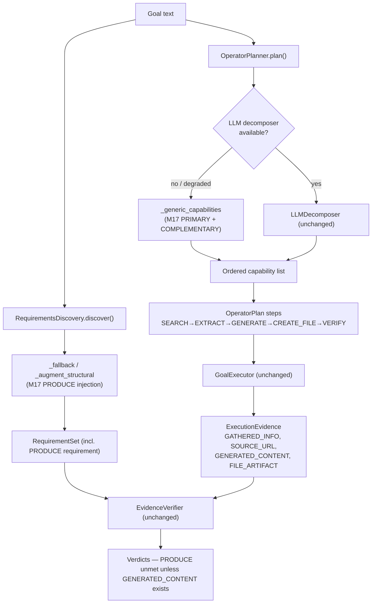

# Design Document — M17 Long-Horizon Synthesis

## Overview

M17 makes one measured capability move: the `long_horizon` benchmark domain rises
above `0.0`. The single benchmark `long_horizon.research_to_document` requires four
evidence kinds — `GATHERED_INFO`, `SOURCE_URL`, `GENERATED_CONTENT`, and
`FILE_ARTIFACT`. Live diagnosis proved the missing kind is `GENERATED_CONTENT`: the
deterministic fallback planner never plans a synthesis step, so the file is written
straight from raw gathered text and no synthesized content is ever recorded.

The root cause is a **keyword gate**. `OperatorPlanner._generic_capabilities` (the
LLM-unavailable fallback path the failing run had degraded to) only appends a
`GENERATE_TEXT` capability when a `needs_content` keyword matches. The benchmark
goal — *"Complete a multi-stage goal: research a topic, then produce and save a
document summarizing it with citations."* — uses the words "produce",
"summarizing", and "document", none of which are in the `needs_content` list
(`summary` is not a substring of `summarizing`). So `needs_content` is `False`, no
`GENERATE_TEXT` step is planned, and the plan collapses to
`SEARCH_WEB → EXTRACT_WEB_CONTENT → CREATE_FILE → VERIFY`.

A secondary defect masks the failure at the self-report layer:
`RequirementsDiscovery` (`_fallback` / `_augment_structural`) misses the same words,
so no `PRODUCE` requirement is emitted, the Evidence Law has nothing to enforce, and
the Operator falsely self-reports `completed=True`. (The benchmark scorer reads
evidence directly, so this masking is not the scoring cause — but it is a real
false-complete bug worth fixing.)

M17 fixes both with a **general planning mechanism**, not per-topic keyword patching:

1. **PRIMARY — a structural planning invariant** in `_generic_capabilities`: any plan
   that both *gathers* information and *saves* an output MUST include a synthesis step
   between them. Saving "a document summarizing X" is impossible without first
   synthesizing the summary. This is derived purely from the goal's inferred shape
   (gather + save), with no application-, site-, or topic-specific branching (Axiom 15).
2. **COMPLEMENTARY — broadened synthesis detection**: extend the `needs_content`
   keyword list (data, not branching) with synthesis verbs/nouns so goals phrased with
   "produce" or "summariz…" classify as needing content even outside the structural
   rule.
3. **FALSE-COMPLETE FIX — requirements discovery**: broaden the same detection in
   `RequirementsDiscovery._fallback`, and inject a `PRODUCE` requirement in both the
   fallback and augmentation paths whenever a goal implies gather+save (or contains a
   synthesis verb) but no `PRODUCE` requirement exists.

The data-flow layer (Requirement 4) is **already correct** and is not re-implemented:
`_dispatch_generate` records `GENERATED_CONTENT` and sets `ctx.generated_content` from
the gathered `combined_info`; `_dispatch_create_file` writes `ctx.generated_content`
(falling back to `combined_info`). Once a `GENERATE_TEXT` step is planned before
`CREATE_FILE`, synthesized content derives from gathered info and is written to the
file automatically.

All changes are additive, deterministic, and replay-safe: the planning decision is a
pure function of goal text + inferred capabilities (no clock, randomness, or network),
so the M17 tests need no live calls.

### Design Goals and Non-Goals

**Goals**
- Ensure a gather+save goal always plans a synthesis step between gather and save.
- Emit a `PRODUCE` requirement so the Evidence Law can enforce `GENERATED_CONTENT`.
- Keep the mechanism general (Axiom 15) and deterministic (Axiom: replay-safe).
- Preserve all existing plan shapes for non-gather+save goals (no regression).

**Non-Goals**
- No re-implementation of the executor data flow (already correct).
- No change to the LLM decomposition path (`LLMDecomposer`) — the fix targets the
  deterministic fallback, which is where the failure occurred.
- No change to production defaults, public signatures, or the committed baseline seed.
- No live-call assertion in the test suite; the real score gain is verified live and
  recorded to `baseline.local.json`.

## Architecture

The change touches two components in the planning/verification layer. Nothing else
changes.



### The gather+save append-order guarantee

The existing append order in `_generic_capabilities` is (confirmed from the real
code):

1. `if needs_info:` → append `SEARCH_WEB`, then `EXTRACT_WEB_CONTENT`
2. `if needs_nav and not needs_info:` → append `NAVIGATE_URL`
3. `if needs_content:` → append `GENERATE_TEXT`
4. `if needs_file:` → append `CREATE_FILE`
5. `if needs_send:` → append `SEND_MESSAGE`
6. fallback → append `OPEN_APPLICATION` (only if nothing matched)

`plan()` then appends a final `VERIFY_GOAL` step. Because `GENERATE_TEXT` is
appended at position 3 — after the gather capabilities and before `CREATE_FILE` — the
PRIMARY invariant only needs to **set `needs_content = True`**. It does not need to
reorder anything. The gather-after / save-before ordering (Requirement 1.2) is a free
consequence of the existing append sequence.

## Components and Interfaces

### C1. `OperatorPlanner._generic_capabilities` (PRIMARY + COMPLEMENTARY)

**File:** `friday/planner/operator_planner.py`

**PRIMARY invariant** — inserted immediately after the five `needs_*` booleans are
computed and **before** the `if needs_info:` append block:

```python
# M17 PRIMARY invariant: gather + save implies synthesize.
# A plan that both gathers information and saves an output MUST include a
# synthesis step between them — saving "a document summarizing X" is
# impossible without first synthesizing the summary. Derived purely from the
# goal's inferred shape; no app/site/topic branching (Axiom 15).
if needs_info and needs_file:
    needs_content = True
```

Placing it before the append block guarantees `GENERATE_TEXT` lands in its existing
position (after `SEARCH_WEB`/`EXTRACT_WEB_CONTENT`, before `CREATE_FILE`), satisfying
Requirement 1.1 and 1.2 with no reordering logic.

**COMPLEMENTARY broadening** — extend the `needs_content` keyword list with synthesis
verbs/nouns (data extension, not per-topic branching):

```python
needs_content = any(kw in text_lower for kw in
                    ["write", "create", "generate", "summary", "report", "compose",
                     "draft", "spreadsheet", "table", "list", "compare", "comparison",
                     # M17 synthesis verbs/nouns:
                     "produce", "summariz", "document", "paper", "cite", "citation",
                     "essay", "brief"])
```

Note `"summariz"` (stem) matches "summarize", "summarizing", and "summary"; the
existing `"summary"` entry is retained for clarity. The PRIMARY invariant then runs
after this assignment and may still force `needs_content = True` for gather+save goals
that use none of these words.

**Interface:** unchanged — `_generic_capabilities(self, goal: Goal, text: str) ->
List[tuple]`. Behavior change is confined to the value of `needs_content`.

### C2. `RequirementsDiscovery` PRODUCE emission (FALSE-COMPLETE FIX)

**File:** `friday/planner/requirements.py`

Two edits plus one shared helper.

**`_fallback` broadening** — the content branch keyword list gains the same synthesis
verbs so a `PRODUCE`-classifying requirement ("Content must be produced") is emitted:

```python
if any(kw in goal_lower for kw in
       ["write", "create", "generate", "report", "summary",
        "produce", "summariz", "document", "paper", "cite", "citation",
        "essay", "brief", "compose", "draft"]):
    reqs.append(Requirement(description="Content must be produced"))
```

`"Content must be produced"` classifies as `PRODUCE` because `classify_requirement`
matches the `"content"` keyword (and is not caught earlier by GATHER/FILE/DELIVER).

**Shared structural PRODUCE injection** — a helper applied by BOTH `_fallback` and
`_augment_structural`, so the invariant holds regardless of whether the LLM path or
the fallback path produced the requirement set:

```python
def _ensure_produce_requirement(self, goal: str, reqs: List[Requirement]) -> List[Requirement]:
    """M17: inject a PRODUCE requirement when the goal implies gather+save
    (or contains a synthesis verb) but no PRODUCE requirement exists."""
    from friday.verification.evidence_law import classify_requirement, RequirementKind
    g = goal.lower()
    kinds = {classify_requirement(r.description) for r in reqs}
    if RequirementKind.PRODUCE in kinds:
        return reqs

    synthesis_verb = any(kw in g for kw in
                         ["produce", "summariz", "document", "paper",
                          "cite", "citation", "essay", "brief"])
    implies_gather = any(kw in g for kw in
                         ["research", "find", "search", "look up", "gather"])
    implies_save = any(kw in g for kw in
                       ["save", "file", "document", ".txt", ".md", ".docx",
                        ".csv", ".xlsx", "spreadsheet", "report"])
    if synthesis_verb or (implies_gather and implies_save):
        reqs.append(Requirement(
            description="A written summary must be synthesized and composed",
            blocking=True,
        ))
    return reqs
```

**Wording is deliberate.** `classify_requirement` checks DELIVER → GATHER → FILE →
PRODUCE in that order, so the injected description MUST avoid tokens that trip an
earlier kind. "A written summary must be synthesized and composed" contains only
PRODUCE tokens (`synthes`, `written`, `summary`, `compose`) and none of
DELIVER/GATHER/FILE — it reliably classifies as `PRODUCE`. Descriptions such as
"synthesized from the **gathered** information" would misclassify as GATHER (the
`"gather"` token), and "produce and save a **document**" would misclassify as FILE;
both are avoided.

`_augment_structural` calls `_ensure_produce_requirement` alongside its existing FILE
and DELIVER injections; `_fallback` calls it (and `_augment_structural`'s FILE/DELIVER
logic can be reused) before returning its `RequirementSet`.

**Interface:** `_augment_structural` and `_fallback` signatures unchanged; a private
helper is added.

### C3. Executor data flow + citation (Requirement 4) — ALREADY CORRECT, no change

**File:** `friday/executor.py`

Confirmed from the real code. The `ExecutionContext` threads data across steps:
`add_info(text)` appends gathered text to `ctx.gathered_info`, and the
`combined_info` property joins it into a single string. The three relevant dispatch
methods form the gather → synthesize → save pipeline:

- **Gather** — `_dispatch_research` / read paths call `ctx.add_info(result.gathered_text)`
  and record `SOURCE_URL` artifacts (`ctx.evidence.add_source_url(url)`) plus
  `GATHERED_INFO`.
- **Synthesize** — `_dispatch_generate(target, cap, ctx)` calls
  `self._generate(target, ctx)`, then sets `ctx.generated_content = content` and calls
  `ctx.evidence.add_generated_content(content)` — recording the `GENERATED_CONTENT`
  artifact.
- **Save** — `_dispatch_create_file(target, cap, ctx)` selects
  `content = ctx.generated_content or ctx.combined_info or f"Content for: {ctx.goal}"`
  and writes it via the file tool, recording a `FILE_ARTIFACT`. **Because
  `ctx.generated_content` is preferred over `ctx.combined_info`, once a
  `GENERATE_TEXT` step runs before `CREATE_FILE` the file receives the SYNTHESIZED
  document, not the raw gathered dump** (Requirement 4.2). The raw-dump path is only
  reached when no synthesis step ran — exactly the pre-M17 failure the C1 fix removes.

**Citation of source URLs (Requirement 4.4) — already implemented in `_generate`.**
`_generate(target, ctx)` builds the synthesis prompt from `ctx.combined_info` and, to
make the summary a *cited* one, collects the real source URLs recorded during gather:

```python
info = ctx.combined_info
source_urls = [a.detail for a in ctx.evidence.of_kind(EvidenceKind.SOURCE_URL)]
if info:
    citation_instruction = ""
    if source_urls:
        src_list = "\n".join(f"- {u}" for u in source_urls[:8])
        citation_instruction = (
            f"\n\nThe information was gathered from these sources:\n{src_list}\n"
            f"Base your response ONLY on the gathered information above. ..."
        )
    prompt = (f"Information:\n{info[:6000]}\n\n"
              f"Produce a clear, well-structured response for the goal: {ctx.goal}"
              f"{citation_instruction}")
```

So the source URLs are available at generation time from the `SOURCE_URL` evidence
artifacts recorded by the gather step, and are injected into the synthesis prompt so
the model cites them. When `self._model_router` is `None` (the deterministic test
path), `_generate` returns `ctx.combined_info` directly — synthesized content still
derives from gathered info, keeping the data flow deterministic and testable without
live calls.

**Conclusion:** once a `GENERATE_TEXT` step is planned before `CREATE_FILE` (the C1
fix), synthesized content derives from gathered info, cites the gathered sources, and
is written to the file; both `GENERATED_CONTENT` and `FILE_ARTIFACT` are recorded.
Requirement 4 (4.1–4.4) is satisfied by the C1 planner fix alone — **no executor
change is made**; the executor is documented here only to prove the data flow already
supports the corrected plan shape.

### C4. Evidence Law (Requirement 3.3/3.4, 6.3) — ALREADY CORRECT, no change

**File:** `friday/verification/evidence_law.py`

`EvidenceVerifier.verify_one` marks a `PRODUCE` requirement satisfied ONLY when a real
`GENERATED_CONTENT` artifact exists, and never lets generated text satisfy a GATHER
requirement. The M17 requirements-discovery fix simply gives the Evidence Law a
`PRODUCE` requirement to enforce; the enforcement itself is unchanged.

## Data Models

No new data structures. M17 reuses existing types:

| Type | File | Role in M17 |
|------|------|-------------|
| `ToolCapability` (enum) | `friday/tools/registry.py` | `SEARCH_WEB`, `EXTRACT_WEB_CONTENT`, `GENERATE_TEXT`, `CREATE_FILE`, `VERIFY_GOAL` — the capabilities composed by the fallback |
| `OperatorStep` / `OperatorPlan` | `friday/planner/operator_planner.py` | Ordered plan whose shape the PRIMARY invariant guarantees |
| `Requirement` / `RequirementSet` | `friday/planner/requirements.py` | Gains an injected `PRODUCE` requirement |
| `RequirementKind` (enum) | `friday/verification/evidence_law.py` | `PRODUCE` is the injected requirement's classification |
| `EvidenceKind` / `ExecutionEvidence` | `friday/verification/evidence_law.py` | `GENERATED_CONTENT` + `FILE_ARTIFACT` recorded end-to-end |

The `needs_*` booleans in `_generic_capabilities` remain plain locals; M17 only
changes how `needs_content` is derived.

### Keyword sets (the only "data" M17 adds)

| Set | Location | M17 additions |
|-----|----------|---------------|
| `needs_content` keywords | `_generic_capabilities` | `produce`, `summariz`, `document`, `paper`, `cite`, `citation`, `essay`, `brief` |
| fallback content keywords | `RequirementsDiscovery._fallback` | same synthesis verbs/nouns |
| synthesis-verb / gather / save detectors | `_ensure_produce_requirement` | reuse of the same verb list + gather/save shape tokens |

## Correctness Properties

*A property is a characteristic or behavior that should hold true across all valid
executions of a system — essentially, a formal statement about what the system should
do. Properties serve as the bridge between human-readable specifications and
machine-verifiable correctness guarantees.*

All properties below are testable **without live calls**: they exercise the pure
`_generic_capabilities` planner, the `RequirementsDiscovery` fallback (with
`model_router=None`), and the pure `EvidenceVerifier`. Property numbers derive from the
prework analysis after redundancy consolidation (1.1+1.2→P1; 1.3+1.4+2.3→P4;
3.1+3.2→P5; 3.3+3.4+6.3→P6).

### Property 1: Gather + save forces an ordered synthesis step

*For any* goal whose inferred capabilities include both a Gather_Step (`SEARCH_WEB` /
`EXTRACT_WEB_CONTENT`) and a Save_Step (`CREATE_FILE`), the capability list produced by
`_generic_capabilities` SHALL contain a `GENERATE_TEXT` step positioned after the last
gather capability and before the first `CREATE_FILE` capability.

**Validates: Requirements 1.1, 1.2**

### Property 2: Synthesis verbs classify as needing content

*For any* goal text containing a Synthesis_Verb ("produce", "summariz", "document",
"paper", "cite", "citation", "essay", "brief"), `_generic_capabilities` SHALL include a
`GENERATE_TEXT` step.

**Validates: Requirements 2.1**

### Property 3: Legacy content keywords still classify as needing content

*For any* goal text containing an existing content keyword ("write", "create",
"generate", "summary", "report", "compose", "draft", "spreadsheet", "table", "list",
"compare", "comparison"), `_generic_capabilities` SHALL include a `GENERATE_TEXT` step.

**Validates: Requirements 2.2**

### Property 4: No spurious synthesis without triggers

*For any* goal text that contains neither a Synthesis_Verb nor a legacy content keyword
and does not have both a gather shape and a save shape (i.e. pure-gather, pure-file, or
neutral goals), `_generic_capabilities` SHALL NOT include a `GENERATE_TEXT` step.

**Validates: Requirements 1.3, 1.4, 2.3**

### Property 5: Requirements discovery emits a PRODUCE requirement

*For any* goal that contains a Synthesis_Verb, OR implies both gathering and saving,
the requirement set produced by `RequirementsDiscovery` (fallback path and
`_augment_structural` augmentation) SHALL contain at least one requirement that
`classify_requirement` classifies as `RequirementKind.PRODUCE`.

**Validates: Requirements 3.1, 3.2**

### Property 6: Evidence Law enforces PRODUCE via GENERATED_CONTENT only

*For any* `ExecutionEvidence`: (a) a PRODUCE requirement is satisfied if and only if a
real `GENERATED_CONTENT` artifact is present; and (b) a `GENERATED_CONTENT` artifact
satisfies a PRODUCE requirement but NEVER satisfies a GATHER requirement.

**Validates: Requirements 3.3, 3.4, 6.3**

### Property 7: Planning decision is deterministic and pure

*For any* goal text, two successive calls to `_generic_capabilities` (with
`model_router=None`) SHALL return identical capability lists, using no clock,
randomness, or network access.

**Validates: Requirements 6.1, 6.4**

### Property 8: No regression on representative plan shapes

*For any* goal drawn from the representative set of existing goal shapes — pure
research, pure file-save, research+report, gather+save+document — `_generic_capabilities`
SHALL produce the expected capability composition (research → gather only; file-save →
create-file only; the three synthesis-bearing shapes → include `GENERATE_TEXT`).

**Validates: Requirements 5.4, 5.5**

### Traceability (Properties to Requirements)

| Property | Requirements | Prework criteria consolidated | Requirements-doc mapping |
|----------|--------------|-------------------------------|--------------------------|
| P1 | 1.1, 1.2 | 1.1, 1.2 | (a) |
| P2 | 2.1 | 2.1 | (b) |
| P3 | 2.2 | 2.2 | (b) |
| P4 | 1.3, 1.4, 2.3 | 1.3, 1.4, 2.3 | (e) |
| P5 | 3.1, 3.2 | 3.1, 3.2 | (c) |
| P6 | 3.3, 3.4, 6.3 | 3.3, 3.4, 6.3 | (d) |
| P7 | 6.1, 6.4 | 6.1 | (h) |
| P8 | 5.4, 5.5 | 5.5 | (f) |

Criteria **not** covered by property tests (by design):
- **4.1, 4.2, 4.4** — data-flow and citation, covered by EXAMPLE unit tests (executor
  already correct): `_dispatch_generate` synthesizes from `combined_info`;
  `_dispatch_create_file` writes `generated_content`; `_generate` injects `SOURCE_URL`
  citations into the synthesis prompt.
- **4.3, 5.1, 5.2, 5.4 (live), 5.6, i** — INTEGRATION/live, verified on a real machine
  and recorded to `baseline.local.json`; not asserted in the suite.
- **5.3, 6.2, 6.4** — SMOKE/process, verified by config check and code review.
- **1.5** — architectural (Axiom 15), verified by review; determinism aspect via P7.

## Design-to-Requirement Traceability

| Component / Decision | Requirements | Notes |
|----------------------|--------------|-------|
| C1 PRIMARY invariant (`needs_info and needs_file ⇒ needs_content=True`) | 1.1, 1.2, 1.5 | Placed before append block; ordering is free from existing sequence |
| C1 COMPLEMENTARY keyword broadening | 2.1, 2.2, 2.3 | Data-only extension of `needs_content` list |
| C2 `_fallback` broadening + `_ensure_produce_requirement` | 3.1, 3.2 | Wording avoids GATHER/FILE/DELIVER tokens so it classifies PRODUCE |
| C3 executor data flow + citation (unchanged) | 4.1, 4.2, 4.3, 4.4 | Already correct given C1 plans GENERATE before CREATE_FILE; `create_file` prefers `generated_content`; `_generate` injects `SOURCE_URL` citations |
| C4 Evidence Law (unchanged) | 3.3, 3.4, 6.3 | Sole judge; PRODUCE needs GENERATED_CONTENT |
| Purity of planner + fallback | 6.1, 6.4 | No clock/randomness/network |
| Additive, defaults preserved | 6.2, 5.3 | No production default or signature change; seed stays unmeasured |
| Live benchmark + ratchet | 5.1, 5.2, 5.4 | Recorded to baseline.local.json; ratchet PASS |
| New tests in new files; regression green | 5.5, 5.6 | 1322-test suite stays green |

## Error Handling

The changed surfaces are pure functions over goal text; there are no exceptions to
handle beyond the existing fallback structure. The relevant behaviors are edge-case
classifications rather than error paths:

| Edge case | Input | Expected behavior | Requirement |
|-----------|-------|-------------------|-------------|
| Empty goal | `""` | No `needs_*` match; falls through to the existing `OPEN_APPLICATION` default; no `GENERATE_TEXT`; no crash | 1.5, 6.1 |
| Gather-only | "research the history of jazz" | `GENERATE_TEXT` absent (invariant needs a save shape) | 1.3, 2.3 |
| File-only | "save my notes to notes.txt" | `GENERATE_TEXT` absent (invariant needs a gather shape) | 1.4, 2.3 |
| Already has content keyword | "write a report about X" | `GENERATE_TEXT` present via legacy keyword (unchanged behavior) | 2.2 |
| Gather + save, no content word | "research a topic and save a document summarizing it" | PRIMARY invariant forces `GENERATE_TEXT`; also caught by "summariz"/"document"/"produce" broadening (defense in depth) | 1.1, 1.2, 2.1 |
| Synthesis verb, no gather/save | "produce an essay" | `GENERATE_TEXT` present via broadened keyword | 2.1 |
| LLM path available | any goal | `_generic_capabilities` not invoked; `LLMDecomposer` output used (unchanged) | 6.2 |
| Fallback path (LLM unavailable/degraded) | any goal | `_generic_capabilities` runs with M17 logic — the actual failing scenario the fix targets | 1.1–2.3 |
| PRODUCE injection wording | any gather+save goal | injected description classifies as PRODUCE, not GATHER/FILE/DELIVER (token-order trap avoided) | 3.1, 3.2 |
| PRODUCE requirement, no content evidence | evidence without `GENERATED_CONTENT` | Evidence Law returns UNMET | 3.3, 3.4 |

## Testing Strategy

### Framework and placement

- Property tests use **Hypothesis** (already the project's PBT library — see
  `.hypothesis/` and `tests/friday/actions/test_primitives_properties.py`).
- Each property test runs a **minimum of 100 examples** (`@settings(max_examples=100)`
  or the shared `COMMON` settings).
- Each property test is tagged with a comment referencing the design property:
  `# Feature: m17-long-horizon-synthesis, Property N: <property text>`.
- **New tests go in new files** (Requirement 5.5), e.g.
  `tests/friday/test_m17_long_horizon_synthesis.py`, and a requirements-discovery
  file if kept separate.
- **No live network or model calls**: planner and requirements-discovery are
  instantiated with `model_router=None`; the Evidence Law is exercised over
  in-memory `ExecutionEvidence` (Requirement 6.4).

### Property tests (P1–P8)

Generators build goal strings from templates combining a topic with gather tokens
(`research`/`find`/`search`/`look up`), save tokens (`save`/`file`/`document`/
`.txt`/`.md`/`spreadsheet`), synthesis verbs, and legacy content keywords, so each
property samples a broad phrasing space:

- **P1** — gather+save templates → assert `GENERATE_TEXT` present and index-ordered
  after the last `SEARCH_WEB`/`EXTRACT_WEB_CONTENT` and before the first `CREATE_FILE`.
- **P2** — random synthesis verb embedded → assert `GENERATE_TEXT` present.
- **P3** — random legacy content keyword embedded → assert `GENERATE_TEXT` present.
- **P4** — pure-gather, pure-file, and neutral goals with no content/synthesis
  triggers → assert `GENERATE_TEXT` absent.
- **P5** — synthesis-verb goals and gather+save goals → `discover()` (fallback) and
  `_augment_structural` both yield a requirement classifying as `PRODUCE`.
- **P6** — evidence toggling: `GENERATED_CONTENT` present ⇒ PRODUCE satisfied and
  GATHER still unmet; absent ⇒ PRODUCE unmet.
- **P7** — call `_generic_capabilities` twice per goal → identical lists.
- **P8** — representative fixed goal shapes → expected capability composition.

### Unit / example tests

- **Data flow (4.1, 4.2)** — deterministic (no-router) executor tests: a `GENERATE_TEXT`
  step sets `ctx.generated_content` and records `GENERATED_CONTENT`; a subsequent
  `CREATE_FILE` writes that content. (Extends existing `test_executor_dispatch.py` /
  `test_executor.py` patterns; new assertions in a new M17 file.)
- **Requirements-discovery PRODUCE emission** — example tests for the exact benchmark
  goal string, asserting a PRODUCE requirement is present on the fallback path.
- **Evidence-Law enforcement** — example test: a gather+save+document requirement set
  is not `all_satisfied` until `GENERATED_CONTENT` evidence exists.

### Regression and candidate-affected tests (for the tasks phase)

The following existing tests were reviewed; none currently assert the *absence* of a
synthesis step for a gather+save goal, so no breakage is expected — but they must be
re-run and are the candidates to update if any assertion tightens:

- `tests/friday/test_requirements.py::TestRequirementsDiscovery::test_fallback_without_llm`
  — goal "Research laptops and save a report" already yields a content requirement via
  "report"; assertion only checks for "information"/"gathered" — expected to still pass.
- `tests/friday/test_query_and_spreadsheet.py::TestPlannerUsesFocusedQuery::test_fallback_search_target_is_focused`
  — goal "research best gaming laptop and make a spreadsheet" already plans
  `GENERATE_TEXT` pre-M17 ("spreadsheet"/"table" are existing `needs_content` keywords),
  so its plan shape is unchanged by M17; the test only checks the search target —
  expected to still pass.
- `tests/friday/test_executor.py` and `test_executor_dispatch.py` — GENERATE→CREATE_FILE
  flows; unaffected.
- `tests/friday/test_repair.py`, `tests/friday/test_evidence_law.py` — PRODUCE/GATHER
  classification and `_augment_structural`; re-run to confirm the new injection wording
  classifies as PRODUCE and does not disturb existing FILE/DELIVER expectations.

Any test that does assert the old plan shape for a Gather_Save_Goal is updated to the
corrected contract, and the change is recorded in the change notes (Requirement 5.6).

### Live verification (not in the unit suite)

- Run `long_horizon.research_to_document` on a real machine; confirm all four evidence
  kinds (`GATHERED_INFO`, `SOURCE_URL`, `GENERATED_CONTENT`, `FILE_ARTIFACT`) and a
  `long_horizon` score > 0.0; record to `baseline.local.json` (Requirements 5.1, 5.2).
- Confirm the committed baseline seed stays all-unmeasured (5.3) and the Ratchet reports
  PASS with no regression to research/coding/browser/desktop (5.4).
- Confirm the full suite (1322 tests) is green (5.5).

### Guiding invariants

- **Additive / general mechanism (Axiom 15)**: the fix is a general planning rule over
  goal shape plus a data-only keyword extension — no application-, site-, or
  topic-specific logic.
- **No production default changed** (Requirement 6.2); the committed baseline seed
  remains all-unmeasured (5.3).
- **Evidence Law is the judge** (Requirement 6.3): generated text satisfies PRODUCE,
  never GATHER.
- **Full regression green** (1322 tests) with new tests in new files (5.5).
- **Target domain**: `long_horizon`.
