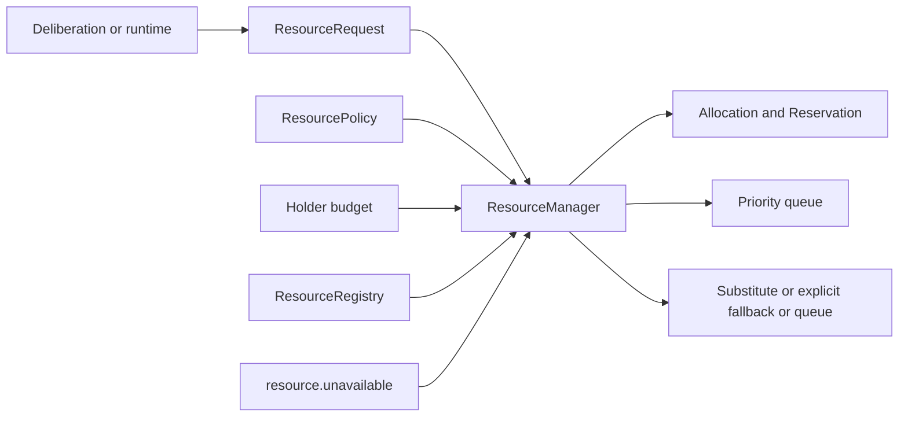

# Design Document

M18 - Resource Manager v2

## Design goals

M18 expands M4 without replacing it.  Existing callers may continue to request
an exact resource through `allocate(resource_id, holder=...)`.  New callers
use `ResourceRequest` and `allocate_best`; this separation prevents a default
change while giving Deliberation v2 a stable, economical resource interface.



## Components

### Resource descriptors and registry

`Resource` keeps the M4 descriptor first, then adds defaulted economics and
observability fields.  `ResourceRegistry.all()` returns a stable snapshot;
`update()` uses `dataclasses.replace`, so health monitors cannot mutate an
already registered descriptor invisibly.

### Economics contracts

`economics.py` contains immutable value objects:

- `ResourceRequest`: demand and explicit degradation permission.
- `ResourcePolicy`: local/cost/reliability/energy/latency/load trade-offs.
- `ResourceBudget` and `BudgetStatus`: concurrent commitment limits.
- `ResourceReservation`: auditable request, policy, cost, energy, and sequence.
- `ReallocationResult`: evidence of substitute, degradation, or queue outcome.

No object holds a clock, random id, provider callback, or resource handle.

### Selection and accounting

`allocate_best` filters resources for health, availability, kind, capability,
permissions, locality, latency, payment policy, exclusive occupancy, and
parallel capacity.  It ranks remaining candidates by:

```
reliability * reliability_weight
+ availability * availability_weight
+ local_preference_bonus
- cost * cost_weight
- energy_cost * energy_weight
- latency_ms * latency_weight
- current_load * load_weight
```

The stable tie-breaker is resource id.  A budget check occurs before the M4
allocation.  On success, accounting creates one sequence-derived reservation;
idempotent re-allocation finds it and records no additional commitment.

### Queue and reallocation

Unallocatable requests receive a sequence-derived queue id.  `process_queue`
orders requests by descending priority, then FIFO sequence.  It deliberately
does not alter M4's direct-release behavior.

`mark_unavailable` replaces a resource descriptor with `healthy=False` and
`availability=0`.  It snapshots only reservations tied to that resource,
releases their accounting, then retries each stored request under its stored
policy while excluding the failed id.  The progression is:

1. compatible resource of the requested kind - `reallocated`;
2. explicitly declared fallback kind - `degraded`;
3. no acceptable resource - `queued`.

The same path is wired to `resource.unavailable` events.  All event handlers
catch exceptions so a malformed event never breaks a kernel tick.

## Invariants

- One manager remains the sole allocation authority.
- Direct M4 allocation semantics remain unchanged.
- No budget is exceeded and no release leaves a stale reservation commitment.
- A failed resource is never reselected in the same failover pass.
- Policy and budget constraints survive reallocation.
- Resources are selected from generic descriptors, never provider or task
  names.
- The system is replay-safe because ordering derives only from descriptors and
  monotonic in-memory sequence numbers.
