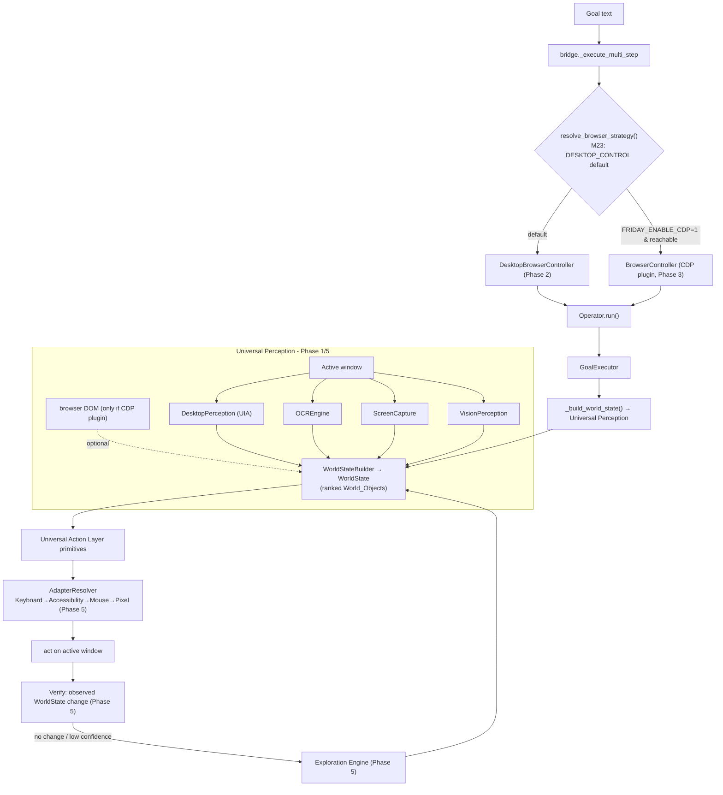

# Design Document — M23 Browser as a Generic Desktop Environment

## Overview

M23 makes the general desktop-cognition pipeline the **canonical** way FRIDAY operates
any web browser, and demotes CDP/Playwright to an optional accelerator. The design is
an **inversion + gap-closure**, not a rewrite: the cognition stack (`Operator`,
`GoalExecutor`, Universal Action Layer primitives + adapter cascade, `research`,
`WebAgent`) is already duck-typed against a controller surface and the perception stack
already ranks sources correctly (`perception/priority.py::SourcePriority`:
BROWSER_DOM 100 → UIA 80 → OCR 50 → VISION 30 → PIXEL 10). Three concrete defects make
Chrome a special case, and M23 removes them:

1. **The primary path never fuses desktop perception.** `GoalExecutor._build_world_state()`
   only fills `browser_elements` from a CDP controller's `observe_interactive()`.
   → **Phase 1** builds a full `WorldState` (UIA + OCR + Vision + pixels) for the active
   window, browser or not.
2. **The desktop browser controller is Chrome/OCR-specific.** `DesktopChromeController`
   keys off the window title "Chrome" and reads via OCR only.
   → **Phase 2** replaces it with a generic `DesktopBrowserController` that perceives via
   the full stack and targets by affordance, not application identity.
3. **The default is CDP-first.** `browser_strategy.resolve_browser_strategy` prefers CDP.
   → **Phase 3** makes DESKTOP_CONTROL the default and CDP an opt-in plugin
   (`FRIDAY_ENABLE_CDP`), with identical correctness either way.

**Phase 5** strengthens the shared substrate (semantic World Objects with full metadata;
Keyboard→Accessibility→Mouse→Pixel motor preference; exploration on low confidence;
success only from World-Model change). **Phase 4** proves it by benchmark with CDP
disabled across Chrome/Edge/Firefox/Brave/Electron.

### Design Goals and Non-Goals

**Goals**
- One perception path and one motor path for browsers and every other desktop app.
- CDP optional; identical correctness with it on or off (Browser_Independence).
- No application-, browser-, site-, or window-title-specific branching (Axiom 15).
- Deterministic, testable-without-live-calls core (fusion + motor selection are pure).

**Non-Goals**
- No change to the LLM planner/decomposer semantics.
- No new cognition subsystem — reuse `DesktopEnvironment`, `MotorSystem`, `Exploration
  Engine`, and the World Model (A2.1).
- No removal of `BrowserController`/`BrowserAdapter` — they remain as the CDP plugin.
- No claim of a browser we did not actually exercise (honest measurement).

## Architecture



## Modified Subsystems

| Subsystem | File(s) | Change |
|-----------|---------|--------|
| Universal Perception | `friday/perception/active_window.py` (NEW), `perception/world_state.py`, `perception/desktop.py`, `perception/ocr.py`, `perception/screen.py`, `perception/vision.py` | New `observe_active_window()` fuses UIA+OCR+screenshot(+Vision on demand) into a `WorldState`. |
| Executor | `friday/executor.py` | `_build_world_state()` calls `observe_active_window()`; merges browser DOM only when a CDP controller is present. |
| Generic browser controller | `friday/actions/desktop_browser.py` (NEW); remove/replace `friday/actions/desktop_chrome.py` | `DesktopBrowserController` — generic, affordance-driven, full-stack perception. |
| Browser strategy / factory | `friday/actions/browser_strategy.py`, `browser_factory.py` | DESKTOP_CONTROL default; CDP modes gated on `FRIDAY_ENABLE_CDP`. |
| Bridge | `friday/bridge.py` | Primary path builds `DesktopBrowserController`; CDP only when enabled + reachable; silent fallback. |
| Motor preference | `friday/actions/adapters/resolver.py`, `actions/primitives.py` | Selection honors Keyboard→Accessibility→Mouse→Pixel; accessibility action preferred over raw coords. |
| World Objects | `friday/perception/types.py`, `perception/observation.py` | Observation/UIElement carry confidence, freshness, evidence, source, bbox, affordances. |
| Exploration hook | `friday/executor.py` / `friday/environments/unknown/` | On unresolved/low-confidence target, invoke Exploration_Engine. |
| Benchmarks | `friday/benchmarks/capability/domains.py`, `scripts/kernel_validation/run_capability_benchmarks.py` | Browser-independence suite; `--no-cdp` run mode; multi-browser targets. |
| Docs | `docs/architecture/FAS_v2.1_AMENDMENTS.md` | Add A2.13; rename **Browser Runtime → Web Environment Runtime**. |

## Runtime Contracts

### RC1 — Controller surface (duck-typed, unchanged)
`DesktopBrowserController` and `BrowserController` both satisfy:
`available: bool`, `start() -> bool`, `stop() -> None`, `navigate(url) -> {url,title,ok}`,
`read_text(max_chars=...) -> str`, `current_url() -> str`, `search_web(query) -> {...}`,
`observe_interactive(limit=...) -> {url,title,elements,ok}`, `click(text) -> {ok,...}`,
`type_text(text, selector=None) -> {ok,...}`, `click_index/fill_index/scroll/press`.
Downstream (`GoalExecutor`, `WebAgent`, `research`) is unchanged.

### RC2 — Universal Perception
`observe_active_window(*, want_vision=False) -> WorldState`. Pure over its injected
sensors (UIA/OCR/screen/vision providers), returns a `WorldState` whose
`sources_used` reflects only the sources that produced data. Never raises; a dead
sensor is skipped.

### RC3 — Motor selection
The `AdapterResolver` returns the highest-preference adapter that `can_handle(target,
world_state)` in Motor_Preference_Order. Selection is a pure function of
`(target, world_state)`.

### RC4 — Verification
A step is `Verified_Success` iff `verify(before_ws, after_ws, expectation)` observes the
expected change (URL changed, new elements, text appeared, focus moved). Input dispatch
alone is never success.

### RC5 — Environment contract alignment
`DesktopBrowserController` is a thin operational surface over the `DesktopEnvironment`
(Ch 30) semantics: observe → interact → verify. It introduces no capability the
`EnvironmentContract` does not already define.

## Components and Interfaces

### C1. Universal Perception — `observe_active_window()` (Phase 1)

**File:** `friday/perception/active_window.py` (NEW)

Fuses the desktop Perception_Stack into a single `WorldState` using the existing
`WorldStateBuilder`:

```python
def observe_active_window(
    *,
    desktop=None,      # DesktopPerception (UIA)
    ocr=None,          # OCREngine
    screen=None,       # ScreenCapture
    vision=None,       # VisionPerception (lazy; only if want_vision)
    want_vision: bool = False,
) -> WorldState:
    """Build a fused WorldState for the active window from UIA + OCR + screenshot
    (+ Vision on demand). Ranked by SourcePriority. No app/title branching."""
```

- UIA elements via `DesktopPerception.get_ui_elements()` → `builder.add_ui_elements(...)`.
- OCR regions via `OCREngine.extract_regions(screenshot)` → `builder.add_ocr_regions(...)`.
- Screenshot hash via `ScreenCapture.grab()` → `builder.set_screenshot_hash(...)`.
- Active window via `DesktopPerception.get_active_window()` → `builder.set_active_window(...)`.
- Vision is **lazy** (`want_vision`) — computed only when semantic sources fail to
  resolve a target (cost control), consistent with ADR-014.

**Interface impact:** additive. `GoalExecutor._build_world_state()` (C2) becomes its
first consumer.

### C2. Executor wiring (Phase 1)

**File:** `friday/executor.py`

`_build_world_state()` today only sets browser state from `self._browser.observe_
interactive()`. New behavior:

```python
def _build_world_state(self) -> WorldState:
    ws = observe_active_window(want_vision=False)          # desktop stack (always)
    if self._browser and getattr(self._browser, "available", False):
        obs = self._browser.observe_interactive()          # DOM (CDP) OR affordances (desktop ctrl)
        # merge browser elements as an additional ranked source
        ...
    return ws
```

`_execute_click`/`_execute_type` already run `P.click(Target(text=...), ws)` through the
adapter cascade; with a fused `ws` they now work on any window. No change to their
control flow.

### C3. `DesktopBrowserController` (Phase 2)

**File:** `friday/actions/desktop_browser.py` (NEW); delete `actions/desktop_chrome.py`.

Generic, affordance-driven controller exposing RC1. It:
- Finds the **active/foreground window** generically via `DesktopPerception.get_active_
  window()` (no title match, no browser-name check).
- **Launches** a browser via `SystemActions.launch_app(name)` when asked to open one,
  but never branches on which browser it is.
- **Navigates** by the universal human sequence: focus window → address-bar focus
  shortcut (Ctrl+L / Alt+D / F6 — all standard across Chromium, Firefox, and most
  browsers) → type URL → Enter. Selection of the address field is affordance-based
  (an editable, top-of-window text field in the WorldState) with the shortcut as the
  reliable keyboard-first path (Motor_Preference_Order).
- **Reads** via `observe_active_window()` fused text (UIA text + OCR), not OCR alone.
- **observe_interactive** returns affordances derived from the WorldState (editable
  fields, buttons, links) in the same shape the executor expects.
- **click/type** delegate to the Universal Action Layer primitives over the fused
  WorldState.

No method inspects the browser's name or window title to decide behavior (Axiom 15).

### C4. Strategy inversion + CDP plugin (Phase 3)

**Files:** `friday/actions/browser_strategy.py`, `browser_factory.py`, `friday/bridge.py`

- `resolve_browser_strategy()` returns `BrowserMode.DESKTOP_CONTROL` by default. A CDP
  mode is chosen only when `FRIDAY_ENABLE_CDP` is truthy AND CDP is (or can be made)
  reachable.
- `build_browser_for_goal()` builds a `DesktopBrowserController` by default;
  `_build_cdp_controller` only when CDP is enabled.
- `bridge._execute_multi_step` / `_get_browser_controller`: primary path constructs the
  desktop controller; CDP is attempted only under the flag and **fails silently to the
  desktop path** (Requirement 3.5). CDP remains registered as the priority-100
  `BrowserAdapter` only when the plugin is active.

`FRIDAY_ENABLE_CDP` unset/`0` = desktop pipeline (default). Setting it `1` restores CDP
acceleration — this single switch is also the **rollback** control (Requirement 10.1).

### C5. Semantic World Objects (Phase 5 — Perception)

**Files:** `friday/perception/types.py`, `perception/observation.py`

Ensure each observation carries: `confidence`, `freshness`, `evidence`, `source`,
`bounding region`, `affordances`. `Observation` already has source/bbox/confidence/
attributes; M23 adds `freshness` (A2.1 decay) and `affordances` (inferred verbs:
clickable/editable/scrollable/selectable) and an `evidence` reference (the raw signal:
UIA property set, OCR text+score, or pixel region). World Objects remain
application-agnostic.

### C6. Motor preference order (Phase 5 — Motor)

**Files:** `friday/actions/adapters/resolver.py`, `actions/primitives.py`

Adapter priorities already encode a cascade; M23 makes the **preference semantics**
explicit and keyboard-first: for a resolvable semantic target, prefer a keyboard/
accessibility interaction (type into focused field, invoke default action) before a
mouse move+click, before pixel-coordinate click. The `DesktopAdapter` (UIA) exposes an
"invoke accessibility action" path preferred over `DesktopActionsAdapter` raw
coordinates; `VisionAdapter` (pixels) stays last.

### C7. Exploration on low confidence (Phase 5 — Exploration)

**Files:** `friday/executor.py`, `friday/environments/unknown/`

When the resolver cannot resolve a target above a confidence threshold, the executor
invokes the Exploration_Engine (Observe → hypothesize → safe-experiment → verify →
update World Model) instead of a blind pixel guess. No app-specific heuristics.

### C8. Verified success (Phase 5 — Verification)

**File:** `friday/executor.py`

After an interaction, re-observe and compare `before`/`after` WorldStates; record
success only on the expected change (URL change, element appearance/disappearance, text
change, focus move). Dispatching an input never sets success.

## Data Models

| Type | File | Role in M23 |
|------|------|-------------|
| `WorldState` / `WorldStateBuilder` | `perception/world_state.py` | The fused snapshot; now built for any active window |
| `UIElement` / `BrowserElement` / `OCRRegion` / `BoundingBox` | `perception/types.py` | World Object carriers; gain freshness + affordances |
| `Observation` | `perception/observation.py` | Uniform observation; gains freshness + affordances + evidence ref |
| `PerceptionSource` / `SourcePriority` | `perception/types.py`, `perception/priority.py` | Ranking (unchanged order) |
| `Target` / `ActionResult` | `actions/target.py`, action layer | Motor input/output (unchanged) |
| `BrowserStrategy` / `BrowserMode` | `actions/browser_strategy.py` | Default flips to DESKTOP_CONTROL |
| `CapabilityBenchmark` | `benchmarks/capability/domains.py` | New browser-independence benchmarks |

## Correctness Properties

*A property is a characteristic that should hold across all valid executions — a formal,
machine-verifiable statement of what the system should do.* All properties below are
testable **without live calls** using injected/simulated sensors and a dry-run motor
backend.

### Property 1: Universal fused WorldState
*For any* set of available desktop sensors, `observe_active_window()` SHALL return a
`WorldState` whose `sources_used` are ranked UIA > OCR > VISION > PIXEL and whose
construction performs no application-, browser-, or window-title-specific branching.
**Validates: Requirements 1.1, 1.2, 1.4**

### Property 2: Non-empty perception without CDP
*For any* active window exposing any UIA/OCR/pixel content and NO CDP controller,
`_build_world_state()` SHALL return a non-empty `WorldState`.
**Validates: Requirements 1.3, 3.2**

### Property 3: Source-agnostic reasoning
*For any* `WorldState`, target resolution and planning SHALL depend only on
World_Object attributes (text/role/affordance/bbox/confidence), not on which
`PerceptionSource` produced them.
**Validates: Requirements 1.5, 4.2**

### Property 4: Generic controller surface
`DesktopBrowserController` SHALL implement the full RC1 surface, and its source SHALL
contain no branch keyed on a browser name or window title and no OCR-only perception.
**Validates: Requirements 2.1, 2.2, 2.4, 2.5**

### Property 5: Browser-invariant navigation
*For any* browser identity label attached to an otherwise identical WorldState, the
navigation action sequence produced by `DesktopBrowserController` SHALL be identical
(focus → address shortcut → type → commit).
**Validates: Requirements 2.3, 2.5**

### Property 6: CDP equivalence
*For any* simulated environment, the operator's step verdicts and produced evidence
kinds with CDP disabled SHALL equal those with the CDP plugin enabled (performance
metadata excluded).
**Validates: Requirements 3.1, 3.2, 3.3, 3.5**

### Property 7: Desktop-first strategy default
*For any* goal, with `FRIDAY_ENABLE_CDP` unset, `resolve_browser_strategy()` SHALL
return `DESKTOP_CONTROL`; a CDP mode SHALL appear only when the flag is truthy.
**Validates: Requirements 3.4, 11.4**

### Property 8: World Object metadata completeness
*For any* observation emitted by the Perception_Stack, the resulting World_Object SHALL
carry confidence, freshness, evidence, source, bounding region, and affordances; and
freshness SHALL be non-increasing with age (A2.1).
**Validates: Requirements 4.1, 4.3, 4.4**

### Property 9: Motor preference ordering
*For any* target resolvable by more than one method, the selected interaction method
SHALL be the highest in Keyboard → Accessibility → Mouse → Pixel that can handle it;
an accessibility action SHALL be preferred over raw coordinates.
**Validates: Requirements 5.1, 5.2, 5.3, 5.4**

### Property 10: Exploration on low confidence
*For any* target that cannot be resolved above the confidence threshold, the operator
SHALL enter the Observe→hypothesize→experiment→verify→update cycle and SHALL NOT act on
a low-confidence guess; the cycle uses no app-specific heuristic.
**Validates: Requirements 6.1, 6.2, 6.3, 6.4**

### Property 11: Verified-success only on observed change
*For any* interaction, success SHALL be recorded iff the after-state differs from the
before-state in the expected way; input dispatch without observed change SHALL yield an
unverified verdict.
**Validates: Requirements 7.1, 7.2, 7.3**

### Property 12: Determinism/purity of selection
*For any* `(WorldState, target)`, two successive fusion+resolution calls SHALL return
identical results, using no clock or randomness in the selection outcome.
**Validates: Requirements 11.1, 11.2**

### Traceability (Properties → Requirements)

| Property | Requirements |
|----------|--------------|
| P1 | 1.1, 1.2, 1.4 |
| P2 | 1.3, 3.2 |
| P3 | 1.5, 4.2 |
| P4 | 2.1, 2.2, 2.4, 2.5 |
| P5 | 2.3, 2.5 |
| P6 | 3.1, 3.2, 3.3, 3.5 |
| P7 | 3.4, 11.4 |
| P8 | 4.1, 4.3, 4.4 |
| P9 | 5.1, 5.2, 5.3, 5.4 |
| P10 | 6.1, 6.2, 6.3, 6.4 |
| P11 | 7.1, 7.2, 7.3 |
| P12 | 11.1, 11.2 |

Criteria verified by INTEGRATION/live + review (not unit properties): 8.1–8.6 (live
benchmark, CDP disabled, recorded to `baseline.local.json`), 9.1–9.3 (spec + rename +
FAS), 10.1–10.5 (rollback switch, suite green, ratchet, seed), 11.3 (honest measurement).

## Rollback Strategy

- **Single-switch rollback:** setting `FRIDAY_ENABLE_CDP=1` restores CDP as the browser
  acceleration path without code changes (Requirement 10.1). Because CDP correctness ==
  desktop correctness (Property 6), this is a performance/behavior-neutral revert.
- **Controller replacement is reversible:** `DesktopChromeController` is removed only
  after `DesktopBrowserController` passes its property suite; git history retains it.
- **Perception wiring is additive:** `_build_world_state()` still merges browser DOM
  when a CDP controller is present, so enabling CDP restores the prior element source.
- **Baseline safety:** browser-independence scores are written only to
  `baseline.local.json`; the committed seed stays all-unmeasured, so a bad measurement
  cannot corrupt the committed ratchet floor (Requirement 10.4).
- **Test gate:** the milestone is not "done" until the full suite is green with no fewer
  passing tests than before (Requirement 10.2), so a regression blocks merge.

## Benchmarks (Phase 4)

New capability-benchmark domain **`web_independence`** (domain-general goal text, no
site names), executed with CDP disabled, targets Chrome/Edge/Firefox/Brave/Electron and
measures, per target: launch, navigate, search, login flow, file upload, download
verification, multi-tab, dynamic interaction, infinite scroll, unexpected dialog, crash
recovery. Each benchmark declares `required_evidence` (Evidence-Law scored). A target
not actually exercised is reported **unmeasured** (no fabrication, Requirement 8.6).
Runner gains a `--no-cdp` mode (and per-target selection) mirroring the existing
`--browser`/`--domain`/`--timeout` flags. Live scores → `baseline.local.json`.

## Risks

| Risk | Impact | Mitigation |
|------|--------|-----------|
| UIA coverage inside a browser is shallow (Chromium exposes limited a11y tree by default) | Desktop perception may under-resolve in-page elements | Fusion falls through to OCR then Vision (ranked stack); accessibility flags (`--force-renderer-accessibility`) noted as optional optimization, never required |
| OCR/Vision latency raises per-step time vs CDP | Slower browser tasks | CDP remains an opt-in accelerator; Vision is lazy (only on semantic-resolution failure); benchmarks measure performance separately from correctness |
| Motor via global keyboard/mouse is L3 (affects focus) | Disruptive/irreversible mis-clicks | Keyboard-first + accessibility-action preference (least invasive); verification-before-success; dialogs handled generically; L4 send still gated |
| Removing `DesktopChromeController` breaks a caller | Regression | Grep all callers; replace on primary path; keep suite green (Req 10.2/10.3) |
| Inverting the default surprises existing flows expecting CDP | Behavior change | Single-switch rollback; CDP-equivalence property; documented in change notes |
| Login/upload/download benchmarks touch real accounts/files | Privacy/side effects | Use FRIDAY's dedicated profile + throwaway fixtures; login/download measured read-only where possible; honest unmeasured when not safely exercisable |
| Electron target availability on the test machine | Missing coverage | Report unmeasured if no Electron app present; do not fabricate |

## Error Handling

| Case | Behavior | Requirement |
|------|----------|-------------|
| A perception sensor raises | Skipped; fusion continues with remaining sources | 1.3, 11.2 |
| No active window / empty screen | `observe_active_window()` returns an empty-but-valid WorldState; step reported unverified | 7.3 |
| CDP requested but unavailable | Silent fallback to desktop pipeline; no error surfaced to correctness | 3.5 |
| Target unresolved above threshold | Exploration_Engine invoked; no blind action | 6.1 |
| Interaction dispatched but no observed change | Step marked unverified; eligible for repair/exploration | 7.3 |
| Electron/target browser absent | Benchmark records unmeasured | 8.6, 11.3 |

## Testing Strategy

- **Framework:** pytest + Hypothesis (repo standard); property tests ≥100 examples,
  tagged `# Feature: m23-browser-generic-desktop-environment, Property N: ...`.
- **New tests in new files** (Requirement 10.2): `tests/friday/test_m23_universal_
  perception.py`, `test_m23_desktop_browser_controller.py`, `test_m23_strategy_
  inversion.py`, `test_m23_motor_preference.py`, `test_m23_verification.py`,
  `test_m23_world_objects.py`.
- **No live calls:** inject fake UIA/OCR/screen/vision providers into
  `observe_active_window()`; drive the motor via the dry-run backend; resolve strategy
  with env flags patched. CDP-equivalence (P6) uses a simulated controller pair.
- **Structural tests (P4):** assert `DesktopBrowserController` implements RC1 and its
  source contains no browser-name/window-title branch (AST/source scan).
- **Live verification (not in unit suite):** Phase 4 benchmarks on a real machine with
  CDP disabled; record to `baseline.local.json`; ratchet PASS; seed unmeasured.
- **Regression:** full `tests/friday/ tests/world/` suite green, no fewer than the
  pre-M23 count; candidate-affected tests (`test_browser_strategy.py`,
  `test_desktop_chrome.py`, `test_bridge.py`, `test_executor*.py`) updated only where an
  assertion genuinely tightens against the corrected contract, recorded in change notes.

## Design-to-Requirement Traceability

| Component / Decision | Requirements |
|----------------------|--------------|
| C1 `observe_active_window()` fusion | 1.1, 1.2, 1.3, 1.4 |
| C2 executor universal `_build_world_state()` | 1.1, 1.3, 1.5 |
| C3 `DesktopBrowserController` | 2.1, 2.2, 2.3, 2.4, 2.5 |
| C4 strategy inversion + CDP plugin | 3.1, 3.2, 3.3, 3.4, 3.5, 10.1 |
| C5 semantic World Objects | 4.1, 4.2, 4.3, 4.4 |
| C6 motor preference order | 5.1, 5.2, 5.3, 5.4 |
| C7 exploration hook | 6.1, 6.2, 6.3, 6.4 |
| C8 verified success | 7.1, 7.2, 7.3 |
| Benchmarks (Phase 4) | 8.1–8.6 |
| Rollback + regression + honesty | 10.1–10.5, 11.1–11.4 |
| Spec + FAS rename | 9.1, 9.2, 9.3 |

## FAS Traceability

Amends Ch 12 (Observation), Ch 23 (EnvironmentContract), Ch 29 (**Browser Runtime →
Web Environment Runtime**), Ch 30 (Desktop Runtime), Ch 31 (Motor System), Ch 32
(Verification), Ch 25/66 (Exploration), and amendments A2.1 (freshness/provenance),
A2.2 (environment fingerprint inputs), A2.8 (Exploration Engine), A2.9 (competence
scoring). A new amendment **A2.13 — Web Environment Runtime (Browser as a Generic
Desktop Environment)** records the principle and the rename.
