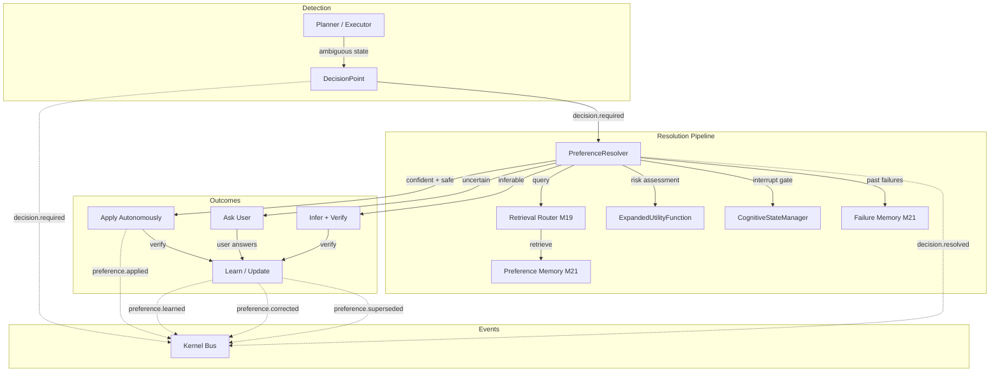

# Design: M25 — Learned Choice & Preference Resolution

## Overview

M25 implements FAS §A2.15 — a general-purpose Preference Resolution Pipeline that
eliminates repeated clarification for recurring, context-identical choices. When FRIDAY
reaches an ambiguous multi-option state, the pipeline detects the decision point, queries
Preference Memory (M21) via the Retrieval Router (M19), evaluates contextual similarity +
empirical confidence + freshness, and either applies a learned preference autonomously (when
confident and safe) or escalates to the user (when unsure or risky). After execution, the
pipeline verifies the outcome and learns/updates the preference for future reuse.

All foundations exist: Preference Memory (`friday/memory/preference_memory.py`), Retrieval
Router (M19), Expanded Deliberation with irreversibility/safety penalties (M16/§A2.3),
Cognitive State Manager with `should_interrupt` (M22/§A2.12), Failure Memory (M21), and the
event bus (Ch 52). This milestone introduces two new modules in `friday/deliberation/` —
`decision_point.py` (frozen dataclass) and `preference_resolver.py` (pipeline coordinator) —
and a bootstrap wiring helper. No new persistence mechanism, no new event bus, no
application-specific logic (Axiom 15).

## Architecture



### Modified / new components

| Component | File | Change |
|---|---|---|
| DecisionPoint | `friday/deliberation/decision_point.py` | **NEW** — frozen dataclass + builder + JSON round-trip |
| PreferenceResolver | `friday/deliberation/preference_resolver.py` | **NEW** — pipeline coordinator, kernel-attached |
| Preference Memory | `friday/memory/preference_memory.py` | Additive fields on `PreferenceRecord` (context_scope, confidence, reuse_count, corrections, superseded_by, provenance, preference_class, last_verified) |
| Bootstrap | `friday/api/server.py` | `attach_preference_resolver(kernel, ...)` in guarded path; expose `kernel.preference_resolver` |
| Docs/matrix | `docs/architecture/*` | §A2.15 → Built; traceability matrix update |

## Components and Interfaces

### C1 — `DecisionPoint` (frozen dataclass)

A first-class, immutable representation of a recurring choice. Keyed by semantic identity
(`decision_id`) — never by application name, dialog, or window handle (Axiom 15).

```python
@dataclass(frozen=True)
class DecisionPoint:
    decision_id: str          # semantic key, e.g. "download_directory"
    goal_context: str         # goal identifier providing purpose context
    environment: str          # environment fingerprint
    options: Tuple[str, ...]  # available choices (immutable)
    risk: float               # [0, 1] clamped
    reversible: bool          # can the choice be undone easily
    category: str             # generic task/object category
    candidates: Tuple[Any, ...]  # candidate preferences from memory
    metadata: FrozenDict      # additional JSON-safe context
```

**Invariants:**
- Construction with empty `decision_id` or empty `options` raises `ValueError` (fail-fast).
- `risk` is clamped to `[0, 1]` on construction.
- `to_dict()` → `from_dict()` round-trips losslessly.
- Imports only stdlib + `friday.events.event.FrozenDict`.

### C2 — `PreferenceResolver` (pipeline coordinator)

Kernel-attached coordinator that resolves `DecisionPoint`s by querying Preference Memory via
the Retrieval Router, evaluating candidates, and gating autonomous application by confidence +
reversibility + `should_interrupt`. Emits lifecycle events.

**Public API:**
```python
class PreferenceResolver:
    def attach(kernel, *, preference_memory, retrieval_router, cognitive_state, failure_memory) -> None
    def resolve_sync(decision_point: DecisionPoint) -> Dict[str, Any]
    def learn_preference(decision_id, chosen, *, context_scope, preference_class, provenance) -> None
    def apply_preference(decision_id, chosen, *, reuse_count, confidence) -> None
    def correct_preference(decision_id, old_value, new_value, *, context_scope) -> None
    def supersede_preference(old_key, new_key, new_value) -> None
    def explain(decision_id) -> Dict[str, Any]
```

**Pipeline stages (in `resolve_sync`):**
1. Emit `decision.required` event.
2. Query Preference Memory via Retrieval Router (tier=PREFERENCE, top_k=5).
3. Evaluate candidates: contextual similarity × confidence × freshness − contradictions.
4. Check Failure Memory: `has_failed_before(decision_id)` — if yes, reduce confidence.
5. Gate: reversibility + confidence + `should_interrupt(urgency)` → apply / infer / ask.
6. If apply: execute, verify, emit `preference.applied`, emit `decision.resolved`.
7. If ask: emit `decision.resolved` with `needs_user_input=True`.
8. Learn/update preference after outcome verification.

**Isolation:**
- Imports only: `friday.events.event`, `friday.memory.interfaces` (for `MemoryTier`),
  `friday.deliberation.decision_point`, and stdlib.
- Collaborators accessed through duck-typed interfaces passed at `attach` time.
- Handlers never raise into the bus (`except Exception` with justifying comment).

### C3 — `compute_preference_confidence(...)` (pure function)

A pure, deterministic function in `preference_resolver.py` that computes empirical confidence
from evidence only — never LLM-asserted.

```python
def compute_preference_confidence(
    *,
    source_type: str,        # "explicit" | "repeated" | "inferred"
    reuse_count: int,
    correction_count: int,
    recency_days: float,
    contradiction_count: int,
) -> float:
    """Return confidence in [0, 1]. Pure and deterministic."""
    # Base confidence from source type.
    base = {"explicit": 0.9, "repeated": 0.6, "inferred": 0.5}.get(source_type, 0.5)
    # Repeated selections scale: log2(reuse_count + 1) * 0.05, capped at 0.3 boost.
    reuse_boost = min(0.3, math.log2(max(1, reuse_count) + 1) * 0.05)
    # Penalties.
    correction_penalty = correction_count * 0.15
    contradiction_penalty = contradiction_count * 0.2
    recency_decay = recency_days / 180.0  # half-year half-life
    raw = base + reuse_boost - correction_penalty - contradiction_penalty - recency_decay
    return max(0.0, min(1.0, raw))
```

### C4 — `contains_secret_material(value)` (pure function)

A small heuristic filter in `preference_resolver.py` that rejects values that look like
secret material. Rejection is a hard boundary — the preference is NOT stored, and a security
warning is logged.

```python
def contains_secret_material(value: Any) -> bool:
    """Return True if value looks like secret material (conservative)."""
    # Checks: known prefixes (sk-, ghp_, gho_, glpat-, xoxb-, xoxp-, Bearer)
    #         base64 blocks > 20 chars with high entropy
    #         known cert/key PEM markers
    # vault:// references are explicitly ALLOWED (opaque identity refs).
```

### C5 — Reversibility gating logic

Integrated into `resolve_sync` via `_gate_decision`:

| Condition | Action |
|---|---|
| `reversible=True` + `confidence >= autonomous_threshold` + `risk < 0.3` | Apply autonomously |
| `reversible=False` OR `risk >= 0.7` OR `confidence < ask_threshold` | Ask user |
| Middle ground | Infer + verify |

The reversibility assessment reuses `ExpandedUtilityFunction.requires_human_confirmation`
(§A2.3) for candidates that `touches_protected`. The asking gate consults
`CognitiveStateManager.should_interrupt(urgency)` — when it returns False (user deeply
focused, low urgency), non-critical questions are deferred.

### C6 — Event emission

All events produced via `make_event` from `friday.events.event` with source
`"preference_resolver"`. Event types:

| Event | Trigger |
|---|---|
| `decision.required` | DecisionPoint enters pipeline |
| `decision.resolved` | Pipeline produces a resolution (apply/infer/ask) |
| `preference.learned` | New preference stored |
| `preference.applied` | Stored preference reapplied autonomously |
| `preference.corrected` | User corrects an existing preference |
| `preference.superseded` | One preference supersedes another |

All payloads are JSON-safe (primitives, lists, dicts only — no opaque objects or callables).

### C7 — Bootstrap wiring

```python
def attach_preference_resolver(
    kernel,
    *,
    preference_memory=None,
    retrieval_router=None,
    cognitive_state=None,
    failure_memory=None,
    **kwargs,
) -> PreferenceResolver:
    """Reusable wiring helper — mirrors attach_skill_pipeline pattern."""
```

Exposed as `kernel.preference_resolver` in the guarded `FRIDAY_USE_KERNEL_EXECUTION=1` path.
Without the flag, no bus subscriptions, no disk I/O — default path byte-unchanged.

## Data Models

### `DecisionPoint` (new)
Frozen dataclass in `friday/deliberation/decision_point.py`. Fields documented in C1 above.
JSON-projectable via `to_dict()` / `from_dict()`. No persistence — it is transient (lives
for the duration of one resolution pipeline invocation).

### `PreferenceRecord` (extended, additive)
Existing record in `friday/memory/preference_memory.py` with M25 additive fields (already
added with safe defaults preserving prior behavior):

| Field | Type | Default | Purpose |
|---|---|---|---|
| `context_scope` | str | `""` | Contextual scope tuple serialized |
| `preference_class` | str | `"contextual"` | Lifecycle class |
| `confidence` | float | `0.5` | Empirical confidence [0, 1] |
| `reuse_count` | int | `0` | Successful reapplication count |
| `last_verified` | float | `0.0` | Timestamp of last successful application |
| `corrections` | int | `0` | Number of corrections received |
| `superseded_by` | str | `""` | Key of superseding preference |
| `provenance` | str | `""` | How learned: explicit / repeated / inferred |

### Resolution result (transient dict)
Returned by `resolve_sync` — JSON-safe dict:
```python
{
    "decision_id": str,
    "chosen_option": Any,
    "confidence": float,
    "source": str,  # "memory" | "inferred" | "user_required"
    "explanation": str,
    "autonomous": bool,
    "needs_user_input": bool,
}
```

## Correctness Properties

*A property is a characteristic or behavior that should hold true across all valid
executions of a system — essentially, a formal statement about what the system should do.
Properties serve as the bridge between human-readable specifications and machine-verifiable
correctness guarantees.*

### Property 1: DecisionPoint construction + serialization round-trip

*For any* valid DecisionPoint constructed with a non-empty `decision_id` and non-empty
`options`, `from_dict(dp.to_dict())` SHALL produce an equivalent DecisionPoint; construction
with empty `decision_id` or empty `options` SHALL raise `ValueError`.

**Validates: Requirements 1.1, 1.3, 1.4**

### Property 2: Precedence hierarchy enforcement

*For any* DecisionPoint with multiple candidate preferences at different precedence levels
(explicit instruction, session choice, exact contextual match, generalized preference, safe
inference), the resolution pipeline SHALL always select the highest-precedence source; an
explicit current instruction SHALL always override any stored preference without requiring
confirmation.

**Validates: Requirements 4.2, 4.3**

### Property 3: Contextual scope gating

*For any* stored preference with a defined contextual scope and *for any* DecisionPoint whose
context (goal, environment, category) yields a similarity score below the configurable
threshold, the preference SHALL be treated as inapplicable and the pipeline SHALL fall
through to the next precedence level or ask the user.

**Validates: Requirements 4.1, 4.4**

### Property 4: Empirical confidence is deterministic and evidence-derived

*For any* tuple of (source_type, reuse_count, correction_count, recency_days,
contradiction_count), `compute_preference_confidence(...)` SHALL return a value in `[0, 1]`
that is purely deterministic (same inputs → same output), monotonically decreasing in
corrections and contradictions, and never assigned by LLM output.

**Validates: Requirements 5.7**

### Property 5: Reversibility-gated asking

*For any* DecisionPoint, when `reversible=True` AND matched preference confidence ≥
`autonomous_threshold` AND `risk < 0.3`, the pipeline SHALL apply autonomously; when
`reversible=False` OR `risk >= 0.7` OR confidence < `ask_threshold`, the pipeline SHALL
require user input. When `CognitiveStateManager.should_interrupt(urgency)` returns False,
non-critical questions SHALL be deferred rather than interrupting.

**Validates: Requirements 6.1, 6.2, 6.4, 6.5**

### Property 6: Credential separation — secret material rejection

*For any* string value matching secret-material heuristics (known token prefixes `sk-`,
`ghp_`, `gho_`, `glpat-`, `xoxb-`, `xoxp-`; base64 blocks ≥ 20 chars), calling
`learn_preference`, `correct_preference`, or `supersede_preference` with that value SHALL
reject the recording (no store, no event) and log a security warning. Vault references
(`vault://...`) SHALL be allowed.

**Validates: Requirements 7.2, 7.3, 7.4**

### Property 7: Event serialization round-trip + replay completeness

*For any* event emitted by the PreferenceResolver (`decision.required`, `decision.resolved`,
`preference.learned`, `preference.applied`, `preference.corrected`, `preference.superseded`),
the event SHALL be JSON-serializable (`json.dumps(event.to_dict())` succeeds) and SHALL carry
all fields required for replay (decision_key, context, resolved option, confidence,
provenance, timestamp).

**Validates: Requirements 10.2, 10.3**

### Property 8: Pipeline idempotence

*For any* DecisionPoint and *for any* fixed state of Preference Memory and Failure Memory,
calling `resolve_sync` twice with no intervening state changes SHALL produce the same
resolution result (same `chosen_option`, same `confidence`, same `source`).

**Validates: Requirements 12.1**

### Property 9: Defensive handlers — malformed events never raise

*For any* malformed event (None payload, missing fields, wrong types, empty dict, non-dict
payload), the `_on_decision_required` handler SHALL not raise an exception and SHALL not
corrupt resolver state.

**Validates: Requirements 10.4, 11.3**

### Property 10: Provenance completeness

*For any* preference that has been applied automatically, calling `explain(decision_id)`
SHALL return a dict containing: `source` (explicit/repeated/inferred), `when_learned`
(timestamp), `context` (scope), `confidence` (float), `reuse_count` (int), `corrections`
(int), and `last_verified` (timestamp).

**Validates: Requirements 8.1, 8.2**

## Error Handling

Structured-error-model compliant (§A2.14.2):

| Scenario | Behavior |
|---|---|
| Retrieval Router unavailable / raises | Degrade to "no candidates found" → ask user |
| Preference Memory write fails | Log warning; emit no `preference.learned` event; pipeline continues |
| Failure Memory unavailable | Skip failure check; treat as "no prior failures" |
| CognitiveStateManager unavailable | Default to `should_interrupt=True` (always interruptible) |
| Malformed `decision.required` event | Handler catches, returns silently (no-op) |
| Secret material in preference value | Reject recording, log security warning, return without storing |
| `BaseException` (KeyboardInterrupt/SystemExit) | Propagates (never caught) |
| Bootstrap wiring failure | Logged with context; bootstrap continues without resolver |

Every handler uses `except Exception` with a justifying `# noqa: BLE001` comment explaining
why the broad catch is necessary (bus safety). No silent blanket swallow without rationale.

## Testing Strategy

**Property-based tests** (Hypothesis, ≥100 examples per property, tagged
`# Feature: m25-learned-choice, Property N: <title>`):

| Property | Test target |
|---|---|
| 1 | `DecisionPoint` construction + `to_dict`/`from_dict` round-trip + fail-fast |
| 2 | Precedence hierarchy resolution with multi-source candidates |
| 3 | Context similarity threshold gating |
| 4 | `compute_preference_confidence` determinism + bounds + monotonicity |
| 5 | `_gate_decision` + `should_interrupt` integration |
| 6 | `contains_secret_material` / `_is_secret_material` rejection |
| 7 | Event `to_dict()` JSON round-trip + payload completeness |
| 8 | `resolve_sync` idempotence under fixed state |
| 9 | `_on_decision_required` with random malformed events |
| 10 | `explain()` field completeness after preference application |

**Acceptance scenario tests** (pytest, example-based):
- (A) First-time ask — no stored preference → resolver returns `needs_user_input=True`
- (B) Same-context automatic reuse — high-confidence match → autonomous apply
- (C) Different-context re-ask — low similarity → falls through to ask
- (D) Explicit override — user instruction supersedes stored preference
- (E) Correction refines boundary — narrowed scope, incremented counter
- (F) Irreversible-action gate — high risk → always asks
- (G) Credential-reference without secret leakage — vault ref stored, raw token rejected
- (H) Explain-why audit — `explain()` returns full provenance chain

**Configuration:**
- PBT library: `hypothesis` (already in project dependencies)
- Minimum iterations: 100 per property (via `@settings(max_examples=100)`)
- Tag format: `# Feature: m25-learned-choice, Property N: <title>`

**Unit test balance:**
- Unit tests cover the eight acceptance scenarios (A–H) with concrete examples.
- Property tests cover the universal invariants (Properties 1–10).
- No test imports application-specific modules or performs real I/O; all collaborators are
  mocked/faked via duck-typing interfaces.

## Traceability

| Spec Reference | Implementation | Status |
|---|---|---|
| FAS §A2.15.1 (DecisionPoint) | `friday/deliberation/decision_point.py` | Built |
| FAS §A2.15.2 (Resolution Pipeline) | `friday/deliberation/preference_resolver.py` | Built |
| FAS §A2.15.3 (Contextual scoping + precedence) | `PreferenceResolver._evaluate_candidates` + `_gate_decision` | Built |
| FAS §A2.15.4 (Preference lifecycle) | `learn_preference` / `correct_preference` / `supersede_preference` | Built |
| FAS §A2.15.5 (Reversibility gates asking) | `_gate_decision` + `should_interrupt` integration | Built |
| FAS §A2.15.6 (Credential separation) | `contains_secret_material` / `_is_secret_material` | Built |
| Axiom 15 (no application-specific logic) | All modules generic; `decision_id` is semantic-only | Enforced |
| Preference Memory (M21) | Reused via duck-typed interface | Dependency |
| Retrieval Router (M19) | Queried via `route(query, tiers={PREFERENCE})` | Dependency |
| Cognitive State Manager (M22) | Consulted via `should_interrupt(urgency)` | Dependency |
| Failure Memory (M21) | Consulted via `has_failed_before(decision_id)` | Dependency |
| Event Bus (Ch 52) | `make_event` + `kernel.publish_event` | Dependency |
