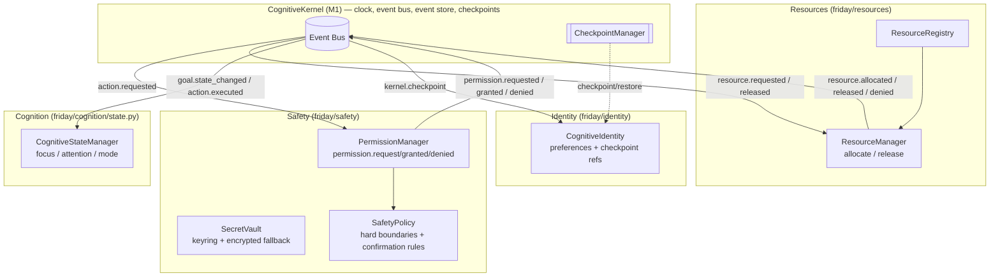

# Design Document: M4-Gaps — Safety & Permission, Resource Model, Cognitive Identity & Cognitive State

## Overview

Milestones M1–M9 built and verified (995 tests passing) the FRIDAY cognitive substrate: a
`CognitiveKernel` (Ch 20) owning the clock/event bus/event store/checkpoints, a belief `WorldModel`
(Ch 9), a `GoalManager`/`GoalGraph` (Ch 18/19), a `Deliberator` (Ch 10), uniform
`EnvironmentContract`/`RuntimeContract` runtimes (Ch 23), evidence-backed `CompetenceRecord`s
(Ch 28), a `UnifiedVerificationEngine` (Ch 32/33), the M8 learning-signal loop
(Reflection/Memory/Competence/Recovery), and the M9 durable-improvement loop
(Learning/Temporal/Long-Horizon/Background).

Four **binding** FAS subsystems from the earlier milestones were never built as dedicated packages
and remain gaps. This milestone closes all four, in the same kernel-event-driven, import-isolated,
wrap-don't-rewrite style as M6–M9:

1. **Safety & Permission** (`friday/safety/` — FAS Ch 35). A `PermissionManager` (nine permission
   levels + five trust zones), a `SecretVault` (replaces plaintext `.env`; keyring-backed with an
   encrypted-file fallback; secrets referenced by key name, never echoed), and a `SafetyPolicy`
   (immutable hard boundaries + confirmation rules). This is a hard constitutional requirement
   (Constitution Article IX) and every risky action (send message, delete file, spend money) is
   gated here.

2. **Resource Model** (`friday/resources/` — FAS Ch 45–48). A `ResourceRegistry` (discover/register
   resources), a `ResourceScheduler`/`ResourceManager` (allocate/release, prevent double-allocation
   of exclusive resources), and a `Resource` type model (type, health, availability, cost). The
   Deliberation utility function's resource-cost term (Ch 10.8) and the "resources are allocated,
   not assumed" law (Ch 45.x, the 7th law) depend on this.

3. **Cognitive Identity** (`friday/identity/` — FAS Ch 51). A `CognitiveIdentity` that persists the
   operator's continuity (identity id, preferences, competence handle, checkpoint references) across
   sessions and restarts, reusing the kernel checkpoint/restore semantics and the M3 `Goal`
   serialization — never rewriting them.

4. **Cognitive State Manager** (`friday/cognition/state.py` — FAS Ch 67). Tracks the operator's own
   mind-state — current focus, attention, interruptibility, thinking depth, reasoning budget,
   urgency, active goal, and mode (idle/exploration/execution/conversation) — as explicit
   first-class state that any subsystem can query, distinct from the `WorldModel`'s model of external
   reality.

Every subsystem communicates only through kernel-published events (Ch 52); subsystems never call one
another directly. All new modules carry `"""Ch NN — ..."""` docstrings, contain no hardcoded
application/site names or URLs (Axiom 15), and run deterministically under `FRIDAY_DRY_RUN=1` so the
existing suite stays green. This document uses Python (the project language) for contracts and
Mermaid for architecture.

---

## Architecture

All four subsystems slot beneath the Kernel exactly like every M1–M9 subsystem. Safety, Resources,
and Identity are kernel-attached services (they `attach(kernel)` and subscribe to events); the
Cognitive State Manager is a passive queryable component updated from the event stream.



**Isolation rule (Ch 52).** Arrows into the bus are `publish_event`; arrows out are `subscribe`. No
M4-gap module holds a reference to another. Safety imports only `friday.events` + standard library
(plus optional `keyring` guarded by try/except). Resources import only `friday.events` +
`friday.kernel.contracts` + stdlib. Identity imports `friday.events` and reuses `Goal` serialization
only through dict round-trips (no direct import required). The Cognitive State Manager imports only
`friday.events` + stdlib.

---

## How M4-Gaps Plugs Into M1–M9 (real signatures)

**Kernel (M1) — `friday/kernel/kernel.py`**
```python
class CognitiveKernel:
    def subscribe(self, pattern: str, handler) -> str
    def publish_event(self, event: Event) -> None
    def register_runtime(self, runtime: RuntimeContract) -> None
    def checkpoint(self) -> str
    def restore(self, path: str) -> None
    def health(self) -> dict  # {"status","tick","wall_time",...}
```

**Event (M1) — `friday/events/event.py`**
```python
def make_event(event_type, source, logical_time, payload=None,
               correlation_id="", parent_id=None, wall_time=None) -> Event
```

**ResourceContract (M1) — `friday/kernel/contracts/resource.py`** (Resource types implement this)
```python
class ResourceContract(ABC):
    @property
    def name(self) -> str: ...
    def health(self) -> Dict[str, Any]: ...
```

**Goal (M3) — `friday/goals/goal.py`** — Identity reuses `Goal.to_dict`/`from_dict` shapes for
serialized continuity (goal ids + states) without rewriting them.

---

## Components and Interfaces

### Component 1: PermissionManager (`friday/safety/permission.py`)

**Purpose**: Classify every action by permission level and trust zone, and decide whether it may
proceed autonomously, requires notification, or requires explicit confirmation.

```python
class PermissionLevel(IntEnum):
    """Ch 35 — nine ascending permission levels; higher = more dangerous."""
    OBSERVATION = 0    # read/inspect/hover — autonomous
    INTERACTION = 1    # click/type/navigate — autonomous
    MODIFICATION = 2   # create files, send messages — notify
    DELETION = 3       # delete files, close apps — confirm
    FINANCIAL = 4      # purchases, transfers — always confirm
    IDENTITY = 5       # passwords, auth tokens — always confirm + vault
    ADMINISTRATIVE = 6 # system settings — always confirm
    KERNEL = 7         # kernel/self-modification — forbidden autonomously
    HARDWARE = 8       # device/hardware control — always confirm

class TrustZone(str, Enum):
    """Ch 35.3 — environment trust classification."""
    TRUSTED = "trusted"
    VERIFIED = "verified"
    RESTRICTED = "restricted"
    UNTRUSTED = "untrusted"
    HOSTILE = "hostile"

class Decision(str, Enum):
    ALLOW = "allow"          # proceed autonomously
    NOTIFY = "notify"        # proceed but announce
    CONFIRM = "confirm"      # require explicit user approval
    DENY = "deny"            # never allowed

@dataclass(frozen=True)
class PermissionRequest:
    action: str
    level: PermissionLevel
    trust_zone: TrustZone
    reversible: bool
    confidence: float

@dataclass(frozen=True)
class PermissionVerdict:
    decision: Decision
    level: PermissionLevel
    reason: str

class PermissionManager:
    """Ch 35 — decide autonomy vs confirmation for every action."""
    def __init__(self, *, policy: "SafetyPolicy" = None) -> None: ...
    def evaluate(self, request: PermissionRequest) -> PermissionVerdict: ...
    def attach(self, kernel) -> None:
        """Subscribe to action.requested; publish permission.granted / permission.denied."""
```

**Responsibilities**:
- Map a `PermissionLevel` to a base `Decision` (0–1 → ALLOW, 2 → NOTIFY, 3/6/8 → CONFIRM, 4/5 →
  CONFIRM, 7 → DENY autonomously).
- Escalate: a HOSTILE/UNTRUSTED trust zone raises the decision one step toward CONFIRM/DENY; an
  irreversible action never returns ALLOW below a confidence floor (fails safe).
- Emit `permission.granted` / `permission.denied` events; never raise into the tick loop.
- **Import boundary**: MUST NOT import memory/competence/learning/resources/identity modules.

### Component 2: SecretVault (`friday/safety/vault.py`)

**Purpose**: Replace plaintext `.env` secret access. Store/retrieve secrets by key name via a
keyring backend when available, else an encrypted-file fallback; never echo secret values.

```python
class SecretVault:
    """Ch 35.6 — secrets referenced by key name, never returned to logs."""
    def __init__(self, *, service: str = "friday", fallback_path: str = None) -> None: ...
    def set(self, key: str, value: str) -> None: ...
    def get(self, key: str) -> Optional[str]:
        """Return the secret for key, or None. Never logs the value."""
    def has(self, key: str) -> bool: ...
    def delete(self, key: str) -> None: ...
    def keys(self) -> List[str]:
        """Return known key NAMES only — never values."""
```

**Responsibilities**:
- Prefer the `keyring` library (Windows Credential Manager) when importable; guard the import with
  try/except so the module never hard-fails on machines without it.
- Encrypted-file fallback: XOR/obfuscate at minimum in DRY_RUN; the interface is what matters for the
  architecture (a stronger cipher can be swapped behind the same API).
- `__repr__`/`__str__` never include secret values. `keys()` returns names only.
- Under `FRIDAY_DRY_RUN=1`, operate on an in-memory store so tests touch no real credential store.

### Component 3: SafetyPolicy (`friday/safety/policy.py`)

**Purpose**: The immutable hard boundaries (Constitution Article IX) that no utility trade-off may
cross, plus the confirmation-rule table the PermissionManager consults.

```python
@dataclass(frozen=True)
class SafetyPolicy:
    """Ch 35 — hard boundaries + confirmation rules; immutable at runtime."""
    confirm_levels: frozenset          # PermissionLevels always requiring confirmation
    forbidden_levels: frozenset        # PermissionLevels never allowed autonomously
    irreversible_confidence_floor: float = 0.85
    def requires_confirmation(self, level: "PermissionLevel") -> bool: ...
    def is_forbidden(self, level: "PermissionLevel") -> bool: ...
    @classmethod
    def default(cls) -> "SafetyPolicy": ...
```

**Responsibilities**:
- Provide the default policy: confirm {DELETION, FINANCIAL, IDENTITY, ADMINISTRATIVE, HARDWARE},
  forbid autonomous {KERNEL}.
- Frozen dataclass — cannot be mutated at runtime (self-protection, Ch 35.7).

### Component 4: Resource + ResourceRegistry (`friday/resources/types.py`, `registry.py`)

**Purpose**: Model finite resources and their discovery/registration.

```python
class ResourceKind(str, Enum):
    COMPUTE = "compute"      # cpu/gpu
    MEMORY = "memory"
    NETWORK = "network"
    MODEL = "model"          # an LLM budget
    BROWSER = "browser"      # a browser session (exclusive)
    INPUT = "input"          # mouse/keyboard (exclusive)
    STORAGE = "storage"
    HUMAN = "human"          # user attention (exclusive)

@dataclass
class Resource:
    """Ch 45 — a finite resource with health, availability, cost."""
    id: str
    kind: ResourceKind
    exclusive: bool                 # only one holder at a time
    cost: float = 0.0               # relative cost per allocation
    healthy: bool = True
    def health(self) -> Dict[str, Any]: ...

class ResourceRegistry:
    """Ch 45 — discover and register resources; never assume availability."""
    def register(self, resource: Resource) -> str: ...
    def unregister(self, resource_id: str) -> None: ...
    def get(self, resource_id: str) -> Optional[Resource]: ...
    def by_kind(self, kind: ResourceKind) -> List[Resource]: ...
```

### Component 5: ResourceManager (`friday/resources/scheduler.py`)

**Purpose**: Allocate/release resources, preventing double-allocation of exclusive resources
(Ch 46). Also the single authority the rest of the runtime asks for resources rather than acquiring
directly.

```python
@dataclass(frozen=True)
class Allocation:
    resource_id: str
    holder: str                     # goal_id or subsystem name
    granted: bool
    reason: str

class ResourceManager:
    """Ch 46 — allocate/release; exclusive resources never double-allocated."""
    def __init__(self, registry: ResourceRegistry) -> None: ...
    def allocate(self, resource_id: str, *, holder: str) -> Allocation: ...
    def release(self, resource_id: str, *, holder: str) -> bool: ...
    def holder_of(self, resource_id: str) -> Optional[str]: ...
    def attach(self, kernel) -> None:
        """Subscribe to resource.requested / resource.released; publish outcomes."""
```

**Responsibilities**:
- An exclusive resource already held returns `Allocation(granted=False)` for any other holder;
  the same holder re-allocating is idempotent (granted=True).
- A non-exclusive resource may be shared by many holders.
- An unhealthy or unknown resource is never granted (fails safe).
- On `resource.requested`/`resource.released` events, allocate/release and publish
  `resource.allocated` / `resource.released` / `resource.denied`; never raise into the tick loop.
- Dynamic reallocation (Ch 46.6): releasing frees the slot for a queued holder — the manager tracks
  a FIFO wait order per exclusive resource and surfaces the next holder on release.

### Component 6: CognitiveIdentity (`friday/identity/identity.py`)

**Purpose**: One continuous identity across sessions/restarts (Ch 51). Persists identity id,
user preferences, and references to the durable state (goal ids + states, last checkpoint path)
so the operator resumes rather than restarts.

```python
@dataclass
class CognitiveIdentity:
    """Ch 51 — one mind across many sessions."""
    identity_id: str
    preferences: Dict[str, Any] = field(default_factory=dict)
    goal_states: Dict[str, str] = field(default_factory=dict)  # goal_id -> state
    last_checkpoint: Optional[str] = None
    def set_preference(self, key: str, value: Any) -> None: ...
    def record_goal_state(self, goal_id: str, state: str) -> None: ...
    def checkpoint(self) -> Dict[str, Any]:
        """JSON-serializable identity state (reuses Goal state shapes)."""
    def restore(self, state: Dict[str, Any]) -> None:
        """Rehydrate identity; missing fields default; invents no goal ids."""
    def attach(self, kernel) -> None:
        """Subscribe to goal.state_changed + kernel.checkpoint (Ch 52)."""
```

**Responsibilities**:
- Track goal ids + states from `goal.state_changed`; store the last checkpoint path from
  `kernel.checkpoint`.
- `checkpoint`/`restore` round-trip cleanly through JSON; restore defaults missing fields and never
  invents goal ids (mirrors M9 LongHorizonPlanner defensiveness).
- Identity id is stable across restore (the same mind continues).

### Component 7: CognitiveStateManager (`friday/cognition/state.py`)

**Purpose**: Explicit model of the operator's own mind (Ch 67), distinct from the WorldModel.

```python
class CognitiveMode(str, Enum):
    IDLE = "idle"
    EXPLORATION = "exploration"
    EXECUTION = "execution"
    CONVERSATION = "conversation"

class ThinkingDepth(str, Enum):
    SHALLOW = "shallow"
    NORMAL = "normal"
    DEEP = "deep"

@dataclass
class CognitiveState:
    mode: CognitiveMode = CognitiveMode.IDLE
    focus: Optional[str] = None            # goal_id currently attended to
    attention: float = 0.0                 # 0..1 committed reasoning capacity
    interruptible: bool = True
    thinking_depth: ThinkingDepth = ThinkingDepth.NORMAL
    reasoning_budget: float = 1.0          # 0..1 remaining budget
    urgency: float = 0.0                   # 0..1 (separate from importance)
    active_goal: Optional[str] = None

class CognitiveStateManager:
    """Ch 67 — track focus/attention/mode; queryable by any subsystem."""
    def __init__(self) -> None: ...
    def snapshot(self) -> CognitiveState: ...
    def enter_mode(self, mode: CognitiveMode) -> None: ...
    def set_focus(self, goal_id: Optional[str], *, attention: float = 1.0) -> None: ...
    def set_interruptible(self, value: bool) -> None: ...
    def set_thinking_depth(self, depth: ThinkingDepth) -> None: ...
    def consume_budget(self, amount: float) -> float: ...   # returns remaining
    def attach(self, kernel) -> None:
        """Subscribe to goal.state_changed / action.executed to update focus + mode."""
```

**Responsibilities**:
- Deriving mode from events: an `action.executed` → EXECUTION; a `goal.state_changed` to `active` →
  focus that goal; no activity → the manager may report IDLE.
- Interruptibility: FINANCIAL/IDENTITY actions in progress set `interruptible=False`; otherwise True.
- `reasoning_budget` clamps to `[0, 1]`; `consume_budget` never goes negative.
- Reads defensively; never raises into the tick loop.

---

## Event Vocabulary

| Event type | Direction | Producer → Consumer | Key payload fields |
|---|---|---|---|
| `action.requested` | consumed | any → PermissionManager | `action, level, trust_zone, reversible, confidence` |
| `permission.granted` | produced | PermissionManager | `action, level, reason` |
| `permission.denied` | produced | PermissionManager | `action, level, reason` |
| `resource.requested` | consumed | any → ResourceManager | `resource_id, holder` |
| `resource.allocated` | produced | ResourceManager | `resource_id, holder` |
| `resource.released` | produced & consumed | ResourceManager | `resource_id, holder, next_holder` |
| `resource.denied` | produced | ResourceManager | `resource_id, holder, reason` |
| `goal.state_changed` | consumed | GoalManager → Identity, CognitiveState | `goal_id, state` |
| `action.executed` | consumed | executor → CognitiveState | `goal_id, capability` |
| `kernel.checkpoint` | consumed | Kernel → Identity | `path` |

---

## Correctness Properties

### Property 1: Forbidden levels are never auto-allowed
For any request whose level is in the policy's forbidden set, `evaluate` never returns `ALLOW` or
`NOTIFY`.
**Validates: Requirements 1.1, 1.4**

### Property 2: Confirmation levels always require confirmation
For any request whose level is in the policy's confirm set, `evaluate` returns `CONFIRM` (or `DENY`),
never `ALLOW`/`NOTIFY`.
**Validates: Requirements 1.2**

### Property 3: Irreversible low-confidence never auto-allowed
An irreversible action below the confidence floor never returns `ALLOW`.
**Validates: Requirements 1.3**

### Property 4: Vault never leaks values
For any key/value, `repr`/`str` of the vault and its `keys()` output never contain the secret value.
**Validates: Requirements 2.2, 2.3**

### Property 5: Vault round-trips
`set(k, v)` then `get(k) == v`; `has(k)` true; after `delete(k)`, `get(k) is None`.
**Validates: Requirements 2.1**

### Property 6: Exclusive resources are never double-allocated
For any interleaving of allocate calls, an exclusive resource has at most one holder at a time.
**Validates: Requirements 3.2, 3.3**

### Property 7: Release frees exactly the holder
Releasing by the current holder frees the resource; releasing by a non-holder does not.
**Validates: Requirements 3.4**

### Property 8: Identity survives restart
For any identity state, `restore(checkpoint())` reproduces identity id, preferences, and goal states
identically; partial state invents nothing.
**Validates: Requirements 4.5, 4.6**

### Property 9: Reasoning budget stays in [0,1]
For any sequence of `consume_budget` calls, the remaining budget is always within `[0, 1]` and
monotonically non-increasing until reset.
**Validates: Requirements 5.4**

### Property 10: Determinism
Replaying the same ordered event log through fresh Safety + Resource + Identity + CognitiveState
subsystems yields identical emitted event types/payloads and internal state (modulo event id and wall
time).
**Validates: Requirements 6.4, 6.5**

## Error Handling

All kernel-attached handlers (`PermissionManager._on_action_requested`,
`ResourceManager._on_resource_requested`/`_on_resource_released`, `CognitiveIdentity` handlers,
`CognitiveStateManager` handlers) read payload fields defensively via `.get(...)` and wrap their
bodies in try/except so a malformed or partial event is skipped WITHOUT raising into the kernel tick
loop (mirrors the M8/M9 convention). The `SecretVault` guards its optional `keyring` import with
try/except and falls back to an encrypted-file (or in-memory under DRY_RUN) store rather than raising.
The `ResourceManager` fails safe: unknown or unhealthy resources are denied rather than granted. The
`SafetyPolicy` is a frozen dataclass and cannot be mutated at runtime (self-protection, Ch 35.7).
Emissions use `make_event` + `kernel.publish_event`; when no kernel is attached, emit methods are
no-ops so pure cores stay unit-testable.

---

## Data Models

See per-component interfaces above. All records are frozen dataclasses where they are values
(PermissionRequest/Verdict, Allocation, SafetyPolicy, CognitiveState is mutable-by-design as it is
live mind-state). `ResourceKind`/`PermissionLevel`/`TrustZone`/`Decision`/`CognitiveMode`/
`ThinkingDepth` are enums. `CompetenceKey`-style tuples are not needed here.

---

## Testing Strategy

- **Isolation (AST)**: `tests/friday/test_m4_isolation.py` — safety imports only events + stdlib
  (+ optional keyring); resources import only events + kernel.contracts + stdlib; identity + cognitive
  state import only events + stdlib; every module has a `"""Ch NN — ..."""` docstring; no hardcoded
  app/site names or URLs.
- **Unit**: permission matrix, vault round-trip + no-leak, resource allocate/release, identity
  round-trip, cognitive-state transitions + budget clamping.
- **Property (Hypothesis)**: the 10 properties above.
- **Integration**: real `CognitiveKernel`, attach all four, drive `action.requested` /
  `resource.requested` / `goal.state_changed` / `kernel.checkpoint`, assert `permission.*` /
  `resource.*` events land and identity/cognitive-state update.
- **Gate**: `tests/friday/test_m4_gate.py` — a risky action is gated (CONFIRM/DENY), an exclusive
  resource contended by two holders grants exactly one, identity survives a checkpoint→restore across
  a fresh kernel, and the run is deterministic on replay.
- All tests run under `FRIDAY_DRY_RUN=1`.
