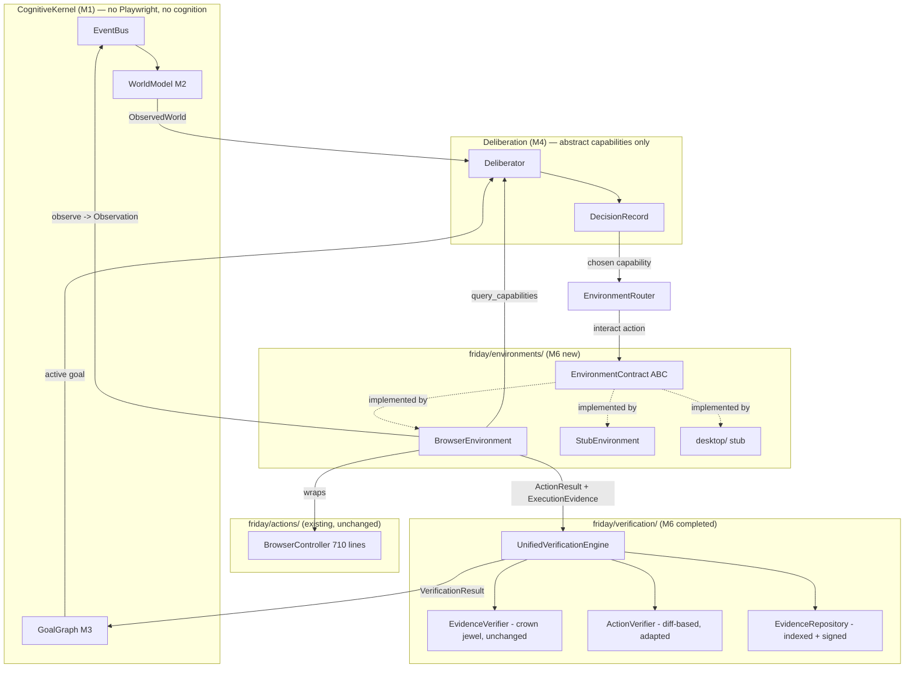

# Design Document: M6 — Environment Contracts, Unified Verification, Operation

> FAS references: Ch 11 (Operation), Ch 23 (Environment Architecture), Ch 24 (Interaction
> Architecture), Ch 29 (Browser Runtime), Ch 32 (Verification Engine), Ch 33 (Evidence System).
> Handoff references: HANDOFF_EXPANDED.md §10 (Milestone 6), §12, §13.

## Overview

Milestone 6 turns FRIDAY's applications-as-environments axiom (Axiom 7) into working code. It
introduces a single, uniform `EnvironmentContract` (FAS Ch 23) that every digital environment
implements, wraps the existing, live-verified `BrowserController` in a `BrowserEnvironment`
adapter (FAS Ch 29) without rewriting it, and merges the two historical verification systems
(the artifact-based `EvidenceVerifier` — the crown jewel — and the diff-based `ActionVerifier`)
into one `UnifiedVerificationEngine` (FAS Ch 32) backed by a queryable, signed `EvidenceRepository`
(FAS Ch 33).

The binding architectural constraint is isolation: the Kernel and Deliberation layers must never
import Playwright and must never know which environment backend they are talking to. M6 proves this
with a gate test — swapping `BrowserEnvironment` for a `StubEnvironment` that returns fake
observations must produce the same `DecisionRecord` structure. Environments are runtimes; all
interaction flows through kernel events and contracts (FAS Ch 52). Nothing bypasses the Kernel.

M6 is additive. The legacy `perception/world_state.py` snapshot keeps working, and `EvidenceVerifier`
semantics are preserved byte-for-byte — the existing 802 tests are the regression oracle that must
stay green before the unified engine can replace the old orphaned verifier.

## Architecture

M6 sits between the Kernel (M1) and the low-level actuation layer (`friday/actions/`). It adds one
new package (`friday/environments/`) and completes one existing package (`friday/verification/`).
Environments are registered with the Kernel as runtimes; Deliberation (M4) chooses actions against
an abstract capability vocabulary; the chosen action is dispatched to the active environment; the
result and its evidence flow into the Unified Verification Engine and are persisted in the Evidence
Repository.



### Where M6 plugs into existing contracts

| Existing contract / type | Source file | M6 relationship |
|---|---|---|
| `RuntimeContract` | `friday/kernel/contracts/runtime.py` | `BrowserEnvironment` and `StubEnvironment` implement it (via a mix-in) so the Kernel can register/tick/checkpoint them. |
| `EnvironmentContract` (stub) | `friday/kernel/contracts/environment.py` | Re-exported; the full ABC lives in `friday/environments/contract.py`. The stub becomes a thin compatibility alias (extend, not break). |
| `Observation` | `friday/perception/observation.py` | The uniform return type of `observe()`. |
| `ActionResult` | `friday/actions/result.py` | The interaction return contract for `interact()`. |
| `PredictedOutcome`, `CandidateAction`, `DecisionRecord` | `friday/deliberation/*` | Deliberation consumes `query_capabilities()`; the winning `CandidateAction.capability` is translated to an environment `Action`. |
| `ObservedWorld` / `PredictedWorld` / `DesiredWorld` | `friday/world/worlds.py` | `verify()` compares a `PredictedWorld` against a freshly built `ObservedWorld`. |
| `ExecutionEvidence`, `EvidenceVerifier`, `RequirementKind` | `friday/verification/evidence_law.py` | Reused unchanged inside `UnifiedVerificationEngine`. |
| `ActionVerifier`, `VerificationResult`, `VerificationVerdict` | `friday/verification/verifier.py` | Adapted (not rewritten) into the diff-based branch of the engine. |
| `WorldObject` | `friday/world/objects.py` | Return type of `query_objects()`. |
| `Goal`, `GoalState` | `friday/goals/goal.py` | Input to `verify_goal()`. |

## Components and Interfaces

### Component 1: EnvironmentContract (`friday/environments/contract.py`)

**Purpose**: The single uniform interface every environment implements (FAS Ch 23.22). Callers
describe WHAT they want (abstract capabilities and semantic targets), never WHERE or HOW.

**Relationship to the existing stub** — *extend, do not fork*: The current
`friday/kernel/contracts/environment.py` declares only `name`/`observe`/`health`. Two options were
considered:

- **A. Grow the kernel stub in place.** Rejected: it would pull environment-specific value types
  (`ActionResult`, `PredictedWorld`, `WorldObject`) into `friday/kernel/contracts/`, and the Kernel
  must stay pure infrastructure (no world/deliberation imports).
- **B. Define the full ABC in `friday/environments/contract.py`; keep the kernel stub as a minimal
  base and re-export.** **Chosen.** The full contract lives in the environments package (which is
  allowed to depend on world/actions/perception). The kernel stub is kept as the minimal
  structural base the Kernel needs, and the full contract subclasses it, so existing imports of the
  stub keep working and no test breaks.

```python
# friday/environments/contract.py
"""Ch 23 — EnvironmentContract: the uniform interface every environment implements."""

from __future__ import annotations

from abc import abstractmethod
from dataclasses import dataclass, field
from typing import Any, Dict, List, Optional

from friday.actions.result import ActionResult
from friday.actions.target import Target
from friday.kernel.contracts.environment import EnvironmentContract as _EnvironmentStub
from friday.perception.observation import Observation
from friday.verification.verifier import VerificationResult
from friday.world.objects import WorldObject
from friday.world.worlds import PredictedWorld


@dataclass(frozen=True)
class Action:
    """An abstract interaction request — never app-specific (Ch 24).

    `capability` is the abstract verb from Deliberation (e.g. "click", "type",
    "navigate", "scroll", "read"). `target` is a semantic Target. There are NO
    site names or URLs baked into an Action; a "navigate" Action carries a URL
    supplied by the goal/plan at runtime, never hardcoded in source.
    """

    capability: str
    target: Optional[Target] = None
    params: Dict[str, Any] = field(default_factory=dict)


@dataclass(frozen=True)
class ObjectQuery:
    """A generic query over the objects an environment currently exposes."""

    object_type: Optional[str] = None      # "button", "link", "textbox", ...
    text_contains: Optional[str] = None
    editable_only: bool = False
    limit: int = 60


class EnvironmentContract(_EnvironmentStub):
    """A digital environment the operator perceives and acts in (Ch 23.22)."""

    @property
    @abstractmethod
    def name(self) -> str:
        """Stable identifier, e.g. 'browser.chrome.dedicated'. NEVER a site name."""

    @abstractmethod
    def observe(self) -> List[Observation]:
        """Return the current uniform Observations (Ch 12). Observation precedes action."""

    @abstractmethod
    def interact(self, action: Action) -> ActionResult:
        """Perform one abstract interaction; always returns an ActionResult (Ch 24)."""

    @abstractmethod
    def verify(self, expected: PredictedWorld) -> VerificationResult:
        """Check whether the environment now matches the predicted world (Ch 32)."""

    @abstractmethod
    def query_objects(self, query: ObjectQuery) -> List[WorldObject]:
        """Return objects matching a generic query (Ch 23) — site-agnostic."""

    @abstractmethod
    def query_capabilities(self) -> List[str]:
        """Return the abstract capabilities this environment currently affords."""

    @abstractmethod
    def pause(self) -> None: ...

    @abstractmethod
    def resume(self) -> None: ...

    @abstractmethod
    def shutdown(self) -> None: ...

    @abstractmethod
    def health(self) -> Dict[str, Any]:
        """Liveness/degradation snapshot, same shape as runtime health()."""
```

**Responsibilities**:
- Present one uniform surface for perception (`observe`, `query_objects`) and action (`interact`).
- Advertise its own capabilities so Deliberation stays environment-agnostic.
- Own its own lifecycle (`pause`/`resume`/`shutdown`) and report `health()`.

### Component 2: BrowserEnvironment (`friday/environments/browser/adapter.py`)

**Purpose**: The Playwright adapter (FAS Ch 29). Wraps the existing 710-line `BrowserController`
and exposes it through `EnvironmentContract`. It rewrites nothing in `browser_controller.py`.

**Dual contract decision** — *implements both `EnvironmentContract` and `RuntimeContract`*: An
environment is a kernel runtime (Ch 52). `BrowserEnvironment` therefore also satisfies
`RuntimeContract` so the Kernel can `register_runtime()`, `tick()`, `checkpoint()` and `shutdown()`
it. To avoid duplicated boilerplate, a small `EnvironmentRuntime` mix-in maps the runtime methods
onto the environment methods:

- `RuntimeContract.observe()` → returns `[obs-as-dict for obs in self.observe()]` (the kernel side
  speaks `List[Dict]`; the environment side speaks `List[Observation]`).
- `RuntimeContract.tick(t)` → best-effort passive observe → publish `observation.received` events.
- `RuntimeContract.receive(event)` → handle `capability.requested` events by routing to `interact`.
- `RuntimeContract.checkpoint()/restore()` → serialize connection mode + last URL (no Playwright
  objects are ever pickled).
- `RuntimeContract.shutdown()` → `self.shutdown()`.

**Wrapping strategy (method routing)**:

| EnvironmentContract call | Routes to BrowserController |
|---|---|
| `observe()` | `browser_controller.observe_interactive(limit)` → list of element dicts → mapped to `Observation` objects with `environment="browser"`, `object_type=role`, `attributes={text, editable, selector, index, in_view}`. |
| `interact(Action("navigate"))` | `navigate(params["url"])` |
| `interact(Action("read"))` | `read_text(max_chars)` |
| `interact(Action("click", target))` | `click_index(index, elements)` when target has an index; else `click(target.text)` |
| `interact(Action("type", target))` | `fill_index(index, value, elements)` else `type_text(value, selector)` |
| `interact(Action("scroll"))` | `scroll(direction, amount)` |
| `interact(Action("press"))` | `press(params["key"])` |
| `interact(Action("upload"))` | `upload_file(paths, index, elements)` |
| `interact(Action("download"))` | `download_file(trigger_index, elements, dest_dir)` |
| `query_objects(query)` | filter the latest `observe_interactive()` snapshot into `WorldObject`s |
| `query_capabilities()` | static list of abstract verbs the browser affords (see below) |
| `pause()/resume()` | no-op flags that gate `tick()` passive observation |
| `shutdown()` | `browser_controller.stop()` |
| `health()` | `{available, connection_mode, is_real_chrome, last_error}` from controller props |

Each controller call returns a `dict` with an `ok` flag; the adapter converts it into an
`ActionResult` via `ActionResult.success(...)` / `ActionResult.failed(...)`, and populates
`ActionEvidence` (url_changed from `url_before`/`url_after`, `state_changed` from `changed`). This is
the single translation boundary — Playwright dict shapes never leak above the adapter.

**Site-agnostic guarantee (Axiom 15)**: The adapter contains no URLs and no application names. The
only string constants are abstract capability names and the environment `name`
(`"browser.chrome.dedicated"`). URLs arrive only inside `Action.params["url"]` at runtime.

**Responsibilities**:
- Translate abstract `Action`s into concrete controller calls and back into `ActionResult`.
- Map controller observations into uniform `Observation`s and `WorldObject`s.
- Behave as a kernel runtime without exposing Playwright upward.

### Component 3: StubEnvironment (`friday/environments/stub.py`)

**Purpose**: A deterministic fake environment for the M6 Gate and for CI (no Playwright, no I/O).
It returns scripted observations and always-successful `ActionResult`s. It is the proof that the
Kernel and Deliberation are backend-independent.

```python
# friday/environments/stub.py
"""Ch 23 — StubEnvironment: a deterministic, Playwright-free environment (M6 gate + CI)."""

class StubEnvironment(EnvironmentRuntime, EnvironmentContract):
    def __init__(self, scripted: Optional[List[Observation]] = None,
                 capabilities: Optional[List[str]] = None) -> None: ...

    @property
    def name(self) -> str:
        return "stub.testenv"

    def observe(self) -> List[Observation]:
        return list(self._scripted)          # fake, deterministic

    def interact(self, action: Action) -> ActionResult:
        return ActionResult.success(action=action.capability, target="stub",
                                    evidence=ActionEvidence(before_hash="a",
                                                            after_hash="b",
                                                            state_changed=True))
    # verify/query_objects/query_capabilities return deterministic fakes
```

**Responsibilities**: Provide identical contract behavior with zero external dependencies so the
gate test can assert `DecisionRecord` structural equivalence across backends.

### Component 4: Desktop environment stub (`friday/environments/desktop/__init__.py`)

**Purpose**: A placeholder `DesktopEnvironment(EnvironmentContract)` that raises
`NotImplementedError` from its abstract-completing methods (or returns empty observations), fleshed
out in M7. Present in M6 only to fix the package shape and the contract import boundary.

### Component 5: UnifiedVerificationEngine (`friday/verification/engine.py`)

**Purpose**: One verification entry point (FAS Ch 32) that merges the two existing verifiers
*without changing either one's semantics*. It composes; it does not replace their internals.

**Merge strategy** — the two verifiers answer different questions and are kept intact:

- `EvidenceVerifier` (artifact-based, `evidence_law.py`) answers *"was the demanded work actually
  done?"* by matching `RequirementKind` to `ExecutionEvidence` artifacts. This is the crown jewel;
  its `verify_one()` is called verbatim. **No behavior change.**
- `ActionVerifier` (diff-based, `verifier.py`) answers *"did this single action visibly change the
  world the way we predicted?"* by diffing before/after `WorldState`. Its per-action strategies are
  reused verbatim through its public `verify(...)`.

The engine routes:

| Engine method | Delegates to | Combination rule |
|---|---|---|
| `verify_action(action_type, predicted, observed, evidence)` | `ActionVerifier.verify(...)` for the diff verdict, and a lightweight artifact check for corroboration | Diff verdict is primary; artifact presence raises confidence. Never downgrades an artifact-backed truth. |
| `verify_requirement(requirement, evidence)` | `EvidenceVerifier.verify_one(...)` **unchanged** | Wrap the returned `RequirementVerdict` into a `VerificationResult`. |
| `verify_goal(goal, evidence)` | `EvidenceVerifier.verify_one(...)` per requirement | Goal is satisfied ⟺ **every** requirement verdict is satisfied (Evidence Law: no artifact ⇒ UNMET). |

**Evidence Law preservation (the hard constraint)**: `verify_requirement`/`verify_goal` call
`EvidenceVerifier.verify_one` directly and do not add any heuristic that could satisfy a GATHER or
DELIVER requirement from generated content. The engine may only *tighten*, never *loosen*. A
property test asserts that for every requirement description and evidence bundle, the engine's
satisfied bit equals `EvidenceVerifier.verify_one(...).satisfied`.

```python
# friday/verification/engine.py
"""Ch 32 — UnifiedVerificationEngine: merges artifact-based and diff-based verification."""

@dataclass
class GoalVerificationResult:
    goal_id: str
    satisfied: bool
    requirement_verdicts: List[RequirementVerdict]
    reason: str = ""

class UnifiedVerificationEngine:
    def __init__(self, repo: Optional["EvidenceRepository"] = None,
                 action_verifier: Optional[ActionVerifier] = None,
                 evidence_verifier: Optional[EvidenceVerifier] = None) -> None: ...

    def verify_action(self, action_type: str, predicted: PredictedWorld,
                      observed: ObservedWorld,
                      evidence: ExecutionEvidence) -> VerificationResult: ...

    def verify_requirement(self, requirement: str,
                           evidence: ExecutionEvidence) -> VerificationResult: ...

    def verify_goal(self, goal: Goal,
                    evidence: ExecutionEvidence) -> GoalVerificationResult: ...
```

**Responsibilities**: Provide one façade; persist every produced verdict + evidence into the
`EvidenceRepository`; guarantee Evidence Law is never weakened.

### Component 6: EvidenceRepository (`friday/verification/evidence_repo.py`)

**Purpose**: A queryable, indexed, signed store of evidence artifacts and verdicts (FAS Ch 33).
Makes evidence auditable after the fact and tamper-evident.

**Responsibilities**: Append artifacts/verdicts keyed by goal and requirement; index by
`EvidenceKind` and by goal id; sign each record; answer queries; support integrity verification.

## Data Models

### Model: EnvironmentRuntime mix-in

```python
class EnvironmentRuntime(RuntimeContract):
    """Bridges EnvironmentContract onto RuntimeContract so the Kernel can host it."""
    def initialize(self, kernel: Any) -> None: self._kernel = kernel
    def tick(self, logical_time: int) -> None: ...     # passive observe -> publish
    def observe(self) -> List[Dict[str, Any]]: ...     # dict view of Observations
    def receive(self, event: Event) -> None: ...        # capability.requested -> interact
    def publish(self, event: Event) -> None: ...
    def checkpoint(self) -> Dict[str, Any]: ...         # NEVER serializes Playwright objects
    def restore(self, state: Dict[str, Any]) -> None: ...
```

**Validation rules**:
- `checkpoint()` must contain only JSON-serializable primitives (no browser/page handles).
- `observe()` must not raise; a dead backend returns `[]` and marks health degraded.

### Model: EvidenceRecord (repository row)

```python
@dataclass(frozen=True)
class EvidenceRecord:
    record_id: str                     # uuid4
    goal_id: str
    requirement: str                   # requirement description (may be "")
    artifact: EvidenceArtifact         # reused from evidence_law.py
    verdict_satisfied: Optional[bool]  # None if this row is a raw artifact
    created_at: float
    signature: str                     # HMAC-SHA256 over the canonical payload
```

**Validation rules**:
- `signature = HMAC(key, canonical_json(record_without_signature))`. Verified on read.
- Records are append-only; there is no update or delete API (audit integrity).
- Index maps: `by_goal[goal_id] -> [record_id]`, `by_kind[EvidenceKind] -> [record_id]`.

**Repository interface**:

```python
class EvidenceRepository:
    def add_artifact(self, goal_id: str, artifact: EvidenceArtifact,
                     requirement: str = "") -> str: ...          # returns record_id
    def add_verdict(self, goal_id: str, verdict: RequirementVerdict) -> str: ...
    def query(self, goal_id: Optional[str] = None,
              kind: Optional[EvidenceKind] = None) -> List[EvidenceRecord]: ...
    def verify_integrity(self) -> bool: ...                      # all signatures valid
    def for_goal(self, goal_id: str) -> ExecutionEvidence: ...   # rebuild an ExecutionEvidence
```

### Model: capability vocabulary (abstract, site-agnostic)

`BrowserEnvironment.query_capabilities()` returns a fixed abstract set — the verbs Deliberation may
choose from. These are the *only* action names that cross the Kernel boundary:

```python
["observe", "read", "navigate", "click", "type", "scroll", "press", "upload", "download"]
```

No entry names a site, app, or person.

## Algorithmic Pseudocode

### interact() dispatch (BrowserEnvironment)

```python
def interact(self, action: Action) -> ActionResult:
    # Precondition: action.capability in self.query_capabilities()
    with ActionTimer() as timer:
        handler = self._routes.get(action.capability)      # dict dispatch, not if/elif chains
        if handler is None:
            return ActionResult.failed(action.capability,
                                       error="capability not afforded by this environment")
        raw = handler(action)                               # -> controller dict with "ok"
    result = self._to_action_result(action, raw, timer)     # dict -> ActionResult + evidence
    # Postcondition: result is an ActionResult; evidence reflects url/state change
    return result
```

**Preconditions**: `browser_controller.available` is True (else returns a BLOCKED result).
**Postconditions**: always returns an `ActionResult`; never raises; no Playwright type escapes.

### verify_goal() (UnifiedVerificationEngine)

```python
def verify_goal(self, goal: Goal, evidence: ExecutionEvidence) -> GoalVerificationResult:
    requirements = goal.constraints.get("requirements", [])   # list[str]
    verdicts = []
    for req in requirements:
        v = self._evidence_verifier.verify_one(req, evidence)  # UNCHANGED crown-jewel call
        verdicts.append(v)
        if self._repo is not None:
            self._repo.add_verdict(goal.id, v)
    satisfied = bool(verdicts) and all(v.satisfied for v in verdicts)
    reason = "all requirements satisfied" if satisfied else "unmet requirements present"
    return GoalVerificationResult(goal.id, satisfied, verdicts, reason)
```

**Invariant (Evidence Law)**: `satisfied` is True only if every requirement is backed by a matching
real artifact. A goal with zero requirements is never trivially satisfied.

## Correctness Properties

These are the universally-quantified statements the property-based tests must hold (Ch 32/33).

These map to the numbered requirements in `requirements.md`. Each property references the specific
acceptance criteria it validates.

### Property 1: Contract totality

*For every* environment `E` implementing `EnvironmentContract` and every `Action a` where
`a.capability ∈ E.query_capabilities()`, `E.interact(a)` returns an `ActionResult` and never raises.

`∀ E, a: isinstance(E.interact(a), ActionResult)`

**Validates: Requirements 1.2, 6.5**

### Property 2: Observation uniformity

*For every* environment `E`, every element of `E.observe()` is an `Observation` with a non-empty
`environment` and `object_type`.

`∀ E, o ∈ E.observe(): isinstance(o, Observation) ∧ o.environment ≠ "" ∧ o.object_type ≠ ""`

**Validates: Requirements 1.3**

### Property 3: Backend independence (M6 Gate)

*For any* goal `g` and capability set, the `DecisionRecord` produced by Deliberation has the same
structure (same fields, same considered-tuple shape) whether the active environment is
`BrowserEnvironment` or `StubEnvironment`.

`∀ g: shape(decide(g, browser)) == shape(decide(g, stub))`

**Validates: Requirements 6.1, 6.2**

### Property 4: Evidence Law is never weakened

*For every* requirement description `r` and evidence bundle `e`, the unified engine's satisfied bit
equals the crown jewel's.

`∀ r, e: engine.verify_requirement(r, e).is_satisfied == EvidenceVerifier().verify_one(r, e).satisfied`

**Validates: Requirements 3.2, 4.3**

### Property 5: No false completion for GATHER/DELIVER

*For every* evidence bundle `e` containing only `GENERATED_CONTENT` artifacts, any GATHER or DELIVER
requirement is UNMET.

`∀ e ∈ generated_only: ¬engine.verify_requirement(gather_or_deliver, e).is_satisfied`

**Validates: Requirements 4.1, 4.2**

### Property 6: Goal completeness

*For any* goal `g` and evidence `e`, `verify_goal(g, e).satisfied ⟺ ∀ req ∈ g.requirements:
verify_requirement(req, e).is_satisfied`, and is `False` when `g` has no requirements.

**Validates: Requirements 3.3, 3.4**

### Property 7: Evidence integrity

*For every* repository `R` and record `rec ∈ R`, the stored signature validates. Mutating any field
invalidates the signature.

`∀ rec ∈ R: verify_signature(rec) ∧ (mutate(rec) ⇒ ¬verify_signature(rec))`

**Validates: Requirements 5.1, 5.2**

### Property 8: Site-agnosticism (Axiom 15)

*For any* source file under `friday/environments/`, the file contains no hardcoded URL scheme literal
or known-application name (repo-wide static test).

**Validates: Requirements 2.1, 2.3, 2.4**

### Property 9: Checkpoint purity

*For every* environment runtime `E`, `E.checkpoint()` is JSON-serializable (contains no live
Playwright/browser handles).

**Validates: Requirements 6.3**

### Property 10: Query soundness

*For every* `ObjectQuery q` with `object_type = t`, every `WorldObject` returned by
`query_objects(q)` has `object_type == t` (when `t` is not None).

**Validates: Requirements 1.4**

## Error Handling

### Backend unavailable
**Condition**: `browser_controller.available` is False (CDP not reachable, dry-run).
**Response**: `interact()` returns `ActionResult.blocked(reason=...)`; `observe()` returns `[]`;
`health()["status"] == "degraded"`.
**Recovery**: Kernel keeps ticking; Deliberation sees reduced capabilities and can choose inaction
(reversible-preferred). No crash propagates to the Kernel.

### Unknown capability
**Condition**: `Action.capability` not in `query_capabilities()`.
**Response**: `ActionResult.failed(error="capability not afforded")` with repair hints.
**Recovery**: Deliberation re-ranks remaining candidates.

### Playwright context destroyed mid-observe
**Condition**: navigation invalidates the execution context.
**Response**: `BrowserController.observe_interactive` already retries once; the adapter surfaces an
empty-but-ok snapshot if the retry fails, and marks the observation stale.
**Recovery**: next tick re-observes.

### Evidence signature mismatch on read
**Condition**: `verify_integrity()` finds a bad signature.
**Response**: The offending record is excluded from `for_goal()` reconstruction and flagged; the
engine logs a degradation reason.
**Recovery**: Verification proceeds on the remaining valid records; a tampered store can never
upgrade a verdict.

## Testing Strategy

### Unit testing
- **Contract conformance**: parametrized suite runs the same assertions against `BrowserEnvironment`
  (with a mocked `BrowserController`) and `StubEnvironment` — every abstract method returns the
  right type; `interact` never raises.
- **Adapter routing**: each `Action.capability` maps to the expected controller method (assert with
  a mock controller that records calls); dict→`ActionResult` translation is correct.
- **Engine delegation**: `verify_requirement`/`verify_goal` return exactly what `EvidenceVerifier`
  returns; `verify_action` uses `ActionVerifier` verdicts.
- **Repository**: add→query round-trips; signatures validate; tamper detection works; append-only.

### Import-boundary tests (Ch 52 isolation)
- Static test: `friday/kernel/**` and `friday/deliberation/**` must not import `playwright`,
  `friday.actions.browser_controller`, or `friday.environments.browser`. Implemented by parsing the
  module import graph (AST) and asserting the forbidden edges are absent.
- Static test: no file under `friday/environments/**` contains a hardcoded URL or app name
  (extends the existing `test_no_site_names_in_source`).

### Property-based tests
- **Library**: Hypothesis. Encodes correctness properties 1, 2, 4, 5, 6, 7, 9, 10 above with
  generated requirement strings, evidence bundles, and object queries.

### Goal-completion test
- Drive a full goal through the Kernel with `StubEnvironment`: submit goal → Deliberation produces
  a `DecisionRecord` → `interact` → `verify_goal` against scripted evidence → assert the goal
  transitions to COMPLETED only when the evidence satisfies every requirement, and stays ACTIVE
  otherwise (Evidence Law).

### StubEnvironment swap gate (M6 Gate — Property 3)
- Run the identical goal/deliberation path twice, once registering `BrowserEnvironment` (mocked
  controller) and once `StubEnvironment`. Assert the two `DecisionRecord`s are structurally
  identical (same fields; `considered` is a tuple of `(id, utility)` pairs in both). This proves the
  Kernel never depends on Playwright.

### Regression oracle
- The full existing suite (`python -m pytest tests/friday/ -q`, 802 tests) must remain green after
  the engine is introduced and the environments package is added. The orphaned `core.py`/old
  `ActionVerifier` wiring is only removed once the unified engine passes all 802 tests
  (Handoff TD-3, TD-4).

## Performance Considerations

- `observe()` is bounded by `BrowserController.observe_interactive(limit=60)` (already tuned,
  iframe/shadow-DOM aware). The adapter adds only an O(n) dict→`Observation` map.
- `EvidenceRepository` uses in-memory dict indices (`by_goal`, `by_kind`) for O(1) insert and
  O(k) query on matches; signing is a single HMAC per append.
- The M6 gate and property suites run under `StubEnvironment` with no I/O, keeping CI fast.

## Security Considerations

- **Evidence tamper-evidence**: HMAC-SHA256 signatures over canonical JSON; the signing key is read
  from the environment/secret source, never hardcoded (aligns with Ch 35 secret handling; the
  in-repo `.env` remains TD-9 and is out of M6 scope).
- **Delivery remains gated**: the Evidence Law path keeps DELIVER requirements satisfiable only by
  an observed `DELIVERY_CONFIRMATION` artifact — the unified engine cannot relax this.
- **No credential exposure**: the browser adapter never logs page content containing secrets and
  never serializes live session/auth state into checkpoints.

## Dependencies

- Existing internal modules (unchanged): `friday.actions.browser_controller`,
  `friday.actions.result`, `friday.actions.target`, `friday.perception.observation`,
  `friday.verification.evidence_law`, `friday.verification.verifier`, `friday.world.worlds`,
  `friday.world.objects`, `friday.goals.goal`, `friday.deliberation.*`, `friday.kernel.*`.
- External (adapter layer only, never above it): `playwright` (already a project dependency via
  `browser_controller`).
- Test-only: `hypothesis` for property-based tests (add to dev dependencies if not present).

## M6 Acceptance Criteria (from HANDOFF_EXPANDED.md §10)

- **AC1 — Uniform contract**: `EnvironmentContract` exposes `name`, `observe`, `interact`, `verify`,
  `query_objects`, `query_capabilities`, `pause`, `resume`, `shutdown`, `health` (Ch 23.22). ✔ via
  Component 1.
- **AC2 — Browser adapter wraps, not rewrites**: `BrowserEnvironment.observe()` calls
  `observe_interactive()`; `interact()` routes to controller methods; `browser_controller.py` is
  unmodified. ✔ via Component 2.
- **AC3 — Unified verification**: one engine exposes `verify_action`, `verify_requirement`,
  `verify_goal`, merging `EvidenceVerifier` and `ActionVerifier`. ✔ via Component 5.
- **AC4 — Evidence Law preserved**: `EvidenceVerifier` semantics unchanged; all 802 tests pass before
  the old verifier is retired (Property 4, 5; regression oracle). ✔
- **AC5 — Queryable signed evidence**: `EvidenceRepository` is indexed, queryable, and signed
  (Property 7). ✔ via Component 6.
- **AC6 — M6 Gate**: swapping `BrowserEnvironment` for `StubEnvironment` yields the same
  `DecisionRecord` structure; Kernel/Deliberation never import Playwright (Property 3; import-boundary
  tests). ✔ via Component 3 + gate test.
- **AC7 — FAS traceability**: every new module carries a `"""Ch NN — ..."""` docstring (§13 rule 3). ✔
- **AC8 — Non-forcing migration**: legacy `perception/world_state.py` keeps working; no forced
  migration in M6 (§10). ✔
