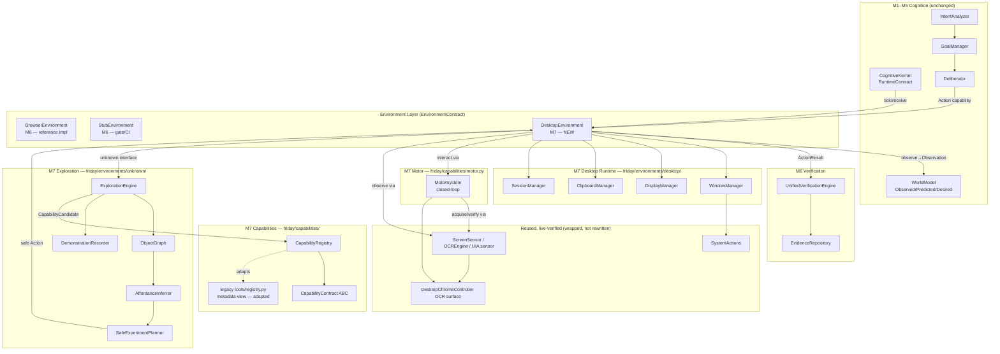
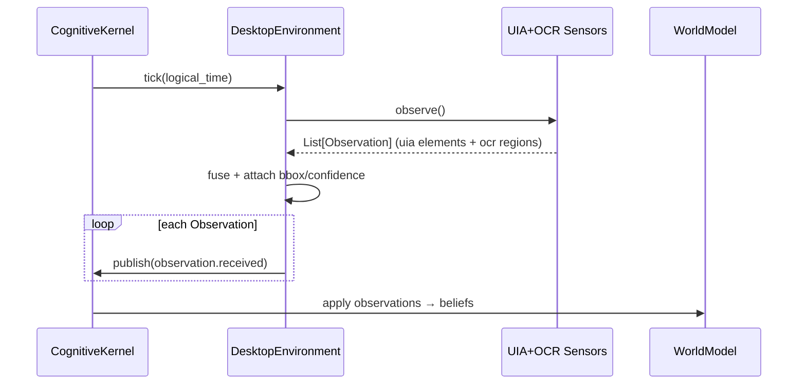
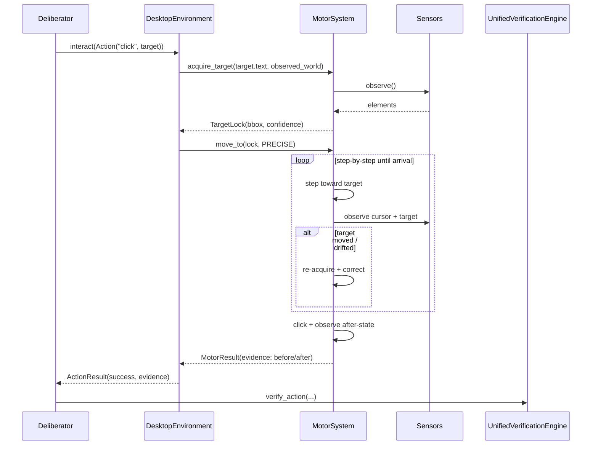
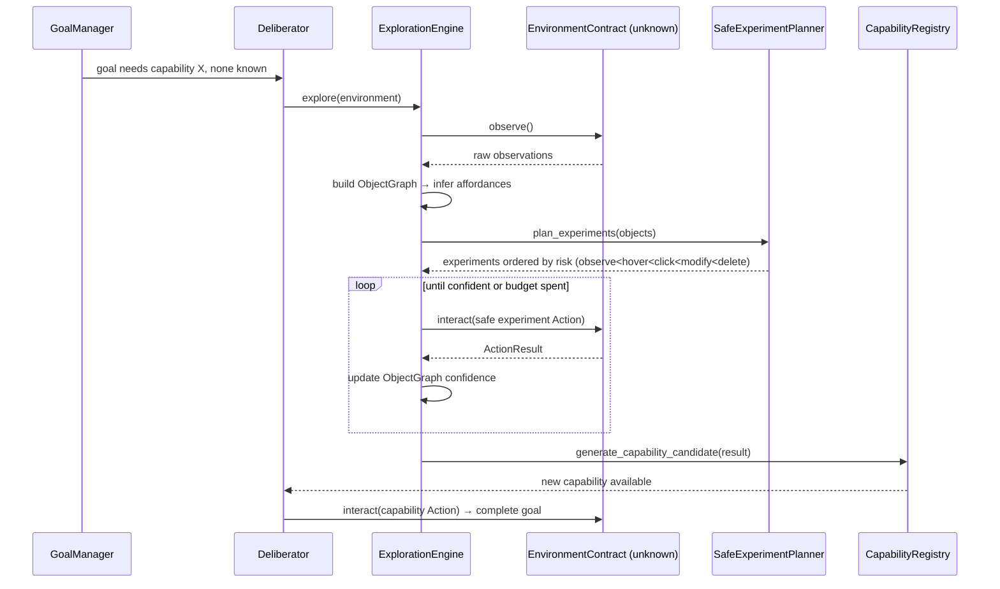

# Design Document: M7 — Desktop Runtime, Motor System, Capabilities & Exploration

## Overview

Milestone 7 is the milestone that makes FRIDAY *general*. Everything before it (M1–M6) built a
persistent cognitive substrate — a Kernel, a World Model, Goals, Deliberation, Intent, and a uniform
`EnvironmentContract` with a live `BrowserEnvironment`. But FRIDAY still could not operate arbitrary
software: the desktop was a placeholder, there was no closed-loop motor control, capabilities were a
3-method stub, and there was no way to make sense of an interface it had never seen.

M7 delivers four tightly-coupled subsystems, all built on the M1–M6 contracts and reusing the
live-verified actuators (`SystemActions`, `DesktopChromeController`'s OCR surface, the perception sensors):

1. **Desktop Runtime** (`friday/environments/desktop/`) — a real `DesktopEnvironment` that implements the
   *same* `EnvironmentContract` + `EnvironmentRuntime` as M6's `BrowserEnvironment`, backed by
   `WindowManager`, `DisplayManager`, `ClipboardManager`, and `SessionManager`, and observing via
   UIA + OCR sensors (replacing the broken `DesktopPerception`, TD-7).
2. **Motor System** (`friday/capabilities/motor.py`) — closed-loop cursor/keyboard control
   (observe→predict→move→observe→correct), never blind coordinate slamming.
3. **Capabilities** (`friday/kernel/contracts/capability.py`, `friday/capabilities/registry.py`,
   `friday/capabilities/contracts.py`) — the full `CapabilityContract` ABC, a `CapabilityRegistry` with
   wired handlers and evidence-backed confidence, superseding the metadata-only `tools/registry.py` (TD-5).
4. **Exploration Engine** (`friday/environments/unknown/`) — `ExplorationEngine`, `ObjectGraph`,
   `AffordanceInferrer`, `SafeExperimentPlanner`, `DemonstrationRecorder`. This is the heart of "general":
   it lets FRIDAY understand *any* interface through safe, risk-ordered experimentation and learn
   *principles* (not coordinates) from human demonstration.

The binding thesis constraint (Axiom 15 / FAS Ch 63): **there is zero app-specific code anywhere in M7.**
No `GmailHandler`, no hardcoded URLs, no `if app == "notepad"` branch. The `DesktopEnvironment` treats
Notepad, a bespoke line-of-business app, and software written yesterday identically — as an environment
exposing observable objects with inferable affordances. The M7 Gate proves this by running a goal on a
never-before-seen stub environment and completing it with no environment-specific logic.

This document uses Python (the project language) for all contracts and algorithms, and Mermaid for
architecture and sequence diagrams. All new modules carry `"""Ch NN — ..."""` docstrings, and all tests
run under `FRIDAY_DRY_RUN=1` with mocked `pyautogui`/`win32`/UIA so the 854 existing tests stay green.

---

## Architecture

M7 slots beneath the Kernel and Deliberation exactly like the Browser Runtime does. Nothing above the
`EnvironmentContract` boundary learns that a new environment type exists — the Kernel ticks it, the
Deliberator requests abstract capabilities, and the Verification Engine checks evidence, all unchanged.



### Layering rules (import-boundary, enforced by test)

- The Kernel and Deliberation import **only** `EnvironmentContract`, `Action`, `ObjectQuery` — never
  `friday.environments.desktop.*`, never `pyautogui`, never `win32`.
- `friday/environments/desktop/*` may import `SystemActions`, perception sensors, and `MotorSystem`.
- `MotorSystem` imports perception sensors and the reused OCR/pyautogui surface, never the Kernel.
- The Exploration Engine imports only the abstract `EnvironmentContract` + `CapabilityContract` — it must
  work against `StubEnvironment` with no knowledge of desktop vs. browser (this is what proves generality).
- No module under `friday/` (outside legacy quarantine) may contain a hardcoded site URL or app-name
  branch. `test_no_site_names_in_source` is extended repo-wide to cover all M7 modules.

---

## Sequence Diagrams

### Flow 1 — Kernel tick → Desktop observe → World Model



### Flow 2 — Deliberator requests a click → closed-loop Motor → verify



### Flow 3 — Goal on unknown software (the M7 Gate)



---

## Components and Interfaces

### Component 1: DesktopEnvironment (`friday/environments/desktop/runtime.py`)

**Purpose**: A real Windows desktop environment implementing the same `EnvironmentContract` +
`EnvironmentRuntime` as `BrowserEnvironment`. Replaces the placeholder in
`friday/environments/desktop/__init__.py` (which currently returns `[]`/failed). Observation is done via
UIA + OCR sensors; interaction is delegated to the closed-loop `MotorSystem`; lifecycle/window/display/
clipboard/session concerns are delegated to the four managers.

**Interface** (mirrors the M6 `BrowserEnvironment` exactly — same contract):

```python
class DesktopEnvironment(EnvironmentRuntime, EnvironmentContract):
    """Ch 30 — Windows desktop as a uniform environment (replaces M6 placeholder)."""

    def __init__(
        self,
        window_manager: Optional[WindowManager] = None,
        display_manager: Optional[DisplayManager] = None,
        clipboard: Optional[ClipboardManager] = None,
        session: Optional[SessionManager] = None,
        motor: Optional[MotorSystem] = None,
        sensors: Optional[List[SensorContract]] = None,
        observe_limit: int = 80,
    ) -> None: ...

    @property
    def name(self) -> str: ...            # "desktop.windows" — NEVER an app name
    def observe(self) -> List[Observation]: ...
    def interact(self, action: Action) -> ActionResult: ...
    def verify(self, expected: PredictedWorld) -> VerificationResult: ...
    def query_objects(self, query: ObjectQuery) -> List[WorldObject]: ...
    def query_capabilities(self) -> List[str]: ...
    def pause(self) -> None: ...
    def resume(self) -> None: ...
    def shutdown(self) -> None: ...
    def health(self) -> Dict[str, Any]: ...
```

**Responsibilities**:
- Fuse UIA element observations (primary, semantic) with OCR text-region observations (fallback) into a
  single ranked `List[Observation]`, each with `environment="desktop"`, an `object_type` (the UIA control
  type or `"text"` for OCR), a `bbox`, and a `confidence` (UIA=high, OCR=lower).
- Dispatch abstract `Action`s (`"click"`, `"type"`, `"scroll"`, `"press"`, `"focus_window"`, `"launch"`,
  `"read"`, `"copy"`, `"paste"`) via a dict route table (no `if/elif` chains, matching the M6 adapter),
  delegating motion to `MotorSystem` and window/clipboard verbs to the managers.
- Return `ActionResult` with populated `ActionEvidence` (before/after screen hash, `state_changed`,
  `window_changed`, `focus_changed`) — never an unverified success.
- Expose `query_capabilities()` as abstract verbs only.

### Component 2: WindowManager (`friday/environments/desktop/window_manager.py`)

**Purpose**: Enumerate, focus, resize, minimize, and restore windows. Wraps the live-verified
`SystemActions` (`launch_app`, `focus_window`, `list_windows`) and `pyautogui` window handles.

**Interface**:

```python
class WindowManager:
    """Ch 30 — window enumeration and control (wraps SystemActions + pyautogui)."""

    def __init__(self, system_actions: Optional[SystemActions] = None) -> None: ...

    def enumerate(self) -> List[WindowInfo]: ...                    # all open windows
    def active_window(self) -> Optional[WindowInfo]: ...
    def focus(self, title_substring: str) -> ActionResult: ...      # → SystemActions.focus_window
    def launch(self, app_name: str) -> ActionResult: ...            # → SystemActions.launch_app
    def resize(self, title_substring: str, w: int, h: int) -> ActionResult: ...
    def move(self, title_substring: str, x: int, y: int) -> ActionResult: ...
    def minimize(self, title_substring: str) -> ActionResult: ...
    def restore(self, title_substring: str) -> ActionResult: ...
```

**Responsibilities**: Translate window operations into `ActionResult` with `window_changed` evidence.
Never hardcodes an app name — `launch`/`focus` take the name/title from the plan at call time.
`SystemActions._APP_COMMANDS` is a *convenience alias map* (chrome→chrome), not app-specific logic; it is
retained but any unknown name falls through to the literal command (already the current behaviour).

### Component 3: DisplayManager (`friday/environments/desktop/display_manager.py`)

**Purpose**: Multi-monitor geometry, DPI, and scaling — critical so the Motor System converts between
logical target coordinates and physical pixels correctly (the same DPR class of bug the browser viewport
fix solved).

**Interface**:

```python
@dataclass(frozen=True)
class Monitor:
    index: int
    bounds: BoundingBox          # physical pixel bounds
    work_area: BoundingBox       # excludes taskbar
    dpi: int                     # e.g. 96, 120, 144
    scale: float                 # dpi / 96.0
    is_primary: bool

class DisplayManager:
    """Ch 30 — multi-monitor, DPI, and coordinate scaling."""

    def monitors(self) -> List[Monitor]: ...
    def primary(self) -> Monitor: ...
    def monitor_at(self, x: int, y: int) -> Optional[Monitor]: ...
    def to_physical(self, x: int, y: int, monitor: Optional[Monitor] = None) -> Tuple[int, int]: ...
    def to_logical(self, x: int, y: int, monitor: Optional[Monitor] = None) -> Tuple[int, int]: ...
```

**Responsibilities**: Provide a single source of truth for coordinate transforms. All Motor moves pass
through `to_physical` so a target expressed in logical coordinates lands correctly under any DPI/scale.

### Component 4: ClipboardManager (`friday/environments/desktop/clipboard.py`)

**Purpose**: Read/write the system clipboard and keep a bounded history, enabling copy/paste-based data
transfer between environments (a general, app-agnostic transport).

**Interface**:

```python
class ClipboardManager:
    """Ch 30 — clipboard read/write with bounded history."""

    def __init__(self, history_limit: int = 25) -> None: ...
    def read(self) -> Optional[str]: ...
    def write(self, text: str) -> ActionResult: ...          # records history entry
    def history(self) -> List[ClipboardEntry]: ...           # newest first, ≤ history_limit
    def clear_history(self) -> None: ...
```

**Responsibilities**: Under `FRIDAY_DRY_RUN=1` the OS clipboard is mocked with an in-memory buffer.
History is capped at `history_limit` (oldest evicted).

### Component 5: SessionManager (`friday/environments/desktop/session.py`)

**Purpose**: Observe and (carefully) affect session/power state — lock detection, idle/active, and safe
restore of the working set. This is read-mostly; state-changing verbs (lock) are high-risk and gated.

**Interface**:

```python
class PowerState(str, Enum):
    ACTIVE = "active"; IDLE = "idle"; LOCKED = "locked"; UNKNOWN = "unknown"

class SessionManager:
    """Ch 30 — session/power state observation and safe restore."""

    def power_state(self) -> PowerState: ...
    def is_locked(self) -> bool: ...
    def snapshot(self) -> SessionSnapshot: ...          # open windows + focus for later restore
    def restore(self, snapshot: SessionSnapshot) -> ActionResult: ...
    def lock(self) -> ActionResult: ...                 # HIGH-RISK — requires explicit enable flag
```

**Responsibilities**: `lock()` is destructive to the user's session and is disabled unless
`allow_session_control=True` is passed at construction; otherwise it returns `ActionResult.blocked`.

### Component 6: MotorSystem (`friday/capabilities/motor.py`)

See the dedicated **Motor System** section below.

### Component 7: CapabilityRegistry & CapabilityContract (`friday/capabilities/`)

See the dedicated **Capabilities** section below.

### Component 8: ExplorationEngine and helpers (`friday/environments/unknown/`)

See the dedicated **Exploration Engine** section below.

---

## Data Models

### Motor data models

```python
class MotionProfile(str, Enum):
    """Ch 31 — movement style trading speed vs. precision vs. safety."""
    PRECISE = "precise"   # small steps, verify each, slow settle — default for clicks
    FAST    = "fast"      # larger steps, minimal correction — for coarse repositioning
    SMOOTH  = "smooth"    # human-like eased trajectory — for demos / anti-bot contexts
    SAFE    = "safe"      # slowest, re-acquires target before every step — near risky UI

@dataclass(frozen=True)
class TargetLock:
    """Ch 31 — a resolved, re-verifiable handle on a target object."""
    target_text: str                     # semantic description used to acquire
    bbox: BoundingBox                    # last-known physical bounds
    center: Tuple[int, int]              # physical click point
    monitor_index: int
    confidence: float                    # 0..1 — acquisition confidence
    source: PerceptionSource             # UIA (preferred) or OCR/VISION
    acquired_at: float

@dataclass
class MotorStep:
    """One increment of a closed-loop move (for evidence + property testing)."""
    from_xy: Tuple[int, int]
    to_xy: Tuple[int, int]
    predicted_xy: Tuple[int, int]
    observed_xy: Tuple[int, int]
    corrected: bool
    residual: float                      # distance |observed - predicted|

@dataclass
class MotorResult:
    """Ch 31 — outcome of a closed-loop motor operation."""
    action: str                          # "move" | "click" | "type" | "scroll"
    success: bool
    final_lock: Optional[TargetLock]
    steps: List[MotorStep]
    evidence: ActionEvidence
    error: Optional[str] = None

    def to_action_result(self) -> ActionResult: ...   # bridge to the universal contract
```

**Validation rules**:
- `MotionProfile.PRECISE` and `SAFE` MUST produce `len(steps) >= 1` and monotonically non-increasing
  residuals in the absence of target motion.
- `TargetLock.confidence` and every `Belief`/capability confidence are clamped to `[0.0, 1.0]`.

### Capability data models

```python
@dataclass(frozen=True)
class Condition:
    """Ch 16 — a predicate over the ObservedWorld that must hold pre/post."""
    kind: str                  # "object_present" | "window_focused" | "text_visible" | ...
    subject: str               # semantic descriptor (never an app name)
    params: Dict[str, Any] = field(default_factory=dict)

    def holds(self, world: "ObservedWorld") -> bool: ...

@dataclass(frozen=True)
class WorldStateDelta:
    """Ch 16 — the change a capability expects to produce (Predicted minus Observed)."""
    adds: List[str] = field(default_factory=list)        # belief descriptions expected to appear
    removes: List[str] = field(default_factory=list)     # belief descriptions expected to vanish
    confidence: float = 1.0

    def as_predicted_world(self) -> PredictedWorld:
        return PredictedWorld(expected=list(self.adds), confidence=self.confidence)

@dataclass
class CompetenceRecord:
    """Ch 16 — evidence-backed success statistics for one capability."""
    attempts: int = 0
    successes: int = 0
    @property
    def confidence(self) -> float:
        # Laplace-smoothed success rate, clamped to [0,1]
        return (self.successes + 1) / (self.attempts + 2)
```

### Exploration data models

```python
class RiskLevel(int, Enum):
    """Ch 25 — the safety ladder. Lower ordinal = safer. Order is the contract."""
    OBSERVE = 0
    HOVER   = 1
    CLICK   = 2
    MODIFY  = 3
    DELETE  = 4

@dataclass
class ObjectNode:
    """Ch 66 — a node in the interface ObjectGraph."""
    id: str
    object_type: str                 # inferred: "button", "textbox", "menu", "unknown"
    label: str                       # visible text/name
    bbox: Optional[BoundingBox]
    affordances: List["Affordance"] = field(default_factory=list)
    confidence: float = 0.5          # grows as experiments confirm inferences
    source: PerceptionSource = PerceptionSource.UIA

@dataclass(frozen=True)
class Affordance:
    """Ch 66 — a possible interaction and its risk + expected effect."""
    capability: str                  # abstract verb: "click", "type", "toggle"
    risk: RiskLevel
    expected_effect: str             # human-readable prediction
    min_confidence_required: float   # gate: only attempt if capability confidence ≥ this

@dataclass
class Experiment:
    """Ch 25 — one safe probe against an object."""
    node_id: str
    action: Action
    risk: RiskLevel
    hypothesis: str
    reversible: bool

@dataclass
class ExplorationResult:
    graph: "ObjectGraph"
    experiments_run: List[Experiment]
    confidence: float                # overall understanding of the interface
    budget_spent: int
    notes: List[str] = field(default_factory=list)

@dataclass
class Principle:
    """Ch 25 — a coordinate-free description extracted from demonstration."""
    step_index: int
    capability: str                  # "click" | "type" | "scroll"
    target_descriptor: str           # "the prominent primary button in the top-right region"
    value: Optional[str] = None      # typed text pattern, if any (parameterizable)

@dataclass
class Procedure:
    """Ch 25 — an ordered, reusable, coordinate-free plan learned from a demo."""
    name: str
    principles: List[Principle]

@dataclass
class CapabilityCandidate:
    """Ch 16/66 — a proposed new capability distilled from successful exploration."""
    proposed_id: str
    affordance: Affordance
    procedure: Optional[Procedure]
    evidence_count: int
    confidence: float
```

---

## Motor System

The Motor System is **closed-loop**: it never issues a blind `pyautogui.click(x, y)`. It acquires a
re-verifiable `TargetLock`, moves in increments while comparing observed cursor position against the
predicted trajectory, corrects on drift, and re-verifies the target is still present on arrival. This is
FAS Ch 31's core distinction from open-loop RPA.

### Interface

```python
class MotorSystem:
    """Ch 31 — closed-loop motor control (observe→predict→move→observe→correct)."""

    def __init__(
        self,
        sensors: List[SensorContract],
        display: DisplayManager,
        backend: Optional[MotorBackend] = None,   # wraps pyautogui; mocked under DRY_RUN
        max_steps: int = 12,
        arrival_tolerance: int = 3,               # physical px
    ) -> None: ...

    def acquire_target(self, description: str, world: ObservedWorld) -> Optional[TargetLock]: ...
    def move_to(self, target: TargetLock, profile: MotionProfile = MotionProfile.PRECISE) -> MotorResult: ...
    def click(self, target: TargetLock, profile: MotionProfile = MotionProfile.PRECISE) -> MotorResult: ...
    def type_text(self, text: str, target: TargetLock) -> MotorResult: ...
    def scroll_to_visible(self, target: TargetLock) -> MotorResult: ...
```

### Key functions with formal specifications

#### `acquire_target(description, world) -> Optional[TargetLock]`

**Preconditions**: `description` is a non-empty semantic string; `world` is a valid `ObservedWorld`.
**Postconditions**: Returns `None` if no object matches; otherwise a `TargetLock` whose `center` lies
inside `bbox`, whose `confidence ∈ [0,1]`, and whose `source` prefers UIA over OCR/vision.
**No side effects** — acquisition is read-only (`RiskLevel.OBSERVE`).

#### `move_to(target, profile) -> MotorResult`

**Preconditions**: `target` is a `TargetLock` acquired within the current observation epoch.
**Postconditions**:
- On success, `|final_cursor - target.center| <= arrival_tolerance`.
- `result.steps` is non-empty and each step records `predicted_xy` and `observed_xy`.
- For `PRECISE`/`SAFE` with a stationary target, `residual` is non-increasing across steps (convergence).
- On arrival the target is re-observed; if it vanished, `success=False` with `error="target_lost"`.
**Loop invariant**: after step *k*, the cursor is strictly closer to the target than after step *k−1*
(distance strictly decreases) unless a correction was triggered by observed target motion.

#### Algorithmic pseudocode — the closed loop

```python
def move_to(self, target, profile=MotionProfile.PRECISE) -> MotorResult:
    assert target is not None
    params = PROFILE_PARAMS[profile]           # step_fraction, settle_ms, reacquire_each_step
    steps: List[MotorStep] = []
    cursor = self._observe_cursor()            # observe (never assume)
    lock = target

    for _ in range(self.max_steps):
        # invariant (stationary target): dist(cursor, lock.center) is non-increasing
        remaining = distance(cursor, lock.center)
        if remaining <= self.arrival_tolerance:
            break

        # predict next position: move a fraction of the remaining vector
        predicted = step_toward(cursor, lock.center, params.step_fraction)
        self._backend.move(*self._display.to_physical(*predicted))

        observed = self._observe_cursor()      # observe after moving
        residual = distance(observed, predicted)
        corrected = False

        if profile in (MotionProfile.SAFE,) or params.reacquire_each_step:
            fresh = self.acquire_target(lock.target_text, self._observe_world())
            if fresh and distance(fresh.center, lock.center) > self.arrival_tolerance:
                lock = fresh                     # target moved → correct
                corrected = True

        steps.append(MotorStep(cursor, predicted, predicted, observed, corrected, residual))
        cursor = observed

    # arrival verification: target must still be present
    final = self.acquire_target(lock.target_text, self._observe_world())
    success = final is not None and distance(cursor, lock.center) <= self.arrival_tolerance
    evidence = self._evidence_from(steps, success)
    return MotorResult("move", success, final, steps,
                       evidence, None if success else "target_lost_or_no_convergence")
```

`click`, `type_text`, and `scroll_to_visible` build on `move_to`: they move first, then perform the
terminal action, then observe the after-state and populate `ActionEvidence` (`state_changed`,
`text_appeared`, etc.). `scroll_to_visible` loops scrolling until the target enters a monitor's work area
or a scroll budget is exhausted.

---

## Capabilities

### The full CapabilityContract (`friday/kernel/contracts/capability.py`)

This replaces the current 3-method stub. Note `execute` is `async` per the handoff signature; the
`CapabilityRegistry` provides a sync bridge for the existing synchronous executor path.

```python
class CapabilityContract(ABC):
    """Ch 16 — a reusable, composable, evidence-tracked unit of competence."""

    @property
    @abstractmethod
    def id(self) -> str: ...

    @property
    @abstractmethod
    def version(self) -> str: ...

    @property
    @abstractmethod
    def confidence(self) -> float:
        """Evidence-backed competence in [0,1], updated after each run."""

    @abstractmethod
    def preconditions(self) -> List[Condition]:
        """Conditions that must hold in the ObservedWorld before execute()."""

    @abstractmethod
    def expected_outcome(self) -> WorldStateDelta:
        """The predicted change; convertible to a PredictedWorld for verification."""

    @abstractmethod
    async def execute(self, params: Dict[str, Any], world: "ObservedWorld") -> ActionResult:
        """Perform the capability. MUST return an ActionResult with evidence."""

    @abstractmethod
    def verify(self, result: ActionResult, world: "ObservedWorld") -> bool:
        """True iff the expected_outcome is satisfied by the post-execution world."""

    @abstractmethod
    def recover(self, failure: ActionResult) -> Optional["CapabilityContract"]:
        """Return an alternative capability to try, or None if unrecoverable."""

    @abstractmethod
    def update_competence(self, result: ActionResult) -> None:
        """Fold this outcome into the competence record (moves confidence)."""
```

A `BaseCapability` helper implements `confidence` and `update_competence` on top of a `CompetenceRecord`
so concrete capabilities only implement the domain-specific methods.

### CapabilityRegistry (`friday/capabilities/registry.py`)

```python
class CapabilityRegistry:
    """Ch 16 — registry of executable capabilities, queryable and confidence-ranked."""

    def register(self, capability: CapabilityContract) -> None: ...
    def unregister(self, capability_id: str) -> None: ...
    def get(self, capability_id: str) -> Optional[CapabilityContract]: ...
    def find_for(self, abstract_verb: str, min_confidence: float = 0.0
                 ) -> List[CapabilityContract]: ...     # sorted by confidence desc
    def record_outcome(self, capability_id: str, result: ActionResult) -> None: ...
    def promote_candidate(self, candidate: CapabilityCandidate) -> CapabilityContract: ...

    # --- Legacy coexistence (TD-5 migration) ---
    def import_tool_metadata(self, tool_registry: ToolRegistry) -> None:
        """Adopt the 22 metadata-only Tools as low-confidence, unwired capability
        descriptors so planning that already queries capability names keeps working."""
    def as_tool_view(self) -> Dict[str, List[str]]:
        """Expose a capability→names map shaped like ToolRegistry.list_capabilities()."""
```

### Relationship to the legacy `tools/registry.py` (TD-5)

The legacy `ToolRegistry` is **planning metadata only** — all 22 `Tool`s have `handler=None`, and real
dispatch lives in `executor.py`'s `if/elif`. M7 does not delete it in-place (854 tests and the planner
reference it); instead:

1. `CapabilityRegistry` becomes the single source of **executable** truth — capabilities have real
   wired handlers (`execute`) and evidence-backed `confidence`.
2. `import_tool_metadata()` ingests the legacy `Tool` entries as descriptors so any planner query over
   capability *names* still resolves. These start at low confidence and carry no handler until wired.
3. `as_tool_view()` provides a drop-in-shaped read model so callers using
   `ToolRegistry.list_capabilities()` can migrate by swapping the source object, not the call sites.
4. The `executor.py` `if/elif` dispatch is redirected (incrementally) to
   `CapabilityRegistry.find_for(verb)[0].execute(...)`. The legacy module remains importable during the
   transition and is scheduled for deletion once no call site references it — this is documented as the
   completion of TD-5, not attempted wholesale in one commit.

This coexistence keeps the regression oracle (854 tests) green while moving the system from
metadata-only to wired-and-measured capabilities.

---

## Exploration Engine

The Exploration Engine is what lets FRIDAY operate software it has never seen. It works **only** against
the abstract `EnvironmentContract` — it cannot tell desktop from browser from stub — which is precisely
what proves generality. It builds an `ObjectGraph`, infers `Affordance`s, plans **risk-ordered**
experiments, executes the safe ones to confirm inferences, and (optionally) distills a
`CapabilityCandidate`.

### ExplorationEngine (`friday/environments/unknown/exploration.py`)

```python
class ExplorationEngine:
    """Ch 25/66 — makes unknown software learnable via safe experimentation."""

    def __init__(
        self,
        inferrer: AffordanceInferrer,
        planner: SafeExperimentPlanner,
        registry: CapabilityRegistry,
        max_experiments: int = 20,
        confidence_target: float = 0.75,
    ) -> None: ...

    def explore(self, environment: EnvironmentContract) -> ExplorationResult: ...
    def learn_from_demonstration(self, recording: "DemonstrationRecording") -> List[Procedure]: ...
    def generate_capability_candidate(self, exploration: ExplorationResult) -> Optional[CapabilityCandidate]: ...
```

#### `explore(environment)` — algorithmic pseudocode

```python
def explore(self, environment) -> ExplorationResult:
    graph = ObjectGraph()
    for obs in environment.observe():                 # 1. observe (Axiom 3)
        graph.add_from_observation(obs)               # 2. build object graph
    for node in graph.nodes():
        node.affordances = self.inferrer.infer(node, graph)   # 3. infer affordances

    experiments = self.planner.plan(graph)            # 4. ordered by ascending risk
    run: List[Experiment] = []

    for exp in experiments:                            # 5. execute safe experiments
        if len(run) >= self.max_experiments:
            break
        # safety gate: never run an experiment whose risk exceeds what confidence allows
        if not self.planner.is_permitted(exp, graph.confidence_for(exp.node_id)):
            continue
        result = environment.interact(exp.action)
        graph.update_from_result(exp, result)         # confirm/deny inference → adjust confidence
        run.append(exp)
        if graph.overall_confidence() >= self.confidence_target:
            break

    return ExplorationResult(graph, run, graph.overall_confidence(), len(run))
```

**Preconditions**: `environment` conforms to `EnvironmentContract`.
**Postconditions**: experiments are executed in non-decreasing `RiskLevel` order; no experiment with
`risk > permitted_by(confidence)` is ever executed; `ExplorationResult.confidence ∈ [0,1]`.

### ObjectGraph (`friday/environments/unknown/object_graph.py`)

Builds a graph of `ObjectNode`s from any environment's observations, with typed edges (`contains`,
`near`, `labels`) reusing the M1 `WorldObject`/`Relationship` shapes. Provides `add_from_observation`,
`infer_types`, `confidence_for`, `update_from_result`, `overall_confidence`, and `nodes()`. Type
inference is heuristic and **generic**: e.g. a small bordered region with short text near an editable
region is likely a labelled control — no app-specific rules.

### AffordanceInferrer (`friday/environments/unknown/affordances.py`)

```python
class AffordanceInferrer:
    """Ch 66 — infer what can be done with an object, generically."""
    def infer(self, node: ObjectNode, graph: ObjectGraph) -> List[Affordance]: ...
```

Maps generic object types to candidate affordances with attached `RiskLevel` and
`min_confidence_required`: a `"button"`→`click` (risk CLICK), a `"textbox"`→`type` (risk MODIFY), an item
labelled like a destructive control→`click` (risk DELETE, high `min_confidence_required`). Risk assignment
is driven by generic signals (visible text semantics, control type), never by app identity.

### SafeExperimentPlanner (`friday/environments/unknown/experiment.py`)

```python
class SafeExperimentPlanner:
    """Ch 25 — orders experiments up the risk ladder; gates by confidence."""

    def plan(self, graph: ObjectGraph) -> List[Experiment]:
        """Return experiments sorted by ascending RiskLevel (observe<hover<click<modify<delete)."""

    def is_permitted(self, experiment: Experiment, node_confidence: float) -> bool:
        """A higher-risk experiment requires higher confidence:
           permitted iff node_confidence >= RISK_CONFIDENCE_GATE[experiment.risk]."""
```

The gate table is monotonic: `OBSERVE→0.0, HOVER→0.2, CLICK→0.5, MODIFY→0.75, DELETE→0.9`. This encodes
"high-risk actions require high confidence" and yields the risk-ladder monotonicity property below.

### DemonstrationRecorder (`friday/environments/unknown/demonstration.py`)

```python
class DemonstrationRecorder:
    """Ch 25 — watch a user, extract PRINCIPLES not coordinates."""

    def start(self) -> None: ...
    def record_event(self, raw_event: Dict[str, Any]) -> None: ...   # click/type/scroll + context
    def stop(self) -> DemonstrationRecording: ...
    def extract_principles(self, recording: "DemonstrationRecording") -> List[Principle]: ...
```

`extract_principles` converts each raw event into a coordinate-free `Principle` by describing the target
relative to the observed object graph at that moment: "clicked the prominent primary button in the
top-right region" rather than "clicked (1243, 56)". The resulting `Procedure` is replayable on a
*different* window layout, resolution, or DPI — because it re-acquires targets by description via the
Motor System at replay time.

---

## Correctness Properties

These are written as universally-quantified statements for property-based testing (library:
**Hypothesis**, matching the Python stack; strategies generate synthetic object graphs, observation
lists, target motions, and demonstration event streams under `FRIDAY_DRY_RUN=1`).

### Property 1: Contract conformance (Desktop ≡ Browser at the boundary)
∀ conformance-test *t* applied to `BrowserEnvironment`: *t* also passes for `DesktopEnvironment`.
`observe()→List[Observation]`, `interact()→ActionResult`, `verify()→VerificationResult`,
`query_objects()→List[WorldObject]`, `query_capabilities()→List[str]` all return the declared types and
never raise for any generated `Action`/`ObjectQuery`.
**Validates: Requirements 1.1, 1.2, 1.9**

### Property 2: Risk-ladder monotonicity
∀ `ExplorationResult r`: the sequence `[e.risk for e in r.experiments_run]` is non-decreasing. And
∀ executed experiment *e*: `node_confidence(e) >= RISK_CONFIDENCE_GATE[e.risk]`. No `DELETE`-risk
experiment is ever executed with confidence `< 0.9`.
**Validates: Requirements 5.2, 5.5**

### Property 3: Risk gate is monotonic in risk
∀ risk levels `a < b`: `RISK_CONFIDENCE_GATE[a] <= RISK_CONFIDENCE_GATE[b]`. (Higher risk never requires
*less* confidence.)
**Validates: Requirements 5.4**

### Property 4: Closed-loop convergence
∀ stationary `TargetLock t`, ∀ profile ∈ {PRECISE, SAFE}: in `move_to(t, profile).steps`, the residual
distance to `t.center` is non-increasing, and the final cursor satisfies
`distance(final, t.center) <= arrival_tolerance` OR `success == False` with an explicit error (never a
silent false success).
**Validates: Requirements 3.3, 3.4**

### Property 5: Closed-loop correction
∀ target that moves by δ mid-move (SAFE profile): the engine re-acquires and the final residual is within
`arrival_tolerance` whenever a fresh lock is obtainable; if not obtainable, `success == False`.
**Validates: Requirements 3.5, 3.6**

### Property 6: Site/app-agnosticism (Axiom 15)
For the repo-wide source scan: ∀ file in `friday/` (excluding legacy quarantine), the source contains no
hardcoded `http(s)://…` site URL and no app-name conditional branch. And ∀ pair of distinct
`EnvironmentContract` implementations *E₁, E₂*: `ExplorationEngine.explore(E₁)` and `.explore(E₂)` execute
the same *algorithm* (no `isinstance(env, DesktopEnvironment)` branches anywhere in exploration).
**Validates: Requirements 6.1, 6.2, 6.3**

### Property 7: Capability confidence bounds & monotonic evidence
∀ `CapabilityContract c`: `0.0 <= c.confidence <= 1.0` always. ∀ sequence of `update_competence` calls:
confidence is a pure function of `(successes, attempts)`; a success never decreases confidence and a
failure never increases it (given the Laplace-smoothed estimator).
**Validates: Requirements 4.2, 4.3, 4.4, 4.5**

### Property 8: Demonstration extracts principles, not coordinates
∀ `DemonstrationRecording d`: every `Principle` in `extract_principles(d)` has a non-empty
`target_descriptor` and contains **no** raw pixel coordinate in its descriptor. Replaying the derived
`Procedure` against a re-scaled/re-positioned object graph resolves the same semantic targets.
**Validates: Requirements 5.7, 5.8**

### Property 9: Evidence Law preserved
∀ `Action` executed by `DesktopEnvironment`: a `success` `ActionResult` has `evidence.has_evidence == True`
(a state-changing action must show before≠after or an explicit change signal). Verification still routes
through `UnifiedVerificationEngine`; M7 never loosens it.
**Validates: Requirements 1.6, 8.4**

### Property 10: Clipboard history bound
∀ sequence of `write` calls: `len(history()) <= history_limit` and entries are ordered newest-first.
**Validates: Requirements 2.6, 2.7**

### Property 11: DPI round-trip
∀ monitor *m*, ∀ logical point *(x,y)*: `to_logical(to_physical(x, y, m), m) == (x, y)` within ±1px.
**Validates: Requirements 2.3**

---

## Error Handling

### Scenario 1: Perception unavailable (no UIA, OCR engine missing)
**Condition**: sensors return `[]` (e.g. `pytesseract` not installed, UIA blocked).
**Response**: `observe()` returns `[]`; `interact()` for motion returns `ActionResult.blocked` with
`error="perception_unavailable"` and repair hints `["install_ocr", "grant_uia"]`. `health()` reports
`status="degraded"`.
**Recovery**: Deliberator can escalate to the vision fallback sensor or defer the goal.

### Scenario 2: Target lost during a move
**Condition**: the target object disappears (window closed, view scrolled) mid-`move_to`.
**Response**: `MotorResult.success=False`, `error="target_lost"`; `to_action_result` yields
`ActionStatus.NEEDS_REPAIR` with hint `re_acquire_target`.
**Recovery**: `CapabilityContract.recover()` returns an alternative (e.g. `scroll_to_visible` then retry).

### Scenario 3: Experiment would exceed permitted risk
**Condition**: planner considers a `MODIFY`/`DELETE` experiment but node confidence is below the gate.
**Response**: the experiment is skipped (never executed); noted in `ExplorationResult.notes`.
**Recovery**: run more low-risk experiments to raise confidence, or abandon that branch.

### Scenario 4: Session control requested without permission
**Condition**: `SessionManager.lock()` called with `allow_session_control=False`.
**Response**: `ActionResult.blocked(error="session_control_disabled")`. No state change.

### Scenario 5: DPI/coordinate mismatch
**Condition**: a target computed on one monitor is actioned on another.
**Response**: `MotorSystem` resolves the monitor via `DisplayManager.monitor_at` before every physical
move; mismatches are corrected by the closed loop rather than causing a wild click.

---

## Testing Strategy

### Unit testing
- Each manager (`WindowManager`, `DisplayManager`, `ClipboardManager`, `SessionManager`) tested against
  mocked `pyautogui`/`win32`/clipboard backends under `FRIDAY_DRY_RUN=1`.
- `MotorSystem` tested with a scripted `MotorBackend` and a scripted sensor so cursor motion is
  deterministic; asserts convergence, correction, arrival verification, and evidence population.
- `CapabilityContract`/`CapabilityRegistry`: registration, confidence ranking, competence updates,
  candidate promotion, and legacy `import_tool_metadata`/`as_tool_view` shape parity.

### Contract-conformance testing
- A shared, parametrized `environment_contract_suite` (introduced in M6 for `Browser`/`Stub`) is extended
  to run against `DesktopEnvironment` with mocked sensors. Property **P1** is enforced here: the desktop
  environment must be indistinguishable from browser/stub at the contract boundary.

### Import-boundary testing
- A test asserts the Kernel/Deliberation packages do not import `friday.environments.desktop.*`,
  `pyautogui`, or `win32`. A second test asserts `friday.environments.unknown.*` imports neither
  `DesktopEnvironment` nor `BrowserEnvironment` concretely (only the abstract contract) — enforcing **P6**.

### Property-based testing (Hypothesis)
- Strategies generate: synthetic `ObjectGraph`s, random experiment orderings, target motion sequences,
  confidence-update sequences, monitor/DPI configs, and demonstration event streams.
- Properties P2–P11 above are each realized as a Hypothesis test. The risk-ladder monotonicity (P2/P3),
  closed-loop convergence/correction (P4/P5), confidence bounds (P7), and principle-extraction (P8) are
  the priority properties.

### The M7 Gate — unknown-software stub environment
- Introduce `UnknownAppStubEnvironment` (test fixture, subclass of `EnvironmentContract`) that scripts a
  small novel interface FRIDAY has never seen: a few controls with generic labels and a hidden success
  state reachable only by a specific sequence.
- The gate test: give the system a goal, let `ExplorationEngine.explore()` build understanding via safe
  experiments, then complete the goal through the same contract calls — asserting the interaction path
  contains **zero** environment-specific code and the success state is reached with evidence. This
  directly encodes the handoff's M7 Gate.

### Regression & DRY_RUN discipline
- `tests/friday/conftest.py` (`FRIDAY_DRY_RUN=1`) is untouched. All 854 existing tests must remain green;
  M7 adds tests alongside, never removes the oracle. No real I/O, no real mouse movement, no real window
  manipulation occurs in CI.

---

## Performance Considerations

- Closed-loop moves add observation overhead per step. `MotionProfile` bounds this: `FAST` uses larger
  step fractions and skips per-step re-acquisition; `PRECISE`/`SAFE` trade latency for reliability.
  `max_steps` caps worst-case cost.
- `observe()` fuses UIA (cheap, structured) first and only falls back to OCR (expensive) when UIA yields
  too few elements, keeping the common path fast.
- Exploration is budgeted (`max_experiments`, `confidence_target`) so it terminates promptly on both
  simple and complex interfaces.

## Security Considerations

- **Session control is destructive**: `SessionManager.lock()` is disabled by default and gated behind an
  explicit constructor flag; `restore` only re-focuses/repositions windows it previously snapshotted.
- **Risk ladder is a safety mechanism**: `MODIFY`/`DELETE` experiments are never run without high
  confidence, preventing exploration from destroying user data while learning an interface.
- **Clipboard** may contain sensitive data; history is in-memory only, bounded, and never persisted to
  disk or logged verbatim.
- **No secrets in source**; M7 introduces no credentials and no network calls of its own.

## Dependencies

- Reused (wrapped, not rewritten): `SystemActions` (`friday/actions/system.py`),
  `DesktopChromeController` OCR surface (`friday/actions/desktop_chrome.py`), perception sensors
  (`ScreenSensor`, `OCREngine`, UIA), M6 `EnvironmentContract`/`Action`/`ObjectQuery`,
  `EnvironmentRuntime`, `UnifiedVerificationEngine`, and the M1 World Model types.
- External (all mocked under `FRIDAY_DRY_RUN=1`): `pyautogui`, `pywin32`/UIA, `pytesseract` (via existing
  `OCREngine`), a clipboard backend.
- Testing: `hypothesis` for property-based tests, `pytest` for unit/contract/gate tests.

---

## M7 Acceptance Criteria

1. **Desktop Runtime replaces the placeholder.** `DesktopEnvironment` in
   `friday/environments/desktop/` implements the full `EnvironmentContract` + `EnvironmentRuntime`,
   returns real observations from UIA+OCR sensors, and passes the shared environment-conformance suite
   identically to `BrowserEnvironment` (P1). The broken `DesktopPerception` (TD-7) is superseded.
2. **Managers exist and are wired.** `WindowManager`, `DisplayManager`, `ClipboardManager`, and
   `SessionManager` are implemented, wrap the reused actuators, and return `ActionResult`s with evidence.
   DPI round-trip holds (P11); clipboard history is bounded (P10).
3. **Motor System is closed-loop.** `MotorSystem` exposes `acquire_target`, `move_to`, `click`,
   `type_text`, `scroll_to_visible` with `MotionProfile`/`TargetLock`/`MotorResult`. Convergence (P4),
   correction (P5), and arrival verification hold; no blind coordinate clicks exist in the code path.
4. **Full CapabilityContract + Registry.** `CapabilityContract` is fleshed out with all nine members;
   `CapabilityRegistry` wires real handlers, tracks evidence-backed confidence within `[0,1]` (P7), and
   provides legacy coexistence (`import_tool_metadata`, `as_tool_view`) that keeps existing planner queries
   working — completing the migration path for TD-5.
5. **Exploration Engine works on unknown software.** `ExplorationEngine`, `ObjectGraph`,
   `AffordanceInferrer`, `SafeExperimentPlanner`, and `DemonstrationRecorder` are implemented. Experiments
   obey risk-ladder monotonicity and the monotonic confidence gate (P2/P3). Demonstrations yield
   coordinate-free principles (P8).
6. **Zero app-specific code (Axiom 15).** No hardcoded URLs or app-name branches anywhere in M7; the
   repo-wide source scan and the exploration-agnosticism test pass (P6). No `*Handler`/`*Agent`
   per-application classes are introduced.
7. **Everything is an EnvironmentContract.** The Kernel/Deliberation never import desktop modules,
   `pyautogui`, or `win32` (import-boundary tests pass). `DesktopEnvironment` is registrable and tickable
   by the Kernel exactly like `BrowserEnvironment`.
8. **Evidence Law intact.** Every successful desktop `ActionResult` carries evidence (P9); verification
   still flows through `UnifiedVerificationEngine`, only tightened, never loosened.
9. **The M7 Gate passes.** A goal is completed on a never-before-seen `UnknownAppStubEnvironment`: the
   `ExplorationEngine` understands the interface via safe experiments, then the goal is achieved through
   the uniform contract with zero environment-specific logic on the path.
10. **Green suite under DRY_RUN.** All 854 existing tests remain green; new unit/contract/property/gate
    tests run under `FRIDAY_DRY_RUN=1` with fully mocked OS surfaces. All new modules carry
    `"""Ch NN — ..."""` docstrings.
