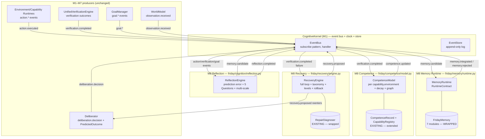
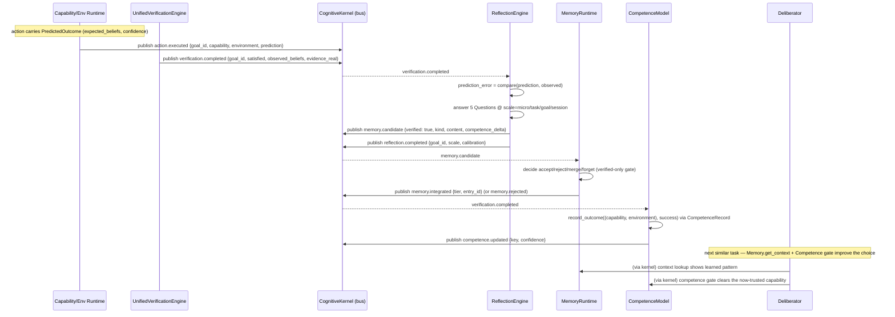

# Design Document: M8 — Reflection, Memory Wiring, Competence & Recovery

## Overview

Milestones 1–7 built and verified (871 tests passing) a persistent, event-driven cognitive
substrate: a `CognitiveKernel` owning the clock/event bus/event store, a `WorldModel` belief
store, a `GoalManager`, a `Deliberator` that emits `PredictedOutcome`s, a uniform
`EnvironmentContract`/`EnvironmentRuntime`, wired `CapabilityContract`s with evidence-backed
`CompetenceRecord`s, a `UnifiedVerificationEngine`, and an `ExplorationEngine` that makes
unknown software learnable. What FRIDAY still cannot do is *close the learning loop*: it never
compares what it predicted against what actually happened, its fully-built 7-module memory
system (`friday/memory/`) is orphaned (TD-6), competence is tracked per-capability but never
aggregated by context or decayed, and failure recovery is a single per-requirement diagnoser
(`RepairDiagnoser`) rather than the full recovery loop.

M8 delivers four kernel-event-driven subsystems that **wire, wrap, and extend** existing code —
no rewrites (binding constraint from HANDOFF Section 12/13):

1. **Reflection** (`friday/cognition/reflection.py`) — a `ReflectionEngine` that subscribes to
   action/verification/goal events, computes prediction error by comparing the M4
   `PredictedOutcome` (`expected_beliefs`, `confidence`, `reversible`) against observed reality,
   answers the FAS Ch 13.5 "5 Questions" at four scales (micro/task/goal/session, Ch 13.13),
   calibrates confidence, and emits `memory.candidate` events. **Reflection proposes; it never
   writes long-term memory directly** (Ch 13.16 / 14.8) — a hard constraint.

2. **Memory Runtime** (`friday/memory/runtime.py`) — a `MemoryRuntime` that satisfies
   `RuntimeContract` (kernel register/tick/checkpoint) and bridges the *existing* `FridayMemory`
   (`record_turn`/`record_pattern`/`remember_fact`/`get_context`/`suggest_action_strategy`) to
   the kernel. It subscribes to `memory.candidate` events and **decides** accept/reject/merge/
   forget (Ch 14). Candidates are integrated **only when they carry verified experience**
   (Ch 14.22). **Memory never overrides reality** (Ch 14.16). It supports forgetting/decay.
   The 7 memory modules are **not** rewritten.

3. **Competence** (`friday/competence/model.py` + `__init__.py`) — a `CompetenceModel` (Ch 28)
   built on the *existing* `CompetenceRecord` (Laplace-smoothed, `friday/kernel/contracts/
   capability.py`) and `CapabilityRegistry.record_outcome`. It tracks competence keyed by
   `(capability, environment)`, decays it over time (Ch 28.8), gates risky actions with
   thresholds (Ch 28.11), and maintains a competence graph. **Competence is aggregated from
   real `CompetenceRecord`s only — never an LLM guess** (Ch 28.20, the 4th law). It subscribes
   to verification outcome events.

4. **Recovery** (`friday/recovery/engine.py` + `__init__.py`) — a `RecoveryEngine` (Ch 34) that
   generalizes the *existing* `RepairDiagnoser` into the full loop (Ch 34.4): Failure → Observe →
   Classify → Collect Evidence → Generate Alternatives → Estimate Utility → Execute Recovery →
   Verify → Continue. It adds a failure taxonomy (Ch 34.3), recovery levels (Ch 34.5), and
   Action Rollback Contracts (Ch 34.9: Undo/Rollback/Compensation), where irreversible actions
   raise the confidence required to proceed. It **preserves the goal id and changes strategy**
   (Ch 34.1).

Every subsystem communicates only through kernel-published events (Ch 52) — **subsystems never
call each other directly.** This document uses Python (the project language) for all contracts
and algorithms and Mermaid for architecture and sequence diagrams. All new modules carry
`"""Ch NN — ..."""` docstrings, and all tests run under `FRIDAY_DRY_RUN=1` so the 871 existing
tests stay green.

---

## Architecture

M8 slots beneath the Kernel exactly like every other runtime and cognition subsystem. The
learning loop is a *cycle of events*: an action is executed and verified → Reflection detects
prediction error and emits a `memory.candidate` → Memory decides whether to integrate it →
Competence updates from the verified outcome → the next attempt at a similar task benefits.
Recovery reacts to failure events, preserves the goal, and proposes an alternative strategy that
re-enters deliberation. No arrows cross subsystem boundaries except through the kernel bus.



### How the learning loop flows (M8 Gate path)



### Event vocabulary (dot-namespaced, matches M1 conventions)

M8 introduces no changes to `make_event`/`Event`. It **consumes** existing events and **produces**
new ones. Producers listed as "existing" are emitted by M1–M7; M8 subscribes to them. Where an
upstream event name is not yet emitted by M6/M7 code, `MemoryRuntime`/`ReflectionEngine` tolerate
its absence (they are purely reactive), and the M8 Gate publishes the events explicitly through
the kernel so the loop is exercised deterministically.

| Event type | Direction | Producer → Consumer | Key payload fields |
|---|---|---|---|
| `deliberation.decision` | consume | Deliberator → Reflection | `goal_id`, `chosen_id`, `considered` |
| `action.executed` | consume | Env/Capability → Reflection, Recovery | `goal_id`, `capability`, `environment`, `prediction`, `reversible` |
| `verification.completed` | consume | Verification → Reflection, Competence, Recovery | `goal_id`, `capability`, `environment`, `satisfied`, `observed_beliefs`, `evidence_real` |
| `goal.created` / `goal.state_changed` | consume | GoalManager → Reflection | `goal_id`, `state` |
| `observation.received` | consume | WorldModel/Env → Reflection | `object_type`, `attributes` |
| `memory.candidate` | **produce/consume** | Reflection → Memory | `verified`, `kind`, `content`, `context_hash`, `competence_delta`, `source_goal_id` |
| `reflection.completed` | produce | Reflection → (audit) | `goal_id`, `scale`, `prediction_error`, `calibration` |
| `memory.integrated` / `memory.rejected` | produce | Memory → (audit) | `decision`, `tier`, `entry_id`, `reason` |
| `competence.updated` | produce | Competence → (audit, Deliberation) | `capability`, `environment`, `confidence`, `attempts` |
| `recovery.proposed` | produce | Recovery → Deliberation | `goal_id`, `failure_class`, `level`, `alternatives`, `required_confidence` |

---

## Components and Interfaces

### Component 1: ReflectionEngine (`friday/cognition/reflection.py`)

**Purpose**: Compare predictions to reality, extract learning, and propose memory candidates —
without ever writing memory itself.

**Responsibilities**:
- Subscribe to `action.executed`, `verification.completed`, and `goal.*` via `kernel.subscribe`.
- Compute prediction error against the M4 `PredictedOutcome`.
- Answer the 5 Questions (Ch 13.5) at four scales (Ch 13.13).
- Calibrate confidence (were high-confidence predictions actually more accurate?).
- Emit `memory.candidate` events flagged `verified` only when the triggering experience was
  verification-backed. **Never** call `FridayMemory` or any memory store directly.

**Interface**:

```python
"""Ch 13 — ReflectionEngine: compare prediction to reality, propose learning.

Reflection proposes; Memory decides (Ch 13.16 / 14.8). This engine NEVER writes
long-term memory directly — it only emits `memory.candidate` kernel events.
"""

from __future__ import annotations

from dataclasses import dataclass, field
from enum import Enum
from typing import Any, Dict, List, Optional, Tuple


class ReflectionScale(str, Enum):
    """Ch 13.13 — the four scales at which reflection happens."""

    MICRO = "micro"      # per action
    TASK = "task"        # per task (group of actions)
    GOAL = "goal"        # per goal
    SESSION = "session"  # per session


@dataclass(frozen=True)
class FiveQuestions:
    """Ch 13.5 — the five reflection questions, as booleans/scores."""

    reality_changed_as_expected: bool      # Q1 did reality change as predicted?
    progress_increased: bool               # Q2 did progress toward the goal increase?
    assumptions_wrong: bool                # Q3 were any assumptions wrong?
    new_knowledge: Tuple[str, ...]         # Q4 what new knowledge was gained?
    should_change_behavior: bool           # Q5 should behavior change next time?


@dataclass(frozen=True)
class ReflectionRecord:
    """Ch 13 — an immutable record of one reflection (audit-grade)."""

    goal_id: str
    scale: ReflectionScale
    capability: str
    environment: str
    predicted_beliefs: Tuple[str, ...]
    observed_beliefs: Tuple[str, ...]
    predicted_confidence: float
    prediction_error: float                # 0..1 — 0 = perfect prediction
    questions: FiveQuestions
    verified: bool                         # was the triggering experience verified?
    calibration_delta: float = 0.0         # signed: predicted_conf - observed_accuracy
    id: str = field(default_factory=lambda: __import__("uuid").uuid4().hex)

    def to_candidate_payload(self) -> Dict[str, Any]:
        """Project into a `memory.candidate` payload (verified-only downstream gate)."""
        ...


class ReflectionEngine:
    """Kernel-driven reflection. Subscribes to events; emits memory candidates."""

    def __init__(self, calibrator: Optional["ConfidenceCalibrator"] = None) -> None: ...

    def attach(self, kernel: Any) -> None:
        """Subscribe to action/verification/goal events (Ch 52 — kernel-driven)."""
        kernel.subscribe("verification.completed", self._on_verification)
        kernel.subscribe("action.executed", self._on_action)
        kernel.subscribe("goal.state_changed", self._on_goal_state)

    def reflect(
        self,
        *,
        goal_id: str,
        scale: ReflectionScale,
        prediction: "PredictedOutcome",
        observed_beliefs: List[str],
        verified: bool,
        capability: str = "",
        environment: str = "",
    ) -> ReflectionRecord:
        """Pure core: build a ReflectionRecord from a prediction/observation pair.

        Deterministic and side-effect free (no I/O, no memory writes) so it is
        directly unit- and property-testable under DRY_RUN.
        """
        ...

    # --- event handlers: reflect() then publish memory.candidate -----------
    def _on_verification(self, event: "Event") -> None: ...
    def _on_action(self, event: "Event") -> None: ...
    def _on_goal_state(self, event: "Event") -> None: ...

    def _emit_candidate(self, record: ReflectionRecord) -> None:
        """Publish a `memory.candidate` — the ONLY way Reflection touches memory."""
        ...


class ConfidenceCalibrator:
    """Ch 13 — tracks predicted-confidence vs observed-accuracy over time."""

    def observe(self, predicted_confidence: float, was_accurate: bool) -> None: ...

    @property
    def calibration_error(self) -> float:
        """Mean |predicted_confidence - observed_accuracy|, in [0, 1]."""
        ...
```

### Component 2: MemoryRuntime (`friday/memory/runtime.py`)

**Purpose**: Bridge the existing, orphaned `FridayMemory` to the kernel and act as the sole
decision-maker on what enters long-term memory.

**Responsibilities**:
- Implement `RuntimeContract` (name/initialize/tick/observe/receive/publish/checkpoint/restore/
  shutdown/health) so the kernel can `register_runtime` it.
- Subscribe to `memory.candidate` events (via `receive`, since `register_runtime` subscribes the
  runtime to `*`, or via an explicit `kernel.subscribe("memory.candidate", ...)`).
- Decide accept / reject / merge / forget (Ch 14). **Integrate only `verified` candidates**
  (Ch 14.22).
- Delegate all storage to `FridayMemory` (`record_turn`, `record_pattern`, `remember_fact`) —
  never re-implement the tiers.
- **Never override reality**: if a candidate contradicts a current confident observation, reject
  it (Ch 14.16). Observation/World Model outranks memory.
- Support forgetting/decay via a periodic `tick`.

**Interface**:

```python
"""Ch 14/52 — MemoryRuntime: kernel bridge for the existing FridayMemory.

Reflection proposes candidates; Memory DECIDES. Only VERIFIED experience is
integrated (Ch 14.22). Memory NEVER overrides reality (Ch 14.16). The 7 memory
modules are wrapped, never rewritten.
"""

from __future__ import annotations

from dataclasses import dataclass
from enum import Enum
from typing import Any, Dict, List, Optional

from friday.events.event import Event, make_event
from friday.kernel.contracts.runtime import RuntimeContract


class MemoryDecision(str, Enum):
    """Ch 14 — the four outcomes Memory can choose for a candidate."""

    ACCEPT = "accept"
    REJECT = "reject"
    MERGE = "merge"
    FORGET = "forget"


@dataclass(frozen=True)
class CandidateVerdict:
    """The decision Memory made about one candidate (audit-grade, pure)."""

    decision: MemoryDecision
    reason: str
    tier: str = ""          # working/episodic/procedural/semantic when accepted/merged
    entry_ref: str = ""


class MemoryRuntime(RuntimeContract):
    """Wraps FridayMemory behind the kernel RuntimeContract."""

    def __init__(
        self,
        memory: Optional["FridayMemory"] = None,
        *,
        decay_interval_ticks: int = 500,
    ) -> None:
        self._memory = memory  # constructed lazily under DRY_RUN if None
        self._kernel: Any = None
        self._decay_interval = decay_interval_ticks
        self._verdicts: List[CandidateVerdict] = []

    # --- RuntimeContract ---------------------------------------------------
    @property
    def name(self) -> str:
        return "memory"

    def initialize(self, kernel: Any) -> None:
        self._kernel = kernel
        kernel.subscribe("memory.candidate", self._on_candidate)

    def tick(self, logical_time: int) -> None:
        """Periodic forgetting/decay (Ch 14) — never touches reality."""
        ...

    def observe(self) -> List[Dict[str, Any]]:
        return []

    def receive(self, event: Event) -> None:
        """Kernel routes all events here; only memory.candidate is acted on."""
        ...

    def publish(self, event: Event) -> None:
        if self._kernel is not None:
            self._kernel.publish_event(event)

    def checkpoint(self) -> Dict[str, Any]:
        """JSON-serializable stats only (no live memory handles)."""
        ...

    def restore(self, state: Dict[str, Any]) -> None: ...
    def shutdown(self) -> None: ...
    def health(self) -> Dict[str, Any]: ...

    # --- decision core (pure, testable) ------------------------------------
    def decide(
        self,
        candidate: Dict[str, Any],
        *,
        contradicting_observation: bool = False,
    ) -> CandidateVerdict:
        """Decide accept/reject/merge/forget for one candidate.

        Hard gates (both reject):
        - candidate["verified"] is not True   → REJECT (Ch 14.22)
        - contradicting_observation is True   → REJECT (Ch 14.16, reality wins)
        Otherwise choose MERGE if a similar entry exists, else ACCEPT.
        """
        ...

    def _on_candidate(self, event: Event) -> None:
        """Decide, delegate storage to FridayMemory, publish the outcome."""
        ...

    def _integrate(self, candidate: Dict[str, Any], verdict: CandidateVerdict) -> None:
        """Route to FridayMemory.record_turn/record_pattern/remember_fact by kind."""
        ...
```

### Component 3: CompetenceModel (`friday/competence/model.py`)

**Purpose**: Aggregate evidence-backed competence per `(capability, environment)`, decay it,
gate risky actions, and expose a competence graph — all from real `CompetenceRecord`s.

**Responsibilities**:
- Subscribe to `verification.completed` and fold each verified outcome into a per-context
  `CompetenceRecord` (reusing its Laplace-smoothed `confidence`, clamped to `[0, 1]`).
- Decay competence over time when no new evidence arrives (Ch 28.8) — decay is **monotonic
  non-increasing** and never fabricates success.
- Gate risky actions: expose `is_permitted(key, risk)` with per-risk confidence thresholds
  (Ch 28.11); irreversible/risky actions require higher confidence.
- Maintain a competence graph (`(capability, environment)` nodes, edges for related contexts).
- **Never invent competence** (Ch 28.20): every number derives from recorded attempts/successes.

**Interface**:

```python
"""Ch 28 — CompetenceModel: evidence-only competence per (capability, environment).

Competence is aggregated from real CompetenceRecords (Laplace-smoothed) — NEVER
an LLM guess (Ch 28.20, the 4th law). Decays over time (Ch 28.8); gates risky
actions (Ch 28.11).
"""

from __future__ import annotations

from dataclasses import dataclass, field
from typing import Any, Dict, List, Optional, Tuple

from friday.kernel.contracts.capability import CompetenceRecord


CompetenceKey = Tuple[str, str]  # (capability, environment)


@dataclass
class CompetenceNode:
    """One node in the competence graph, backed by an evidence record."""

    key: CompetenceKey
    record: CompetenceRecord = field(default_factory=CompetenceRecord)
    last_evidence_tick: int = 0

    @property
    def confidence(self) -> float:
        """Delegates to the evidence-backed CompetenceRecord.confidence in [0, 1]."""
        return self.record.confidence


class CompetenceModel:
    """Kernel-driven competence aggregation, decay, and gating."""

    # Ch 28.11 — higher risk demands higher demonstrated competence.
    RISK_CONFIDENCE_GATE: Dict[str, float] = {
        "observe": 0.0,
        "reversible": 0.3,
        "modify": 0.6,
        "irreversible": 0.85,
    }

    def __init__(self, decay_half_life_ticks: int = 10_000) -> None:
        self._nodes: Dict[CompetenceKey, CompetenceNode] = {}
        self._decay_half_life = decay_half_life_ticks
        self._kernel: Any = None

    def attach(self, kernel: Any) -> None:
        self._kernel = kernel
        kernel.subscribe("verification.completed", self._on_verification)

    def record_outcome(
        self, key: CompetenceKey, *, success: bool, tick: int = 0
    ) -> CompetenceNode:
        """Fold a VERIFIED outcome into the (capability, environment) record.

        Evidence-only: increments attempts, and successes iff success is True.
        """
        ...

    def confidence(self, key: CompetenceKey) -> float:
        """Current evidence-derived confidence in [0, 1] (0.5 prior if unseen)."""
        ...

    def decay(self, now_tick: int) -> None:
        """Ch 28.8 — apply time decay. Monotonic non-increasing without new evidence.

        Decay reduces effective confidence toward the neutral prior; it never
        increases confidence and never adds successes.
        """
        ...

    def is_permitted(self, key: CompetenceKey, risk: str) -> bool:
        """Ch 28.11 — gate: confidence(key) >= RISK_CONFIDENCE_GATE[risk]."""
        ...

    def graph(self) -> Dict[CompetenceKey, CompetenceNode]:
        """Return the competence graph (read-only view)."""
        ...

    def _on_verification(self, event: "Event") -> None:
        """Update competence from a verification.completed event, then publish."""
        ...
```

### Component 4: RecoveryEngine (`friday/recovery/engine.py`)

**Purpose**: Turn a failure into an alternative strategy that preserves the goal, generalizing
`RepairDiagnoser` into the full Ch 34 loop with a taxonomy, recovery levels, and rollback
contracts.

**Responsibilities**:
- Subscribe to `verification.completed` (failures) and `action.executed`.
- Run the loop (Ch 34.4): Observe → Classify (taxonomy, Ch 34.3) → Collect Evidence → Generate
  Alternatives → Estimate Utility → Execute Recovery → Verify → Continue.
- Delegate diagnosis to the existing `RepairDiagnoser.diagnose` and map `RepairCause` into the
  richer `FailureClass` taxonomy and `RecoveryLevel` ladder (Ch 34.5).
- Apply Action Rollback Contracts (Ch 34.9): Undo/Rollback/Compensation; **irreversible actions
  raise the required confidence** to attempt recovery.
- **Preserve the goal id and change strategy** (Ch 34.1): recovery output references the same
  `goal_id` and proposes a *different* approach, published as `recovery.proposed` for the
  Deliberator to re-enter.

**Interface**:

```python
"""Ch 34 — RecoveryEngine: the full failure→recovery loop.

Generalizes the existing RepairDiagnoser (friday/planner/repair.py) into
Failure→Observe→Classify→Evidence→Alternatives→Utility→Execute→Verify→Continue.
Preserves goal id, changes strategy (Ch 34.1). Irreversible actions raise the
required confidence (Ch 34.9).
"""

from __future__ import annotations

from dataclasses import dataclass, field
from enum import Enum, IntEnum
from typing import Any, Dict, List, Optional

from friday.planner.repair import RepairCause, RepairDiagnoser, RepairDiagnosis


class FailureClass(str, Enum):
    """Ch 34.3 — the failure taxonomy (superset mapping RepairCause)."""

    TRANSIENT = "transient"            # retry may succeed (timeouts, flakiness)
    PRECONDITION = "precondition"      # required state absent (no sources/content)
    CAPABILITY = "capability"          # capability not competent here
    ENVIRONMENTAL = "environmental"    # environment changed/unavailable
    BLOCKED = "blocked"                # captcha/verification/human wall
    IRRECOVERABLE = "irrecoverable"    # no viable alternative
    UNKNOWN = "unknown"


class RecoveryLevel(IntEnum):
    """Ch 34.5 — escalating recovery levels (lower tried first)."""

    MICRO = 0          # retry the same action
    LOCAL = 1          # different capability, same plan step
    ENVIRONMENTAL = 2  # change environment/session
    STRATEGIC = 3      # replan the approach (new strategy, same goal)
    HUMAN = 4          # request human help
    ARCHITECTURAL = 5  # capability/architecture gap — escalate


class RollbackKind(str, Enum):
    """Ch 34.9 — Action Rollback Contract kinds."""

    UNDO = "undo"                  # exact inverse exists
    ROLLBACK = "rollback"          # restore a prior checkpoint
    COMPENSATION = "compensation"  # semantically offset (no exact inverse)
    NONE = "none"                  # irreversible — nothing can undo it


@dataclass(frozen=True)
class RecoveryAlternative:
    """One candidate recovery approach, with an estimated utility."""

    level: RecoveryLevel
    description: str
    capability: str
    estimated_utility: float
    required_confidence: float     # raised for irreversible actions (Ch 34.9)


@dataclass(frozen=True)
class RecoveryPlan:
    """Ch 34 — the recovery decision for one failure (audit-grade, pure)."""

    goal_id: str                   # PRESERVED — same goal (Ch 34.1)
    failure_class: FailureClass
    level: RecoveryLevel
    rollback: RollbackKind
    alternatives: tuple            # ordered RecoveryAlternative by utility desc
    chosen: Optional[RecoveryAlternative]
    reversible: bool
    note: str = ""

    def to_payload(self) -> Dict[str, Any]: ...


class RecoveryEngine:
    """Kernel-driven recovery built on top of RepairDiagnoser."""

    # Irreversible actions demand more confidence before we act (Ch 34.9).
    IRREVERSIBLE_CONFIDENCE_FLOOR: float = 0.85
    REVERSIBLE_CONFIDENCE_FLOOR: float = 0.3

    def __init__(self, diagnoser: Optional[RepairDiagnoser] = None) -> None:
        self._diagnoser = diagnoser or RepairDiagnoser()
        self._kernel: Any = None

    def attach(self, kernel: Any) -> None:
        self._kernel = kernel
        kernel.subscribe("verification.completed", self._on_verification)

    def recover(
        self,
        *,
        goal_id: str,
        requirement: str,
        evidence: Any,
        reversible: bool = True,
        blocked: bool = False,
        competence: float = 1.0,
    ) -> RecoveryPlan:
        """Pure core: diagnose, classify, generate alternatives, choose one.

        Preserves goal_id. Irreversible failures require competence >=
        IRREVERSIBLE_CONFIDENCE_FLOOR before an alternative is chosen; otherwise
        it escalates to a higher RecoveryLevel (e.g. HUMAN).
        """
        ...

    def _classify(self, diagnosis: RepairDiagnosis) -> FailureClass:
        """Map RepairCause → FailureClass (wrap, don't rewrite the diagnoser)."""
        ...

    def _required_confidence(self, reversible: bool) -> float: ...

    def _on_verification(self, event: "Event") -> None:
        """React to a failure event, run recover(), publish recovery.proposed."""
        ...
```

---

## Data Models

### `ReflectionRecord` (frozen)
`goal_id`, `scale`, `capability`, `environment`, `predicted_beliefs`, `observed_beliefs`,
`predicted_confidence`, `prediction_error ∈ [0,1]`, `questions: FiveQuestions`, `verified: bool`,
`calibration_delta`, `id`.
**Validation**: `0 ≤ predicted_confidence ≤ 1`; `0 ≤ prediction_error ≤ 1`; tuples are immutable;
`verified` is copied verbatim into the `memory.candidate` payload.

### `memory.candidate` payload (dict on the event bus)
`{ "verified": bool, "kind": "turn|pattern|fact", "content": str, "context_hash": str,
"competence_delta": float, "source_goal_id": str, "capability": str, "environment": str }`.
**Validation**: Memory treats a missing/false `verified` flag as REJECT.

### `CandidateVerdict` (frozen)
`decision: MemoryDecision`, `reason`, `tier`, `entry_ref`.

### `CompetenceNode`
`key: (capability, environment)`, `record: CompetenceRecord`, `last_evidence_tick`.
**Validation**: `confidence ∈ [0,1]` (guaranteed by `CompetenceRecord`); attempts/successes are
monotonic non-decreasing; decay reduces effective confidence only.

### `RecoveryPlan` (frozen)
`goal_id` (preserved), `failure_class`, `level`, `rollback`, `alternatives`, `chosen`,
`reversible`, `note`.
**Validation**: output `goal_id == input goal_id`; if `reversible is False`, the chosen
alternative's `required_confidence ≥ IRREVERSIBLE_CONFIDENCE_FLOOR` or `chosen is None` with an
escalated `level`.

---

## Correctness Properties

These properties are the specification for the M8 property-based test suite (Hypothesis). Each is
stated as a universally-quantified invariant. The `**Validates: Requirements X.Y**` lines use
placeholders to be filled in when requirements are derived from this design.

### Property 1: Reflection never writes long-term memory directly

For every reflection over any prediction/observation pair, the `ReflectionEngine` performs **no**
call into `FridayMemory` or any `MemoryStore`; the only side effect that can touch memory is a
published `memory.candidate` event. Formally: for all inputs, the set of memory-write calls made
during `reflect()`/`_on_*` is empty, and any memory mutation is preceded by a `memory.candidate`
event handled by `MemoryRuntime`.

**Validates: Requirements 1.1**

### Property 2: Memory candidates are integrated only from verified experience

For all candidates `c`, `MemoryRuntime.decide(c)` returns a decision in `{ACCEPT, MERGE}` **only
if** `c["verified"] is True`. Equivalently: `c["verified"] is not True` ⟹ decision is `REJECT`
(or `FORGET`), and no `FridayMemory.record_*`/`remember_fact` call occurs.

**Validates: Requirements 2.1**

### Property 3: Competence is in [0, 1] and evidence-derived

For every `(capability, environment)` key and any sequence of recorded outcomes,
`CompetenceModel.confidence(key) ∈ [0, 1]`, and its value equals the Laplace-smoothed
`CompetenceRecord.confidence` computed purely from `(successes, attempts)` — with no term
originating from an LLM or any non-evidence source.

**Validates: Requirements 3.1, 3.4**

### Property 4: Competence decay is monotonic non-increasing without new evidence

For any node and any two ticks `t1 ≤ t2` with **no** intervening recorded outcome,
`effective_confidence(t2) ≤ effective_confidence(t1) + ε`. Decay never increases confidence and
never adds successes.

**Validates: Requirements 3.2**

### Property 5: Recovery preserves the goal id

For all failures, `RecoveryEngine.recover(goal_id=g, ...)` returns a `RecoveryPlan` with
`plan.goal_id == g`, and the emitted `recovery.proposed` event carries the same `goal_id`. The
strategy (`chosen` alternative / `level`) may differ, but the goal id is invariant (Ch 34.1).

**Validates: Requirements 4.1**

### Property 6: Irreversible-action confidence gate is monotonic

The required confidence to attempt recovery is non-decreasing in irreversibility:
`required_confidence(reversible=False) ≥ required_confidence(reversible=True)`. For any
irreversible failure, if available competence `< IRREVERSIBLE_CONFIDENCE_FLOOR` then `chosen is
None` and `level ≥ HUMAN` (escalate rather than act). More generally, for risk levels `a ≤ b`,
`RISK_CONFIDENCE_GATE[a] ≤ RISK_CONFIDENCE_GATE[b]`.

**Validates: Requirements 3.6, 4.2, 4.3**

### Property 7: Memory never overrides a contradicting observation

For all candidates `c` presented alongside a current confident observation that contradicts `c`,
`MemoryRuntime.decide(c, contradicting_observation=True)` returns `REJECT`, regardless of
`c["verified"]`. Reality (observation / World Model) always outranks memory (Ch 14.16).

**Validates: Requirements 2.2**

### Property 8: Prediction error is a bounded, symmetric-free score

For any `PredictedOutcome` and observed belief set, `prediction_error ∈ [0, 1]`, equals `0` when
observed beliefs exactly match `expected_beliefs`, and equals `1` when there is no overlap and the
prediction was non-empty. (Grounds the 5 Questions and calibration.)

**Validates: Requirements 1.2, 1.3, 1.4**

---

## Error Handling

### Scenario 1: Malformed or partial event payload
**Condition**: An incoming event lacks `goal_id`, `prediction`, or `observed_beliefs`.
**Response**: Handlers read fields defensively (`payload.get(...)` with defaults) and skip
reflection/decision when the minimum fields are absent; they never raise into the kernel tick
loop (the kernel already isolates handler exceptions, but M8 does not rely on that).
**Recovery**: The event is ignored; a `reflection.completed`/`memory.rejected` is *not* forced.

### Scenario 2: Unverified candidate reaches Memory
**Condition**: A `memory.candidate` arrives with `verified` false/missing.
**Response**: `decide()` returns `REJECT` with reason `"unverified experience"`; no store call.
**Recovery**: `memory.rejected` is published for audit.

### Scenario 3: Candidate contradicts current reality
**Condition**: Candidate content conflicts with a confident active belief.
**Response**: `decide(contradicting_observation=True)` returns `REJECT` (`"reality outranks memory"`).
**Recovery**: `memory.rejected` published; World Model unchanged.

### Scenario 4: Irreversible action with insufficient competence
**Condition**: Failure on an irreversible action, competence `< IRREVERSIBLE_CONFIDENCE_FLOOR`.
**Response**: `RecoveryEngine` chooses no automatic alternative (`chosen is None`), escalates
`level` to `HUMAN`.
**Recovery**: `recovery.proposed` carries the escalation so the Deliberator/human can act; the
goal id is preserved.

### Scenario 5: `FridayMemory` construction/IO fails under DRY_RUN
**Condition**: Backing JSON stores unavailable.
**Response**: `MemoryRuntime` degrades to in-memory no-op storage, records the reason in
`health()`, and still publishes decisions.
**Recovery**: `health()["status"] == "degraded"`; the kernel keeps ticking.

---

## Testing Strategy

### Unit Testing Approach
- **Reflection**: `reflect()` is a pure function — table-test the 5 Questions and
  `prediction_error` for exact-match, partial-overlap, and disjoint predictions; assert
  `ReflectionRecord` immutability and that `to_candidate_payload()["verified"]` mirrors input.
- **Memory**: table-test `decide()` across the verified/unverified × contradiction matrix; assert
  `RuntimeContract` method presence and `checkpoint()`/`restore()` round-trip.
- **Competence**: fold known outcome sequences and assert `confidence` equals the Laplace formula;
  assert `is_permitted` at each risk threshold boundary.
- **Recovery**: map each `RepairCause` to its `FailureClass`; assert goal-id preservation and the
  irreversible escalation branch.

### Property-Based Testing Approach
Realize Properties 1–8 above as Hypothesis tests in `tests/friday/test_m8_properties.py`, each
carrying its `Validates: Requirements` annotation. Strategies generate belief sets, outcome
sequences (`st.lists(st.booleans())`), confidence floats, and reversible/irreversible flags.

**Property Test Library**: Hypothesis (matching M7's `test_m7_properties.py`).

### Kernel-Event Integration Testing
`tests/friday/test_m8_integration.py`: build a real `CognitiveKernel`, `register_runtime` the
`MemoryRuntime`, `attach` Reflection/Competence/Recovery, publish an `action.executed` +
`verification.completed` pair through the kernel, and assert the *event log* contains, in causal
order, `memory.candidate → memory.integrated` and `competence.updated`. No subsystem is called
directly — everything flows through `kernel.publish_event`/`subscribe`.

### Import-Boundary Testing
`tests/friday/test_m8_isolation.py` (AST-based, extending the M6/M7 pattern):
- Reflection imports neither `friday.memory.*` storage nor `friday.competence.*` nor
  `friday.recovery.*` (subsystems never call each other directly — Ch 52).
- `friday/competence/` and `friday/recovery/` do not import `friday.memory.controller`.
- No banned site/app names or hardcoded URLs in the M8 file set.
- Reflection contains no `FridayMemory`/`MemoryStore` symbol usage (enforces Property 1
  structurally).

### M8 Gate Testing
`tests/friday/test_m8_gate.py` — see the M8 Gate below.

### DRY_RUN
Every M8 test module sets `os.environ.setdefault("FRIDAY_DRY_RUN", "1")` before importing any
`friday` module, so no real filesystem/LLM/OS surface is touched and the 871 existing tests stay
green.

---

## M8 Gate

**The acceptance oracle for M8.** It proves the closed learning loop end-to-end, deterministically,
through the kernel event log only.

**Setup (DRY_RUN)**: a real `CognitiveKernel`; a `MemoryRuntime` registered via `register_runtime`;
`ReflectionEngine`, `CompetenceModel`, and `RecoveryEngine` attached via their `attach(kernel)`.

**Scenario**:
1. **Prediction mismatch** — publish `action.executed` for capability `C` in environment `E`
   carrying a `PredictedOutcome` (`expected_beliefs`, `confidence`), then publish a
   `verification.completed` whose `observed_beliefs` differ from the prediction and `satisfied`
   is false (a genuine prediction error).
2. **Reflection detects** — the `ReflectionEngine` computes `prediction_error > 0`, answers the 5
   Questions, and emits a `memory.candidate` flagged `verified: true`.
3. **Memory integrates** — the `MemoryRuntime` decides `ACCEPT`/`MERGE` (verified gate passes) and
   publishes `memory.integrated`, delegating storage to the wrapped `FridayMemory`.
4. **Competence updates** — the `CompetenceModel` folds the verified outcome for `(C, E)` and
   publishes `competence.updated`.
5. **Repeat shows measurable improvement** — publish a second, now-successful
   `action.executed`/`verification.completed` for the same `(C, E)`; assert
   `CompetenceModel.confidence((C, E))` **strictly increased** versus after step 4, and that
   `MemoryRuntime`'s wrapped `FridayMemory.get_context(...)`/`suggest_action_strategy(...)` now
   returns the learned pattern (context is non-empty where it was empty before).

**Assertions (all via the kernel event log)**:
- The event log contains, in causal order: `action.executed → verification.completed →
  memory.candidate → memory.integrated`, and `verification.completed → competence.updated`.
- Reflection emitted **exactly** the `memory.candidate` path to memory — no direct memory write
  occurred (Property 1).
- Competence after the successful repeat `>` competence after the initial failure (measurable
  improvement).
- Re-running the whole gate with the same inputs produces an **identical** ordered sequence of
  M8 event types (deterministic under `FRIDAY_DRY_RUN=1`).

---

## Security Considerations

- M8 introduces no network calls and no new secrets; it is pure cognition over the event bus.
- Memory integration is gated on `verified` experience, preventing poisoning of long-term memory
  from unverified/hallucinated candidates (Ch 14.22).
- Recovery raises the confidence bar for irreversible actions (Ch 34.9), reducing the blast radius
  of automatic recovery on destructive operations; when confidence is insufficient it escalates to
  a human rather than acting.

## Performance Considerations

- All M8 handlers are O(payload size); reflection and decision cores are pure and allocation-light.
- Competence decay runs on a periodic `tick` (or lazily on read) rather than per-event, so the hot
  path (verification → update) stays O(1) per event.
- Memory forgetting/decay is bounded by `decay_interval_ticks` to avoid per-tick scans of stores.

## Dependencies

- **Existing (wrapped/extended, not rewritten)**: `friday.events.event.make_event`/`Event`;
  `friday.kernel.kernel.CognitiveKernel` (`subscribe`, `publish_event`, `register_runtime`,
  `submit_observation`); `friday.kernel.contracts.runtime.RuntimeContract`;
  `friday.deliberation.candidate.PredictedOutcome`;
  `friday.kernel.contracts.capability.CompetenceRecord`;
  `friday.capabilities.registry.CapabilityRegistry` (`record_outcome`);
  `friday.memory.controller.FridayMemory`; `friday.planner.repair`
  (`RepairDiagnoser`/`RepairDiagnosis`/`RepairCause`);
  `friday.environments.runtime.EnvironmentRuntime` (reference subscriber pattern).
- **New packages**: `friday/cognition/reflection.py`, `friday/memory/runtime.py`,
  `friday/competence/{__init__,model}.py`, `friday/recovery/{__init__,engine}.py`.
- **Testing**: Hypothesis (property tests), pytest; all under `FRIDAY_DRY_RUN=1`.

---

## M8 Acceptance Criteria

1. **Reflection subsystem** — `friday/cognition/reflection.py` exists with a `ReflectionEngine`
   that subscribes to action/verification/goal events via `kernel.subscribe`, computes prediction
   error against `PredictedOutcome`, answers the 5 Questions at four scales, calibrates confidence,
   and emits `memory.candidate` events. It performs **no** direct long-term memory write
   (Property 1).
2. **Memory wiring** — `friday/memory/runtime.py` exists with a `MemoryRuntime` implementing
   `RuntimeContract`, registrable via `kernel.register_runtime`, that subscribes to
   `memory.candidate`, decides accept/reject/merge/forget, integrates **only** verified candidates
   (Property 2), never overrides a contradicting observation (Property 7), supports decay, and
   delegates all storage to the existing `FridayMemory` (no rewrite of the 7 modules).
3. **Competence subsystem** — `friday/competence/` exists with a `CompetenceModel` that aggregates
   `CompetenceRecord`s per `(capability, environment)` from `verification.completed` events, keeps
   confidence in `[0,1]` (Property 3), decays monotonically without new evidence (Property 4),
   gates risky actions with monotonic thresholds (Property 6), exposes a competence graph, and
   invents no competence (Ch 28.20).
4. **Recovery subsystem** — `friday/recovery/` exists with a `RecoveryEngine` wrapping
   `RepairDiagnoser`, implementing the full Ch 34.4 loop, a `FailureClass` taxonomy, `RecoveryLevel`
   ladder, and `RollbackKind` contracts, preserving the goal id (Property 5) and raising required
   confidence for irreversible actions (Property 6).
5. **Kernel-event-driven only** — no M8 subsystem imports or calls another M8 subsystem directly;
   all communication is via kernel events (enforced by `test_m8_isolation.py`).
6. **Binding constraints honored** — Reflection proposes / Memory decides; memory never overrides
   reality; competence from evidence only; candidates only from verified experience; recovery
   preserves goals; irreversible actions need higher confidence; the 7 memory modules,
   `RepairDiagnoser`, and `CompetenceRecord` are wrapped/extended, not rewritten.
7. **Module hygiene** — every new module carries a `"""Ch NN — ..."""` docstring; M8 files contain
   no hardcoded site/app names or URLs.
8. **M8 Gate passes** — the closed loop (prediction mismatch → Reflection → `memory.candidate` →
   Memory integrates → Competence updates → repeated task shows measurable improvement) is
   demonstrated entirely through the kernel event log and is deterministic under `FRIDAY_DRY_RUN=1`.
9. **Regression safety** — `python -m pytest tests/friday/ -q` remains green at ≥ 871 passing, plus
   the new M8 unit, property, isolation, integration, and gate tests.
