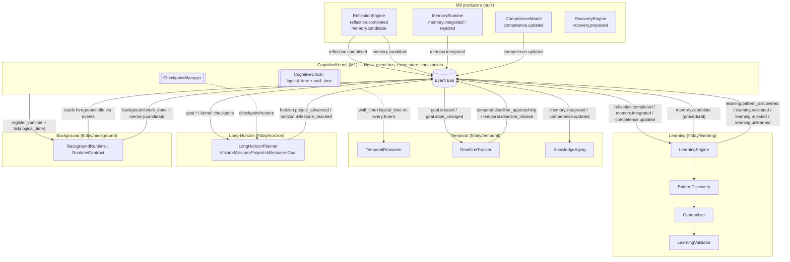

# Design Document: M9 — Learning, Temporal Reasoning, Long-Horizon Planning & Background Cognition

## Overview

Milestones 1–8 built and verified (890 tests passing) a persistent, event-driven cognitive
substrate: a `CognitiveKernel` owning the clock / event bus / event store / checkpoints, a
`WorldModel` belief store, a `GoalManager` over a `GoalGraph`, a `Deliberator` emitting
`PredictedOutcome`s, uniform `EnvironmentContract`/`RuntimeContract` runtimes, evidence-backed
`CompetenceRecord`s, a `UnifiedVerificationEngine`, and — from M8 — a closed learning-signal loop:
`ReflectionEngine` (emits `reflection.completed` + `memory.candidate`), `MemoryRuntime` (emits
`memory.integrated`/`memory.rejected`), `CompetenceModel` (emits `competence.updated`), and
`RecoveryEngine` (emits `recovery.proposed`).

What FRIDAY still cannot do is **improve durably over repeated experience, reason about time, plan
across sessions, and make progress while the user is away.** M8 produces one-shot reflections and
per-experience memory candidates; it never notices that the *same* verified experience has recurred,
never lifts a specific lesson into a reusable principle, never ages stale knowledge, never tracks a
deadline, and terminates all cognition the moment the foreground is idle. M9 closes those four gaps
with four new kernel-event-driven subsystems that **wire, wrap, and extend** existing code — never
rewriting it (binding constraint from HANDOFF Section 12/13):

1. **Learning** (`friday/learning/`) — a `LearningEngine` orchestrating `PatternDiscovery`,
   `Generalizer`, and `LearningValidator`. It consumes M8 `reflection.completed` /
   `memory.candidate` / `memory.integrated` / `competence.updated` events, discovers patterns from
   **repeated verified experience** (a single success proves nothing — Ch 15.5), generalizes a
   specific pattern into a reusable principle across contexts (Ch 15.6/15.9), and promotes a
   candidate learning to procedural memory **only after a validated pipeline shows measurable
   improvement** (Ch 15.4). It **learns only from verified experience** (Ch 15.19) and supports
   **unlearning** (retiring principles whose confidence drops). Like M8 Reflection, it **never writes
   memory directly** — it proposes procedural writes only via `memory.candidate` events.

2. **Temporal** (`friday/temporal/`) — a `TemporalReasoner`, `DeadlineTracker`, and `KnowledgeAging`
   that reason about deadlines, knowledge freshness, and staleness (Ch 9.22, Ch 49). They consume
   the **kernel clock** carried on every `Event` (`logical_time` + `wall_time`) — no new clock is
   invented. `KnowledgeAging` reuses the `CompetenceModel` decay precedent
   (`0.5 ** (elapsed / half_life)`). `DeadlineTracker` emits `temporal.deadline_approaching` /
   `temporal.deadline_missed`.

3. **Long-Horizon** (`friday/horizon/`) — a `LongHorizonPlanner` implementing the Ch 42 planning
   hierarchy (Vision → Mission → Project → Milestone → Goal), dynamic roadmaps that evolve (Ch 42.4),
   milestones as verification points (Ch 42.5), and **context persistence across sessions**
   (Ch 42.6). It reuses M3 `Goal` serialization (`Goal.to_dict`/`from_dict`) and the kernel
   `checkpoint()`/`restore()` so multi-session goals survive restarts on the durable event log.

4. **Background Cognition** (`friday/background/`) — a `BackgroundRuntime(RuntimeContract)`,
   registered with the kernel exactly like an M6/M7 environment. On `tick()` it performs
   **opportunistic** work only when the foreground is idle (Ch 43.4): memory consolidation,
   competence-decay checks, knowledge-freshness checks, and advancing suspended/waiting long-horizon
   goals. It is event-driven, not a busy-poll (Ch 43.3); the foreground always preempts and background
   yields immediately (Ch 43.5). It emits `background.work_done` and, under `FRIDAY_DRY_RUN`, does
   bounded no-op-safe work.

Every subsystem communicates **only** through kernel-published events (Ch 52) — subsystems never call
each other directly, and the learning path never imports `friday.memory.controller` or
`friday.competence` internals (it mirrors M8 Reflection's isolation). This document uses Python (the
project language) for all contracts and algorithms, plus Mermaid for architecture and sequence
diagrams. All new modules carry `"""Ch NN — ..."""` docstrings; no hardcoded app/site names or URLs
appear anywhere (Axiom 15); and all tests run under `FRIDAY_DRY_RUN=1` so the 890 existing tests stay
green.

---

## Architecture

M9 slots beneath the Kernel exactly like every M1–M8 subsystem. Learning, Temporal, and Long-Horizon
are kernel-attached cognition (they `attach(kernel)` and subscribe to events); Background is a
first-class `RuntimeContract` the kernel `register_runtime`s and ticks. Nothing in M9 is on the
foreground critical path — all four subsystems are reactive consumers of the M8 event stream and the
kernel clock.



**Isolation rule (Ch 52).** Arrows into the bus are `publish_event`; arrows out are `subscribe`.
No M9 module holds a reference to another M9 or M8 module. The `LearningEngine` proposes procedural
writes the same way `ReflectionEngine` does — by emitting `memory.candidate` — so `MemoryRuntime`
remains the single decider of what enters memory (Ch 14.8).

---

## How M9 Plugs Into M1–M8 (real signatures)

M9 depends only on already-shipped, verified surfaces. The exact signatures it builds against:

**Kernel (M1) — `friday/kernel/kernel.py`**
```python
class CognitiveKernel:
    def subscribe(self, pattern: str, handler) -> str          # fnmatch, e.g. "reflection.*"
    def publish_event(self, event: Event) -> None
    def register_runtime(self, runtime: RuntimeContract) -> None
    def checkpoint(self) -> str                                 # returns checkpoint path
    def restore(self, path: str) -> None                        # replays event log
    def health(self) -> dict                                    # {"status","tick","wall_time",...}
    def query_goals(self) -> List[dict]
```

**Event (M1) — `friday/events/event.py`** (the kernel clock M9 consumes; never invents its own)
```python
@dataclass(frozen=True)
class Event:
    id: str
    logical_time: int          # Lamport tick — the logical clock M9 reads
    wall_time: float           # time.time() at emission — the wall clock M9 reads
    event_type: str
    source: str
    payload: FrozenDict
    correlation_id: str
    parent_id: Optional[str]
    signature: str

def make_event(event_type, source, logical_time, payload=None,
               correlation_id="", parent_id=None, wall_time=None) -> Event
```

**RuntimeContract (M1) — `friday/kernel/contracts/runtime.py`** (BackgroundRuntime implements this)
```python
class RuntimeContract(ABC):
    @property
    def name(self) -> str: ...
    def initialize(self, kernel: Any) -> None: ...
    def tick(self, logical_time: int) -> None: ...
    def observe(self) -> List[Dict[str, Any]]: ...
    def receive(self, event: Event) -> None: ...
    def publish(self, event: Event) -> None: ...
    def checkpoint(self) -> Dict[str, Any]: ...
    def restore(self, state: Dict[str, Any]) -> None: ...
    def shutdown(self) -> None: ...
    def health(self) -> Dict[str, Any]: ...
```

**Goal (M3) — `friday/goals/goal.py`** (Long-Horizon reuses this serialization for survival)
```python
class Goal:
    @property
    def id(self) -> str
    @property
    def state(self) -> GoalState          # created/active/suspended/blocked/completed/failed/abandoned
    def to_dict(self) -> Dict[str, Any]
    @classmethod
    def from_dict(cls, data: Dict[str, Any]) -> "Goal"

class GoalManager:                        # friday/goals/manager.py
    def set_state(self, goal_id: str, state: GoalState, reason: Optional[str] = None) -> None
    def checkpoint(self) -> Dict[str, Any]
    def restore(self, state: Dict[str, Any]) -> None
    # publishes goal.created / goal.state_changed / goal.decomposed
```

**ReflectionEngine (M8) — `friday/cognition/reflection.py`** — M9 Learning consumes its outputs.
`reflection.completed` payload: `{goal_id, scale, prediction_error, calibration}`.
`memory.candidate` payload (from `ReflectionRecord.to_candidate_payload`):
`{verified, kind, content, context_hash, competence_delta, source_goal_id, capability, environment}`.

**CompetenceModel (M8) — `friday/competence/model.py`** — `competence.updated` payload:
`{capability, environment, confidence, attempts}`. M9 reuses its decay precedent:
```python
factor = 0.5 ** (elapsed / self._decay_half_life)
effective = NEUTRAL_PRIOR + (base - NEUTRAL_PRIOR) * factor
```

**MemoryRuntime (M8) — `friday/memory/runtime.py`** — decides M9's proposed candidates.
It accepts a candidate only when `candidate["verified"] is True` (Ch 14.22) and emits
`memory.integrated` / `memory.rejected`. `kind == "pattern"` routes to procedural memory.

**ProceduralMemory (M8-adjacent) — `friday/memory/procedural.py`** — the eventual home of validated
learnings (written by MemoryRuntime, never by M9 directly):
```python
@dataclass
class ActionPattern:
    action_type: str
    target_description: str
    context_hash: str
    steps: List[str]
    success_count: int = 1
    repair_strategy: Optional[str] = None
    tags: List[str] = field(default_factory=list)

class ProceduralMemory:
    def record_success(self, pattern: ActionPattern) -> None
    def suggest_strategy(self, action_type: str, context_hash: str) -> Optional[List[str]]
```

---

## Components and Interfaces

### Component 1: LearningEngine (`friday/learning/engine.py`)

**Purpose**: Kernel-attached orchestrator of the discover → generalize → validate pipeline. Subscribes
to M8 events, tracks measurable competence improvement, and proposes procedural-memory writes **only**
through `memory.candidate` events.

**Interface**:
```python
class LearningEngine:
    """Ch 15 — orchestrates pattern discovery, generalization, and validated promotion."""

    def __init__(
        self,
        discovery: Optional["PatternDiscovery"] = None,
        generalizer: Optional["Generalizer"] = None,
        validator: Optional["LearningValidator"] = None,
        *,
        min_repetitions: int = 3,
    ) -> None: ...

    def attach(self, kernel: Any) -> None:
        """Subscribe to reflection.completed / memory.integrated / competence.updated (Ch 52)."""

    # pure core (deterministic, side-effect free wrt return value; unit/property testable)
    def ingest(self, experience: "VerifiedExperience") -> "LearningStep":
        """Fold one verified experience through discover→generalize→validate; return the step taken.

        Learns ONLY when experience.verified is True (Ch 15.19). Returns a LearningStep describing
        whether a pattern was discovered, a principle generalized, and/or a learning validated.
        """

    def unlearn(self, principle_id: str, reason: str) -> "Principle":
        """Retire a principle whose confidence dropped below the retire threshold (Ch 15 unlearning)."""

    def improvement(self, key: "CompetenceKey") -> float:
        """Measured competence delta for a (capability, environment) since first observation."""

    # event handlers (never raise into tick loop): reflect the M8 stream into ingest()
    def _on_reflection_completed(self, event: Event) -> None: ...
    def _on_memory_integrated(self, event: Event) -> None: ...
    def _on_competence_updated(self, event: Event) -> None: ...
```

**Responsibilities**:
- Convert M8 events into `VerifiedExperience` records, dropping any where `verified` is not `True`.
- Run `PatternDiscovery` → `Generalizer` → `LearningValidator` in order.
- Emit `learning.pattern_discovered`, `learning.validated` / `learning.rejected`, `learning.unlearned`.
- On a validated learning, emit a `memory.candidate` with `kind="pattern"`, `verified=True` so
  `MemoryRuntime` writes it to procedural memory — the engine itself never touches memory.
- Track competence improvement per `(capability, environment)` from `competence.updated`.
- **Import boundary**: MUST NOT import `friday.memory.controller`, `friday.memory.runtime`,
  `friday.competence.*`, or reference `FridayMemory`/`MemoryStore`.

### Component 2: PatternDiscovery (`friday/learning/patterns.py`)

**Purpose**: Detect recurring patterns from **repeated** verified experience. A single success is
never a pattern (Ch 15.5).

**Interface**:
```python
class PatternDiscovery:
    """Ch 15.5 — patterns emerge from repetition, never a single success."""

    def __init__(self, *, min_repetitions: int = 3) -> None: ...

    def observe(self, experience: "VerifiedExperience") -> Optional["DiscoveredPattern"]:
        """Accumulate a verified experience; return a DiscoveredPattern once repetition threshold met.

        Only counts experiences with verified is True. Returns None until the same
        (capability, environment, outcome_signature) has recurred >= min_repetitions times with
        consistent outcome. The returned pattern's support == observed repetitions.
        """

    def support(self, signature: str) -> int:
        """How many verified repetitions currently back this pattern signature."""
```

**Responsibilities**:
- Bucket verified experiences by a stable `signature = (capability, environment, outcome)`.
- Emit a `DiscoveredPattern` only when `support >= min_repetitions`.
- Never count unverified experience toward support.

### Component 3: Generalizer (`friday/learning/generalization.py`)

**Purpose**: Lift a specific discovered pattern into a reusable `Principle` that transfers across
contexts (Ch 15.6/15.9 transfer learning).

**Interface**:
```python
class Generalizer:
    """Ch 15.6/15.9 — lift a specific pattern into a transferable principle."""

    def generalize(self, pattern: "DiscoveredPattern") -> "Principle":
        """Produce a context-lifted principle from a discovered pattern.

        The principle abstracts the specific (capability, environment) into a broader applicability
        scope, carrying provenance (the pattern signature + support) and an initial confidence
        derived from support. NEVER hardcodes app/site names (Axiom 15) — scope is expressed by
        capability/environment class, not literal identifiers.
        """

    def merge(self, principle: "Principle", other: "DiscoveredPattern") -> "Principle":
        """Fold additional supporting evidence from another context into an existing principle,
        widening its applicability and raising confidence."""
```

**Responsibilities**:
- Produce a `Principle` whose `applicability` is broader than the source pattern's context.
- Preserve provenance (`source_signatures`, aggregate `support`).
- Derive confidence monotonically from accumulated support (more corroboration → higher confidence).

### Component 4: LearningValidator (`friday/learning/validation.py`)

**Purpose**: The validated pipeline (Ch 15.4). A candidate learning is promoted **only after
validation demonstrates measurable improvement**; otherwise it is rejected. Never learns from
unverified experience (Ch 15.19).

**Interface**:
```python
class LearningValidator:
    """Ch 15.4/15.19 — promote a learning only after measurable, verified improvement."""

    def __init__(self, *, min_improvement: float = 0.05) -> None: ...

    def validate(
        self,
        principle: "Principle",
        *,
        baseline: float,
        observed: float,
        verified: bool,
    ) -> "ValidationResult":
        """Return VALIDATED iff verified is True AND (observed - baseline) >= min_improvement.

        Returns REJECTED when the experience is unverified (hard gate, Ch 15.19) or improvement is
        not measurable. The result carries the signed improvement delta for audit.
        """

    def should_unlearn(self, principle: "Principle", current_confidence: float) -> bool:
        """True when a previously-validated principle's confidence has decayed below retire floor."""
```

**Responsibilities**:
- Hard-gate on `verified is True` before any promotion.
- Require a measurable improvement delta `>= min_improvement`.
- Provide the unlearning predicate used by `LearningEngine.unlearn`.

### Component 5: TemporalReasoner (`friday/temporal/clock.py`)

**Purpose**: Reason about deadlines, knowledge aging, and freshness using the kernel clock carried on
events (Ch 9.22, Ch 49). Does **not** create a clock — it reads `Event.logical_time` and
`Event.wall_time`.

**Interface**:
```python
class TemporalReasoner:
    """Ch 49 — temporal reasoning over the kernel clock (logical_time + wall_time)."""

    def freshness(self, observed_at: float, now: float, *, ttl_seconds: float) -> float:
        """Freshness in [0, 1]: 1.0 at observation, decaying to 0 as it approaches/exceeds ttl."""

    def is_stale(self, observed_at: float, now: float, *, ttl_seconds: float) -> bool:
        """True once age exceeds ttl_seconds (knowledge past its freshness window)."""

    def time_remaining(self, deadline_wall: float, now: float) -> float:
        """Seconds until deadline (negative once missed)."""
```

### Component 6: DeadlineTracker (`friday/temporal/deadlines.py`)

**Purpose**: Track goal deadlines and answer "can this still finish on time?"; emit approaching/missed
events.

**Interface**:
```python
class DeadlineTracker:
    """Ch 49 — track goal deadlines; emit approaching/missed events."""

    def __init__(self, *, approach_fraction: float = 0.2) -> None: ...

    def attach(self, kernel: Any) -> None:
        """Subscribe to goal.created / goal.state_changed (reads deadline from goal constraints)."""

    def register(self, goal_id: str, deadline_wall: float, *, created_wall: float) -> None:
        """Record a deadline for a goal (deadline taken from Goal.constraints['deadline'])."""

    def evaluate(self, now_wall: float) -> List["DeadlineStatus"]:
        """Classify each tracked goal as ON_TRACK / APPROACHING / MISSED at wall time now_wall.

        APPROACHING when remaining <= approach_fraction * total_window and not yet missed.
        MISSED when now_wall > deadline_wall and the goal is not terminal.
        """

    def can_finish(self, goal_id: str, now_wall: float, *, est_seconds: float) -> bool:
        """True iff time_remaining(now) >= est_seconds (feasibility check)."""

    # emits temporal.deadline_approaching / temporal.deadline_missed via kernel
```

### Component 7: KnowledgeAging (`friday/temporal/aging.py`)

**Purpose**: Decay knowledge/belief freshness over logical + wall time and flag stale knowledge for
refresh. Reuses the `CompetenceModel` half-life decay precedent.

**Interface**:
```python
class KnowledgeAging:
    """Ch 9.22/49 — decay knowledge freshness; flag stale items for refresh.

    Reuses the CompetenceModel decay precedent: factor = 0.5 ** (elapsed / half_life).
    """

    def __init__(self, *, half_life_seconds: float = 86_400.0, stale_threshold: float = 0.25) -> None: ...

    def freshness(self, observed_at: float, now: float) -> float:
        """0.5 ** ((now - observed_at) / half_life), clamped to [0, 1]; monotnon-increasing in now."""

    def stale_items(self, items: List["AgingItem"], now: float) -> List["AgingItem"]:
        """Return items whose freshness has fallen below stale_threshold (candidates for refresh)."""
```

### Component 8: LongHorizonPlanner (`friday/horizon/planner.py`)

**Purpose**: Own the Ch 42 planning hierarchy, evolve roadmaps, treat milestones as verification
points, and persist context across sessions so multi-session goals survive restarts. Reuses M3 `Goal`
serialization + kernel checkpoint/restore.

**Interface**:
```python
class LongHorizonPlanner:
    """Ch 42 — Vision>Mission>Project>Milestone>Goal; roadmaps that survive across sessions."""

    def attach(self, kernel: Any) -> None:
        """Subscribe to goal.created / goal.state_changed / kernel.checkpoint (Ch 52)."""

    def define_project(self, project: "Project") -> str:
        """Register a Project with its milestone roadmap; returns project_id."""

    def next_actionable(self, project_id: str) -> Optional["Milestone"]:
        """The next milestone whose prerequisites are complete (drives background advancement)."""

    def advance(self, project_id: str, milestone_id: str) -> "Project":
        """Mark a milestone reached (only after its verification point passes); evolve the roadmap.
        Emits horizon.milestone_reached / horizon.project_advanced."""

    def revise_roadmap(self, project_id: str, revision: "RoadmapRevision") -> "Project":
        """Dynamic roadmap evolution (Ch 42.4) without changing the immutable Vision/goal outcome."""

    # persistence — reuses Goal.to_dict/from_dict + kernel checkpoint semantics
    def checkpoint(self) -> Dict[str, Any]:
        """JSON-serializable roadmap state (projects, milestones, goal ids)."""
    def restore(self, state: Dict[str, Any]) -> None:
        """Rehydrate roadmaps after a session boundary (Ch 42.6 — resume months later)."""
```

**Responsibilities**:
- Maintain the hierarchy; the immutable `Goal` outcome (Axiom 1) is never mutated — only roadmap
  structure and milestone/goal *state* evolve.
- Gate milestone completion on a verification point (a `verification.completed`/`goal.state_changed`
  signal), never on assertion alone (Axiom 5).
- Serialize via `Goal.to_dict` so goals survive restart on the durable event log + checkpoint.

### Component 9: BackgroundRuntime (`friday/background/runtime.py`)

**Purpose**: A `RuntimeContract` that performs opportunistic background cognition when the foreground
is idle, always yielding to foreground work.

**Interface**:
```python
class BackgroundRuntime(RuntimeContract):
    """Ch 43 — opportunistic background cognition; foreground always preempts."""

    def __init__(self, *, idle_ticks_required: int = 5, max_work_per_tick: int = 1) -> None: ...

    # RuntimeContract
    @property
    def name(self) -> str: ...                     # "background"
    def initialize(self, kernel: Any) -> None:
        """Subscribe to foreground-activity events (goal.state_changed, action.executed, etc.)."""
    def tick(self, logical_time: int) -> None:
        """If foreground idle for >= idle_ticks_required, do <= max_work_per_tick bounded units;
        otherwise yield immediately. Never raises into the tick loop (Ch 43.5)."""
    def receive(self, event: Event) -> None:
        """Any foreground-activity event resets the idle counter — immediate preemption."""
    def observe(self) -> List[Dict[str, Any]]: ...
    def publish(self, event: Event) -> None: ...
    def checkpoint(self) -> Dict[str, Any]: ...
    def restore(self, state: Dict[str, Any]) -> None: ...
    def shutdown(self) -> None: ...
    def health(self) -> Dict[str, Any]: ...

    # background work units (each bounded, each safe under DRY_RUN)
    def _consolidate_memory(self, logical_time: int) -> bool: ...     # emits memory.candidate
    def _apply_competence_decay(self, logical_time: int) -> bool: ... # emits background.work_done
    def _check_freshness(self, logical_time: int) -> bool: ...        # flags stale knowledge
    def _advance_long_horizon(self, logical_time: int) -> bool: ...   # nudges suspended goals
```

**Responsibilities**:
- Track foreground idleness via events (Ch 43.3 — event-driven, not busy-poll).
- Do bounded opportunistic work only while idle (Ch 43.4); yield the instant a foreground event
  arrives (Ch 43.5).
- Emit `background.work_done` with a description of the unit performed; propose memory writes via
  `memory.candidate` (never write memory directly).
- Under `FRIDAY_DRY_RUN`, perform bounded no-op-safe work and still emit auditable events.

---

## Event Vocabulary

M9 subscribes to M8/M3/kernel events (consumed) and publishes its own (produced). All communication is
through the kernel bus (Ch 52).

| Event type | Direction | Producer → Consumer | Key payload fields |
|---|---|---|---|
| `reflection.completed` | consumed | ReflectionEngine → LearningEngine | `goal_id, scale, prediction_error, calibration` |
| `memory.candidate` | consumed & produced | Reflection/Learning/Background → MemoryRuntime | `verified, kind, content, context_hash, competence_delta, capability, environment` |
| `memory.integrated` | consumed | MemoryRuntime → LearningEngine, KnowledgeAging | `decision, tier, reason` |
| `memory.rejected` | consumed | MemoryRuntime → LearningEngine | `reason` |
| `competence.updated` | consumed | CompetenceModel → LearningEngine, KnowledgeAging | `capability, environment, confidence, attempts` |
| `goal.created` | consumed | GoalManager → DeadlineTracker, LongHorizonPlanner | `goal_id, text` |
| `goal.state_changed` | consumed | GoalManager → DeadlineTracker, LongHorizonPlanner, BackgroundRuntime | `goal_id, state, reason` |
| `kernel.checkpoint` | consumed | Kernel → LongHorizonPlanner | `path` |
| `action.executed` | consumed | executor/env → BackgroundRuntime | `goal_id, capability, environment` |
| `learning.pattern_discovered` | produced | PatternDiscovery (via LearningEngine) | `signature, support, capability, environment` |
| `learning.validated` | produced | LearningValidator (via LearningEngine) | `principle_id, improvement, baseline, observed` |
| `learning.rejected` | produced | LearningValidator (via LearningEngine) | `principle_id, reason` |
| `learning.unlearned` | produced | LearningEngine | `principle_id, reason, confidence` |
| `temporal.deadline_approaching` | produced | DeadlineTracker | `goal_id, remaining_seconds, deadline_wall` |
| `temporal.deadline_missed` | produced | DeadlineTracker | `goal_id, overrun_seconds, deadline_wall` |
| `horizon.milestone_reached` | produced | LongHorizonPlanner | `project_id, milestone_id, verified` |
| `horizon.project_advanced` | produced | LongHorizonPlanner | `project_id, next_milestone_id` |
| `background.work_done` | produced | BackgroundRuntime | `unit, logical_time, dry_run` |

---

## Data Models

```python
# ---- Learning (friday/learning) --------------------------------------------

@dataclass(frozen=True)
class VerifiedExperience:
    """Ch 15.19 — one unit of experience the learner may consume. Only used when verified is True."""
    goal_id: str
    capability: str
    environment: str
    outcome_signature: str      # stable hash of the observed outcome (repetition key)
    prediction_error: float     # 0..1 from the M8 reflection
    verified: bool              # HARD GATE — must be True to be learned from
    competence_delta: float     # signed nudge carried from reflection
    logical_time: int
    wall_time: float

@dataclass(frozen=True)
class DiscoveredPattern:
    """A pattern backed by repeated verified experience (support >= min_repetitions)."""
    signature: str
    capability: str
    environment: str
    support: int                # count of verified repetitions (>= min_repetitions)
    mean_prediction_error: float

@dataclass(frozen=True)
class Principle:
    """A generalized, transferable learning lifted from one or more patterns (Ch 15.6/15.9)."""
    id: str
    statement: str              # human-readable, NO literal app/site names (Axiom 15)
    applicability: Tuple[str, ...]   # capability/environment classes it transfers to
    source_signatures: Tuple[str, ...]
    support: int
    confidence: float           # in [0, 1], monotonically derived from support

    def __post_init__(self) -> None:
        object.__setattr__(self, "confidence", max(0.0, min(1.0, self.confidence)))

class ValidationStatus(str, Enum):
    VALIDATED = "validated"
    REJECTED = "rejected"

@dataclass(frozen=True)
class ValidationResult:
    status: ValidationStatus
    principle_id: str
    improvement: float          # signed observed - baseline
    reason: str

@dataclass(frozen=True)
class LearningStep:
    """Audit record of one ingest(): what the pipeline did with a single experience."""
    discovered: Optional[DiscoveredPattern]
    generalized: Optional[Principle]
    validation: Optional[ValidationResult]

# ---- Temporal (friday/temporal) --------------------------------------------

class DeadlineState(str, Enum):
    ON_TRACK = "on_track"
    APPROACHING = "approaching"
    MISSED = "missed"

@dataclass(frozen=True)
class DeadlineStatus:
    goal_id: str
    state: DeadlineState
    remaining_seconds: float    # negative when missed
    deadline_wall: float

@dataclass(frozen=True)
class AgingItem:
    key: str                    # belief/knowledge id or (capability, environment) key
    observed_at: float
    freshness: float            # in [0, 1] at last evaluation

# ---- Long-Horizon (friday/horizon) -----------------------------------------

class HorizonLevel(str, Enum):
    VISION = "vision"
    MISSION = "mission"
    PROJECT = "project"
    MILESTONE = "milestone"
    GOAL = "goal"

@dataclass(frozen=True)
class Milestone:
    id: str
    text: str
    goal_ids: Tuple[str, ...]           # M3 goals whose completion (verified) reaches this milestone
    prerequisites: Tuple[str, ...]      # milestone ids that must complete first
    reached: bool = False

@dataclass(frozen=True)
class Project:
    id: str
    vision: str                          # immutable outcome (Axiom 1)
    milestones: Tuple[Milestone, ...]    # ordered roadmap (may be revised, Ch 42.4)

    def to_dict(self) -> Dict[str, Any]: ...
    @classmethod
    def from_dict(cls, data: Dict[str, Any]) -> "Project": ...

@dataclass(frozen=True)
class RoadmapRevision:
    add: Tuple[Milestone, ...] = ()
    remove: Tuple[str, ...] = ()
```

**Validation rules**:
- `Principle.confidence` and all freshness values are clamped to `[0, 1]`.
- `DiscoveredPattern.support >= min_repetitions` is an invariant of any emitted pattern.
- `VerifiedExperience.verified` must be `True` for a record to enter the learning pipeline.
- `Project.vision` is immutable across revisions; only `milestones` structure/state changes.
- Deadlines are read from `Goal.constraints["deadline"]` (wall-time epoch seconds); goals without a
  deadline are simply not tracked.

---

## Correctness Properties

These are the properties M9 must satisfy, to be exercised by property-based tests (Hypothesis) and
kernel-event integration tests under `FRIDAY_DRY_RUN=1`.

### Property 1: Learn only from verified experience
For any stream of experiences, no `learning.validated` event and no procedural `memory.candidate`
(`kind="pattern"`) is ever produced from an experience whose `verified` flag is not `True`.
Formally: `∀ e ∈ experiences: promoted(e) ⟹ e.verified is True`.
**Validates: Requirements 1.1, 1.9**

### Property 2: Patterns require repetition
`PatternDiscovery.observe` returns a `DiscoveredPattern` for a signature only after at least
`min_repetitions` verified experiences share that signature.
Formally: `∀ s: emitted_pattern(s) ⟹ support(s) >= min_repetitions`, and a single verified experience
never yields a pattern.
**Validates: Requirements 1.2, 1.3**

### Property 3: Validated before promotion
A `Principle` is promoted (emits `learning.validated` and a procedural `memory.candidate`) only when
`LearningValidator.validate` returns `VALIDATED`, which requires `verified is True` **and**
`observed - baseline >= min_improvement`. No measurable improvement ⟹ `learning.rejected`.
**Validates: Requirements 1.6, 1.7, 1.8**

### Property 4: Temporal decay is monotonic
For fixed observation time and half-life, `KnowledgeAging.freshness(observed_at, now)` is monotonically
non-increasing as `now` increases, stays within `[0, 1]`, and equals `1.0` at `now == observed_at`.
Mirrors the `CompetenceModel` `0.5 ** (elapsed / half_life)` precedent.
**Validates: Requirements 2.2**

### Property 5: Deadline detection
Given a goal with `deadline_wall` and `created_wall`, `DeadlineTracker.evaluate(now)` classifies it
`MISSED` iff `now > deadline_wall` (and the goal is non-terminal), `APPROACHING` iff
`remaining <= approach_fraction * total_window` and not missed, else `ON_TRACK`; a `MISSED`
classification always corresponds to a `temporal.deadline_missed` emission.
**Validates: Requirements 2.4, 2.5**

### Property 6: Background yields to foreground
For any interleaving of foreground-activity events and ticks, `BackgroundRuntime` performs a work unit
on a tick only if no foreground activity occurred within the preceding `idle_ticks_required` ticks;
any foreground event resets the idle counter, so background never runs concurrently with foreground
progress.
**Validates: Requirements 4.2, 4.3, 4.4, 6.3**

### Property 7: Long-horizon goal survives restart
For any project/roadmap with goals checkpointed via `LongHorizonPlanner.checkpoint` +
`GoalManager.checkpoint` and kernel `checkpoint()`, a subsequent kernel `restore()` +
`LongHorizonPlanner.restore` reproduces the identical set of goal ids, goal states, and reached
milestones. Formally: `restore(checkpoint(P)) == P` over `(goal_ids, goal_states, reached_milestones)`.
**Validates: Requirements 3.5, 3.6, 6.1**

### Property 8: Determinism
Replaying the same ordered event log through the M9 subsystems produces identical emitted events
(types, payloads modulo event id/wall_time) and identical internal state. No M9 decision depends on
wall-clock time except where wall_time is read verbatim from the triggering `Event`.
**Validates: Requirements 6.4, 6.5**

### Property 9: Unlearning retires low-confidence principles
If a validated principle's confidence decays below the retire floor, `LearningValidator.should_unlearn`
returns `True` and `LearningEngine.unlearn` emits exactly one `learning.unlearned`; the principle is no
longer proposed for procedural promotion afterward.
**Validates: Requirements 1.10**

### Property 10: Measurable improvement is real
`LearningEngine.improvement(key)` is derived only from `competence.updated` evidence (never fabricated),
is `0.0` for an unseen key, and equals the signed difference between latest and first observed
confidence for that key.
**Validates: Requirements 1.11**

---

## Error Handling

### Error Scenario 1: Malformed or partial M8 event payload
**Condition**: A consumed event lacks `goal_id`, `verified`, `capability`, or another expected field.
**Response**: Handlers read fields defensively (`payload.get(...)`), skip the event, and never raise
into the kernel tick loop (mirrors M8 `_on_*` handlers).
**Recovery**: The next well-formed event proceeds normally; no state is corrupted.

### Error Scenario 2: Unverified experience reaches the learner
**Condition**: A `memory.candidate`/`reflection.completed` carries `verified=False`.
**Response**: `PatternDiscovery` and `LearningValidator` hard-gate on `verified is True`; the
experience is dropped before affecting support or promotion.
**Recovery**: No learning is produced; the drop is auditable (no `learning.*` emission).

### Error Scenario 3: Background work raises
**Condition**: A background work unit (`_consolidate_memory`, etc.) throws.
**Response**: `tick()` wraps each unit in a guard that swallows exceptions and marks a degraded health
reason; the kernel tick loop is never interrupted (Ch 43.5 / RuntimeContract contract).
**Recovery**: Idle detection continues; the next eligible tick retries a bounded unit.

### Error Scenario 4: Deadline data missing or nonsensical
**Condition**: A goal has no `deadline` constraint, or `deadline_wall <= created_wall`.
**Response**: Goals without deadlines are not tracked; a non-positive window is treated as immediately
`MISSED` only if `now > deadline_wall`, otherwise `ON_TRACK`, never dividing by zero.
**Recovery**: `evaluate` remains total (defined for all inputs) and side-effect free.

### Error Scenario 5: Restore from a truncated/older checkpoint
**Condition**: `LongHorizonPlanner.restore` receives partial state.
**Response**: Restore defensively — unknown/missing fields default to empty roadmaps; never invent
goal ids or milestones.
**Recovery**: Missing projects are simply absent; existing durable goals still rehydrate via
`GoalManager.restore` from the event log.

---

## Testing Strategy

### Unit Testing Approach
- Pure cores tested directly: `PatternDiscovery.observe`, `Generalizer.generalize/merge`,
  `LearningValidator.validate/should_unlearn`, `TemporalReasoner.*`, `KnowledgeAging.freshness`,
  `DeadlineTracker.evaluate/can_finish`, `LongHorizonPlanner.checkpoint/restore`.
- Deterministic, side-effect-free returns → asserted with fixed inputs.
- Coverage goal: every branch of every hard gate (verified gate, repetition gate, improvement gate,
  idle gate) plus each error scenario above.

### Isolation / Import-Boundary Testing
An AST import-boundary test (mirroring M1 A5 and the M8 isolation tests) asserts that
`friday/learning/*.py` do **not** import `friday.memory.controller`, `friday.memory.runtime`,
`friday.competence.*`, and do not reference `FridayMemory`/`MemoryStore`. The only sanctioned learning
→ memory path is a `memory.candidate` emission. A matching test asserts `friday/background/runtime.py`
imports only `friday.events` / `friday.kernel.contracts` (plus stdlib) — same isolation guarantee as
M6/M7 environments.

### Property-Based Testing Approach
**Property Test Library**: Hypothesis (already used across the repo; `.hypothesis/` present).
Properties 1–10 above are encoded as Hypothesis strategies over synthetic event streams:
- generate mixed verified/unverified experiences → assert Property 1, 2, 3, 9, 10;
- generate `(observed_at, now, half_life)` triples → assert Property 4 monotonicity;
- generate `(created, deadline, now)` triples → assert Property 5 classification;
- generate interleavings of foreground events and ticks → assert Property 6 yielding;
- generate roadmaps + goal states → assert Property 7 `restore(checkpoint(P)) == P`;
- replay the same generated log twice → assert Property 8 determinism.

### Kernel-Event Integration Testing
Wire a real `CognitiveKernel` with M8 producers (`ReflectionEngine`, `MemoryRuntime`,
`CompetenceModel`) and M9 consumers attached, drive `verification.completed`/`goal.*` events, and
assert the expected `learning.*` / `temporal.*` / `horizon.*` / `background.work_done` events land on
the event log in causal order. Confirms M9 consumes only through `subscribe` and produces only through
`publish_event`.

### M9 Gate — Multi-Session Simulation
The binding gate: **"a multi-session goal advances while the user is away."** The integration test:
1. Start a kernel; define a `Project` with a multi-milestone roadmap via `LongHorizonPlanner`; submit
   the long-horizon `Goal` (state `active` → `suspended` to model the user leaving).
2. Drive verified experience so a milestone's verification point passes; `checkpoint()` the kernel
   (session boundary).
3. Construct a fresh kernel, `restore(path)`, and `LongHorizonPlanner.restore` — assert Property 7
   (goal ids/states/reached milestones identical).
4. With the foreground idle, run `BackgroundRuntime.tick()` repeatedly; assert it advances the
   suspended long-horizon goal (`horizon.project_advanced` / next milestone actionable) and emits
   `background.work_done`, all while foreground is idle.
5. Inject a foreground-activity event mid-run; assert background yields immediately (Property 6).
6. Assert the entire advancement is reconstructable deterministically from the durable event log
   (Property 8).

### Regression
All 890 existing tests must stay green; M9 tests run under `FRIDAY_DRY_RUN=1` (set by
`tests/friday/conftest.py`). No M9 module performs real I/O on import (lazy construction, mirroring
`MemoryRuntime`).

---

## Performance Considerations
- Background work is strictly bounded per tick (`max_work_per_tick`), so opportunistic cognition can
  never starve the tick loop (Ch 43.4/43.5).
- `PatternDiscovery` uses O(1) per-signature counters; discovery is amortized constant per experience.
- Temporal/aging computations are closed-form (`0.5 ** (elapsed/half_life)`), no iteration over
  history.

## Security Considerations
- No hardcoded app/site names or URLs anywhere (Axiom 15); principles express applicability by
  capability/environment class, never literal identifiers — enforced by the repo-wide no-site-names
  test.
- M9 never writes memory or competence directly; the `memory.candidate` path keeps `MemoryRuntime` the
  sole decider (defense-in-depth against unverified learning entering long-term storage).

## Dependencies
- Internal only: `friday.events` (Event/make_event), `friday.kernel.contracts.runtime`
  (RuntimeContract), and — for Long-Horizon persistence — the M3 `Goal.to_dict/from_dict` shape and
  kernel `checkpoint`/`restore`. No new third-party packages. Hypothesis (already present) for property
  tests.

---

## M9 Acceptance Criteria

- **A1 — Verified-only learning**: No `learning.validated` or procedural `memory.candidate` is ever
  emitted from an experience with `verified != True` (Property 1). Test with mixed streams.
- **A2 — Repetition required**: A single verified success never yields a `DiscoveredPattern`; a pattern
  appears only at `support >= min_repetitions` (Property 2).
- **A3 — Validated pipeline**: Promotion occurs only on measurable improvement `>= min_improvement`;
  otherwise `learning.rejected` (Property 3).
- **A4 — Unlearning**: A principle whose confidence decays below the retire floor produces exactly one
  `learning.unlearned` and is no longer promoted (Property 9).
- **A5 — Temporal decay**: `KnowledgeAging.freshness` is monotone non-increasing in `now`, in `[0,1]`,
  `1.0` at observation (Property 4).
- **A6 — Deadline events**: `evaluate` correctly classifies ON_TRACK/APPROACHING/MISSED and emits
  `temporal.deadline_approaching` / `temporal.deadline_missed` accordingly (Property 5).
- **A7 — Background yields**: Background performs work only after `idle_ticks_required` idle ticks and
  yields immediately on any foreground event; a raising work unit never breaks the tick loop
  (Property 6).
- **A8 — Goal survives restart**: `restore(checkpoint(P))` reproduces identical goal ids/states/reached
  milestones (Property 7).
- **A9 — Determinism**: Replaying the same event log yields identical M9 emissions and state
  (Property 8).
- **A10 — Isolation**: AST import-boundary tests pass — learning never imports memory/competence
  internals; background imports only events + contracts.
- **A11 — Uses kernel clock**: Temporal subsystems read `Event.logical_time`/`Event.wall_time`; no new
  clock is constructed anywhere in M9.
- **A12 — M9 Gate**: The multi-session simulation passes end-to-end — a checkpointed long-horizon goal
  resumes across a session boundary and `BackgroundRuntime` advances it while the foreground is idle,
  fully reconstructable from the durable event log.
- **A13 — Regression**: All 890 prior tests remain green under `FRIDAY_DRY_RUN=1`.
