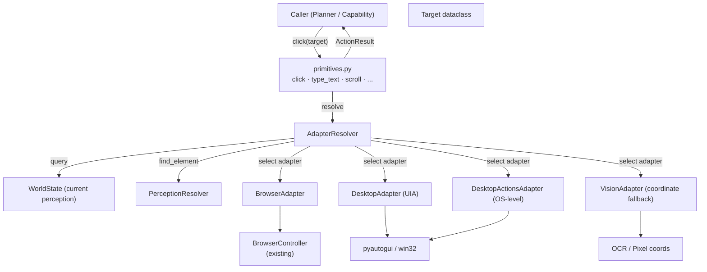
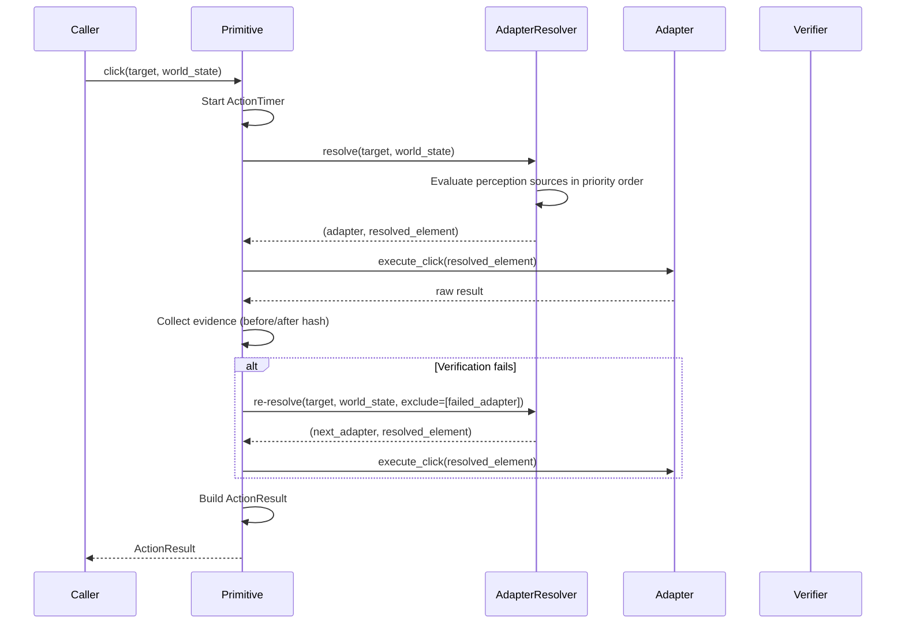

# Design Document: Universal Action Layer

## Overview

The Universal Action Layer introduces `friday/actions/primitives.py` as the single entry point for all atomic actions FRIDAY can perform. Today, clicking in a browser and clicking on the desktop are separate tools with separate call sites. The Universal Action Layer collapses them into one `click(target)` function whose environment is resolved at runtime from the current perception state.

The design follows three core principles:

1. **Semantic-first targeting** — Callers describe WHAT to act on (text, role, selector), never WHERE. The system resolves coordinates internally from the highest-fidelity perception source available.
2. **Runtime adapter resolution** — A single `AdapterResolver` picks the best environment adapter (Browser → Desktop UIA → Desktop Actions → Vision) for each invocation based on current WorldState.
3. **Contract compliance** — Every primitive returns the existing `ActionResult` with evidence, timing, and repair hints. No existing contracts are modified.

### Key Design Decisions

| Decision | Rationale |
|----------|-----------|
| Async primitives with sync wrappers | BrowserController already uses a dedicated event loop; async aligns naturally. Sync wrappers provided for callers that don't need async. |
| Adapter Protocol (not ABC) | Structural subtyping via `typing.Protocol` allows adapters to be composed without inheritance hierarchies. Easier to mock in tests. |
| Target as a dataclass, not a string | Enables rich matching (text + role + selector + coordinate fallback) without overloading a single parameter. |
| Re-routing on failure built into the primitive loop | Keeps retry/fallback logic out of callers. The primitive itself handles adapter cascade. |
| WorldState passed explicitly | Avoids hidden global state. Callers can inject stale/mock states for testing. |

---

## Architecture



### Execution Flow (Single Primitive Call)



---

## Components and Interfaces

### File Layout

```
friday/actions/
├── primitives.py              ← Public API (click, type_text, observe, verify, wait_for, etc.)
├── target.py                  ← Target dataclass
├── adapters/
│   ├── __init__.py            ← Re-exports AdapterProtocol + all adapters
│   ├── base.py                ← AdapterProtocol (typing.Protocol)
│   ├── browser.py             ← BrowserAdapter (wraps BrowserController)
│   ├── desktop.py             ← DesktopAdapter (Windows UIA via pyautogui/win32)
│   ├── desktop_actions.py     ← DesktopActionsAdapter (OS-level keystrokes/pointer)
│   ├── vision.py              ← VisionAdapter (coordinate-based OCR/pixel fallback)
│   └── resolver.py            ← AdapterResolver
└── (existing files unchanged: result.py, browser_controller.py, system.py, browser_session.py)
```

### Target Dataclass (`friday/actions/target.py`)

```python
from __future__ import annotations
from dataclasses import dataclass, field
from typing import Optional, Tuple

@dataclass(frozen=True)
class Target:
    """Semantic description of what a primitive acts on.

    Callers describe WHAT, not WHERE. The resolver uses these
    fields in priority order to find the element.
    """
    text: str = ""                          # Visible text / label
    role: str = ""                          # ARIA role or UIA control type
    selector: str = ""                      # CSS selector (browser only)
    automation_id: str = ""                 # UIA AutomationId (desktop only)
    window_title: str = ""                  # For switch_window
    coordinates: Optional[Tuple[int, int]] = None  # Absolute fallback (x, y)
    index: int = 0                          # Disambiguation: nth match

    def __post_init__(self):
        if not any([self.text, self.role, self.selector,
                    self.automation_id, self.window_title,
                    self.coordinates]):
            raise ValueError("Target must have at least one identifying field")

    @property
    def has_semantic_hint(self) -> bool:
        """Whether the target has any semantic (non-coordinate) identifier."""
        return bool(self.text or self.role or self.selector or self.automation_id)
```

### Adapter Protocol (`friday/actions/adapters/base.py`)

```python
from __future__ import annotations
from typing import Protocol, Optional, runtime_checkable
from friday.actions.result import ActionResult
from friday.actions.target import Target
from friday.perception.world_state import WorldState
from friday.perception.priority import ResolvedElement

@runtime_checkable
class AdapterProtocol(Protocol):
    """Protocol that all environment adapters must satisfy."""

    @property
    def name(self) -> str: ...

    @property
    def priority(self) -> int: ...

    def can_handle(self, target: Target, world_state: WorldState) -> bool:
        """Return True if this adapter can act on the target given current state."""
        ...

    def resolve_element(self, target: Target, world_state: WorldState) -> Optional[ResolvedElement]:
        """Attempt to locate the target element in this adapter's environment."""
        ...

    async def click(self, element: ResolvedElement) -> ActionResult: ...
    async def double_click(self, element: ResolvedElement) -> ActionResult: ...
    async def right_click(self, element: ResolvedElement) -> ActionResult: ...
    async def type_text(self, text: str, element: Optional[ResolvedElement] = None) -> ActionResult: ...
    async def press_key(self, key: str) -> ActionResult: ...
    async def press_hotkey(self, keys: list[str]) -> ActionResult: ...
    async def scroll(self, direction: str, amount: int, element: Optional[ResolvedElement] = None) -> ActionResult: ...
    async def drag(self, source: ResolvedElement, dest: ResolvedElement) -> ActionResult: ...
    async def focus_window(self, target: Target) -> ActionResult: ...
```

### BrowserAdapter (`friday/actions/adapters/browser.py`)

- **Wraps**: Existing `BrowserController` (persistent Playwright session on dedicated event loop)
- **Priority**: 100 (matches `SourcePriority.BROWSER_DOM`)
- **`can_handle`**: Returns `True` when `world_state.browser_connected` is `True` AND the target can be matched to a DOM element (via text, selector, or role)
- **Execution**: Delegates to `BrowserController.click()`, `.type_text()`, etc. via `_submit()` which posts coroutines to the dedicated event loop
- **Evidence**: Captures `before_hash` / `after_hash` from page URL + DOM snapshot hash

### DesktopAdapter (`friday/actions/adapters/desktop.py`)

- **Wraps**: `pyautogui` + `win32` APIs for UIA-based interactions
- **Priority**: 80 (matches `SourcePriority.UIA`)
- **`can_handle`**: Returns `True` when `world_state.ui_elements` contains a match for the target
- **Execution**: Uses UIA element coordinates from the resolved `UIElement.bbox.center` with `pyautogui.click()`, `pyautogui.write()`, etc.
- **Evidence**: Captures window title changes, focus changes

### DesktopActionsAdapter (`friday/actions/adapters/desktop_actions.py`)

- **Wraps**: OS-level desktop control — `pyautogui` keystrokes, pointer moves, `subprocess` for window management
- **Priority**: 60 (between UIA and OCR — used when UIA element not available but desktop control needed)
- **`can_handle`**: Returns `True` when target has `window_title` or `coordinates`, or when the target implies OS-level action (hotkeys without a specific element)
- **Use cases**: Browser dialogs (file picker, permission prompts), OS-level hotkeys (`Ctrl+S`), coordinate-based pointer actions when UIA tree is unavailable
- **Execution**: Direct `pyautogui.press()`, `pyautogui.hotkey()`, `pyautogui.click(x, y)`, `pyautogui.moveTo()`

### VisionAdapter (`friday/actions/adapters/vision.py`)

- **Wraps**: Coordinate-based actions using OCR/pixel-detected bounding boxes
- **Priority**: 30 (matches `SourcePriority.VISION`)
- **`can_handle`**: Returns `True` when OCR regions or raw coordinates are available for the target
- **Execution**: Resolves target to `OCRRegion.bbox.center` coordinates, executes via `pyautogui`
- **Fallback of last resort**: Only selected when Browser, Desktop UIA, and DesktopActions all fail

### AdapterResolver (`friday/actions/adapters/resolver.py`)

```python
from __future__ import annotations
from typing import List, Optional, Tuple
from friday.actions.target import Target
from friday.actions.adapters.base import AdapterProtocol
from friday.perception.world_state import WorldState
from friday.perception.priority import ResolvedElement

class AdapterResolver:
    """Selects the best adapter for a target based on WorldState and priority.

    Resolution order (Resolution_Preference):
      1. BrowserAdapter   (priority 100)
      2. DesktopAdapter   (priority 80)
      3. DesktopActionsAdapter (priority 60)
      4. VisionAdapter    (priority 30)

    On failure, the resolver can be asked to re-resolve excluding
    previously failed adapters.
    """

    def __init__(self, adapters: List[AdapterProtocol]) -> None:
        # Sort by priority descending
        self._adapters = sorted(adapters, key=lambda a: a.priority, reverse=True)

    def resolve(
        self,
        target: Target,
        world_state: WorldState,
        exclude: Optional[List[str]] = None,
    ) -> Optional[Tuple[AdapterProtocol, ResolvedElement]]:
        """Find the best adapter + resolved element for the target.

        Args:
            target: What to act on
            world_state: Current perception snapshot
            exclude: Adapter names to skip (for re-routing after failure)

        Returns:
            (adapter, resolved_element) or None if no adapter can handle it
        """
        excluded = set(exclude or [])
        for adapter in self._adapters:
            if adapter.name in excluded:
                continue
            if adapter.can_handle(target, world_state):
                element = adapter.resolve_element(target, world_state)
                if element is not None:
                    return (adapter, element)
        return None
```

### Primitives Module (`friday/actions/primitives.py`)

The public API. Each primitive is an async function that:
1. Accepts a `Target` (or specific parameters) and a `WorldState`
2. Starts an `ActionTimer`
3. Calls `AdapterResolver.resolve()` to pick an adapter
4. Executes via the selected adapter
5. On failure, attempts re-routing to the next adapter
6. Returns an `ActionResult` with evidence, timing, and metadata (including source used)

```python
async def click(target: Target, world_state: WorldState, *, timeout_ms: float = 10000) -> ActionResult:
    """Click a target element. Resolves environment automatically."""
    ...

async def double_click(target: Target, world_state: WorldState, *, timeout_ms: float = 10000) -> ActionResult: ...
async def right_click(target: Target, world_state: WorldState, *, timeout_ms: float = 10000) -> ActionResult: ...
async def type_text(text: str, world_state: WorldState, *, target: Optional[Target] = None, timeout_ms: float = 15000) -> ActionResult: ...
async def press_key(key: str, world_state: WorldState, *, timeout_ms: float = 5000) -> ActionResult: ...
async def press_hotkey(keys: list[str], world_state: WorldState, *, timeout_ms: float = 5000) -> ActionResult: ...
async def scroll(direction: str, amount: int, world_state: WorldState, *, target: Optional[Target] = None, timeout_ms: float = 5000) -> ActionResult: ...
async def drag(source: Target, dest: Target, world_state: WorldState, *, timeout_ms: float = 15000) -> ActionResult: ...
async def switch_window(target: Target, world_state: WorldState, *, timeout_ms: float = 10000) -> ActionResult: ...
async def observe(world_state: WorldState) -> ActionResult: ...
async def verify(condition: str, world_state: WorldState) -> ActionResult: ...
async def wait_for(condition: str, world_state: WorldState, *, timeout_ms: float = 30000, poll_interval_ms: float = 500) -> ActionResult: ...
```

### Primitive Execution Pattern (Internal)

```python
async def _execute_with_fallback(
    action_name: str,
    target: Target,
    world_state: WorldState,
    execute_fn: Callable[[AdapterProtocol, ResolvedElement], Awaitable[ActionResult]],
    timeout_ms: float,
) -> ActionResult:
    """Common execution pattern for all state-changing primitives."""
    timer = ActionTimer()
    timer.__enter__()
    excluded: List[str] = []

    while True:
        # Check timeout
        elapsed = (time.perf_counter() - timer._perf_start) * 1000
        if elapsed >= timeout_ms:
            timer.__exit__(None, None, None)
            return ActionResult.timeout(action=action_name, target=target.text, duration_ms=elapsed)

        # Resolve adapter
        resolution = resolver.resolve(target, world_state, exclude=excluded)
        if resolution is None:
            timer.__exit__(None, None, None)
            return ActionResult.failed(
                action=action_name,
                target=target.text,
                error=f"No adapter can handle target: {target.text}",
                repair_hints=[f"attempted_adapters: {excluded}", "re_observe", "relocate_target"],
            )

        adapter, element = resolution
        result = await execute_fn(adapter, element)

        if result.is_success:
            timer.__exit__(None, None, None)
            result.started_at = timer.started_at
            result.duration_ms = timer.duration_ms
            result.metadata["source"] = element.source.value
            result.metadata["adapter"] = adapter.name
            return result

        # Failed — try next adapter
        excluded.append(adapter.name)
```

---

## Data Models

### Target Fields and Resolution

| Field | Used By | Resolution Mechanism |
|-------|---------|---------------------|
| `text` | All adapters | `WorldState.find_browser_element(text)`, `find_ui_element(text)`, `find_ocr_text(text)` |
| `role` | Browser, Desktop | Matched against `BrowserElement.role` or `UIElement.control_type` |
| `selector` | Browser only | Direct CSS selector via Playwright |
| `automation_id` | Desktop only | Matched against `UIElement.automation_id` |
| `window_title` | Desktop, DesktopActions | Matched against `WindowInfo.title` |
| `coordinates` | Vision, DesktopActions | Direct pixel coordinates (last resort) |
| `index` | All | Disambiguates when multiple matches exist |

### ActionResult Metadata Extensions

The Universal Action Layer adds the following keys to `ActionResult.metadata` (no contract changes needed since `metadata` is `Dict[str, Any]`):

| Key | Type | Description |
|-----|------|-------------|
| `"source"` | `str` | Perception source used (e.g., `"browser"`, `"uia"`, `"ocr"`) |
| `"adapter"` | `str` | Adapter name that executed the action |
| `"adapters_attempted"` | `list[str]` | All adapters tried (on re-routing) |
| `"resolution_confidence"` | `float` | Confidence of the element match (0–1) |

### Adapter Priority Mapping

| Adapter | Priority | Perception Source | SourcePriority |
|---------|----------|-------------------|----------------|
| BrowserAdapter | 100 | `PerceptionSource.BROWSER` | `BROWSER_DOM = 100` |
| DesktopAdapter | 80 | `PerceptionSource.UIA` | `UIA = 80` |
| DesktopActionsAdapter | 60 | `PerceptionSource.UIA` / coordinates | Between UIA and OCR |
| VisionAdapter | 30 | `PerceptionSource.OCR` / `SCREEN` | `VISION = 30` |

---


## Correctness Properties

*A property is a characteristic or behavior that should hold true across all valid executions of a system — essentially, a formal statement about what the system should do. Properties serve as the bridge between human-readable specifications and machine-verifiable correctness guarantees.*

### Property 1: Priority Resolution

*For any* Target and WorldState where more than one adapter can handle the target, the AdapterResolver SHALL always select the adapter with the highest priority value among those that can handle it.

**Validates: Requirements 1.3, 2.1, 2.2, 3.1, 3.2**

### Property 2: All Adapters Remain Candidates

*For any* WorldState (browser-only, desktop-only, mixed, or empty), every registered adapter SHALL remain in the resolver's candidate list and be eligible for selection — no adapter is ever pruned based on the current environment.

**Validates: Requirements 2.3**

### Property 3: Fallback to Lower-Priority Adapter

*For any* Target that cannot be resolved by the highest-priority adapter but CAN be resolved by a lower-priority adapter, the resolver SHALL select that lower-priority adapter rather than returning failure.

**Validates: Requirements 2.4, 4.3, 4.4**

### Property 4: Exhaustion Produces FAILED with Attempted Adapters

*For any* Target that no adapter can resolve (given the current WorldState), the primitive SHALL return an ActionResult with status FAILED and repair hints that list all adapters that were attempted.

**Validates: Requirements 2.5, 4.5, 9.6**

### Property 5: Semantic-First Execution

*For any* Target that resolves to a semantic source (Browser DOM or UIA), the resolved element passed to the adapter SHALL have `is_semantic == True`, and the execution SHALL use element data (selector, automation_id, text) rather than raw screen coordinates.

**Validates: Requirements 3.3**

### Property 6: Source Recorded in Metadata

*For any* primitive invocation that completes (success or failure after resolution), the ActionResult.metadata SHALL contain a `"source"` key whose value matches the PerceptionSource of the resolved element.

**Validates: Requirements 3.5**

### Property 7: Re-Routing on Adapter Failure

*For any* primitive invocation where the first-choice adapter returns FAILED, the system SHALL re-invoke resolution with that adapter excluded, and if another adapter can handle the target, it SHALL be selected and execution SHALL proceed through it.

**Validates: Requirements 4.1, 4.2**

### Property 8: ActionResult Contract Invariant

*For any* primitive invocation (regardless of outcome), the return value SHALL be an instance of ActionResult with a valid ActionStatus, and the `action_type` field SHALL be non-empty.

**Validates: Requirements 5.1, 13.1**

### Property 9: Success Implies Evidence

*For any* state-changing primitive (click, type_text, scroll, drag, press_key, press_hotkey, switch_window) that returns status SUCCESS, the ActionResult.evidence.has_evidence SHALL be True.

**Validates: Requirements 5.2**

### Property 10: Failure Implies Error Category and Repair Hints

*For any* primitive that returns status FAILED, the ActionResult SHALL have a non-None error_category AND at least one entry in repair_hints.

**Validates: Requirements 5.3**

### Property 11: Timing Fields Populated

*For any* primitive invocation, the ActionResult SHALL have `started_at > 0` and `duration_ms >= 0`.

**Validates: Requirements 5.4**

### Property 12: Timeout Biconditional

*For any* primitive invocation, the ActionResult status SHALL be TIMEOUT if and only if the execution duration exceeds the configured timeout_ms. Conversely, if execution completes within timeout_ms, the status SHALL NOT be TIMEOUT.

**Validates: Requirements 5.5, 5.6, 8.4**

### Property 13: Verify Condition Evaluation

*For any* condition string and WorldState, the `verify` primitive SHALL return SUCCESS if and only if the condition is satisfied in that WorldState, and FAILED with a reason otherwise.

**Validates: Requirements 7.2, 7.3**

### Property 14: Wait Polling Terminates Correctly

*For any* condition and timeout, `wait_for` SHALL return SUCCESS if the condition becomes true before the timeout elapses, and TIMEOUT if it does not. After returning, no further polling SHALL occur.

**Validates: Requirements 8.1, 8.2, 8.3, 8.4**

### Property 15: Pointer Dispatch Correctness

*For any* resolvable Target and WorldState, invoking `click` SHALL dispatch exactly one `click` call to the adapter, `double_click` SHALL dispatch `double_click`, `right_click` SHALL dispatch `right_click`, `scroll` SHALL dispatch `scroll` with the correct direction and amount, and `drag` SHALL dispatch `drag` with both source and destination resolved elements.

**Validates: Requirements 9.1, 9.2, 9.3, 9.4, 9.5**

### Property 16: Keyboard Dispatch Correctness

*For any* text string, key name, or key combination, the corresponding keyboard primitive SHALL dispatch the exact value to the adapter's method without modification. `type_text(t)` passes `t` to adapter.type_text, `press_key(k)` passes `k` to adapter.press_key, `press_hotkey(ks)` passes `ks` to adapter.press_hotkey.

**Validates: Requirements 10.1, 10.2, 10.3**

### Property 17: No Focus Means Keyboard Fails

*For any* WorldState where `focused_element` is None and no adapter reports a focused input, keyboard primitives (type_text, press_key, press_hotkey) SHALL return ActionResult with status FAILED and a repair hint containing "focus".

**Validates: Requirements 10.4**

### Property 18: Switch Window Success Evidence

*For any* successful `switch_window` invocation, the ActionResult.evidence SHALL have `window_changed == True` and the metadata SHALL record the window that was focused.

**Validates: Requirements 11.1, 11.2**

### Property 19: Registry Discoverability

*For any* ToolCapability that a primitive provides (CLICK_ELEMENT, TYPE_TEXT, SCROLL, SWITCH_WINDOW, VERIFY_RESULT), querying the Tool_Registry for that capability SHALL return a tool whose handler is the corresponding universal primitive.

**Validates: Requirements 12.2**

---

## Error Handling

### Error Categories

Each adapter and primitive maps failures to specific error categories for the repair loop:

| Error Category | Source | Example |
|---------------|--------|---------|
| `"target_not_found"` | AdapterResolver | No adapter can resolve the target |
| `"element_not_interactable"` | BrowserAdapter | Element found but not clickable/visible |
| `"no_focus"` | Keyboard primitives | No focused element for text input |
| `"window_not_found"` | switch_window | No window matches target title |
| `"adapter_failed"` | Any adapter | Adapter-specific execution error |
| `"timeout"` | Timeout guard | Execution exceeded time bound |
| `"perception_unavailable"` | observe | No perception source responding |
| `"perception_insufficient"` | observe | Only pixel data, no semantic/OCR |
| `"verification_failed"` | verify | Condition not met |
| `"browser_unavailable"` | BrowserAdapter | Playwright session not connected |

### Repair Hints Strategy

Repair hints are ordered from most-likely-to-help to least:

```python
# Target not found
["re_observe", "scroll_to_element", "wait_for_element", "switch_window"]

# Adapter execution failure
["retry", "re_resolve_target", "try_alternative_adapter", "increase_timeout"]

# No focus for keyboard
["click_target_first", "focus_input", "tab_to_element"]

# Window not found
["launch_application", "check_window_title", "list_windows"]

# Timeout
["retry", "increase_timeout", "check_state", "simplify_action"]
```

### Exception Handling Pattern

All adapters catch exceptions internally and convert them to ActionResult.failed():

```python
async def click(self, element: ResolvedElement) -> ActionResult:
    try:
        # ... adapter-specific execution ...
        return ActionResult.success(...)
    except TimeoutError:
        return ActionResult.timeout(...)
    except Exception as exc:
        return ActionResult.failed(
            action="click",
            error=str(exc),
            error_category="adapter_failed",
            repair_hints=["retry", "re_resolve_target"],
        )
```

No exception propagates past the primitive boundary. Callers always receive an ActionResult.

### Re-Routing Flow

```
1. Primitive invokes adapter → FAILED
2. Primitive excludes failed adapter
3. Primitive asks resolver for next adapter
4. If found → execute via new adapter → return result
5. If not found → return FAILED with all attempted adapters listed
```

Maximum re-routing depth = number of registered adapters (4 in v1). No infinite loops possible because each failed adapter is excluded from subsequent resolution.

---

## Testing Strategy

### Dual Testing Approach

**Property-Based Tests (Hypothesis)**: Verify the 19 correctness properties above using randomized inputs. Each property test runs a minimum of 100 iterations.

**Unit Tests**: Verify specific examples, integration points, edge cases, and error conditions.

### Property-Based Testing Configuration

- **Library**: [Hypothesis](https://hypothesis.readthedocs.io/) (Python's standard PBT library)
- **Minimum iterations**: 100 per property
- **Tag format**: `# Feature: universal-action-layer, Property {N}: {title}`
- **Test file**: `tests/friday/actions/test_primitives_properties.py`

### Custom Generators (Hypothesis Strategies)

```python
# Generate random Target instances with varying field combinations
@st.composite
def targets(draw):
    text = draw(st.text(min_size=1, max_size=50))
    role = draw(st.sampled_from(["button", "link", "textbox", "menuitem", ""]))
    selector = draw(st.sampled_from(["#submit", ".btn-primary", "input[name='q']", ""]))
    coords = draw(st.one_of(st.none(), st.tuples(st.integers(0, 1920), st.integers(0, 1080))))
    return Target(text=text, role=role, selector=selector, coordinates=coords)

# Generate random WorldState with varying perception source availability
@st.composite
def world_states(draw):
    has_browser = draw(st.booleans())
    has_uia = draw(st.booleans())
    has_ocr = draw(st.booleans())
    # ... build WorldState with appropriate elements
```

### Unit Test Coverage

| Area | Tests | Focus |
|------|-------|-------|
| Target validation | 5–8 | Constructor validation, has_semantic_hint |
| AdapterResolver | 10–15 | Priority ordering, exclusion, empty state |
| BrowserAdapter | 8–12 | Delegates to BrowserController correctly |
| DesktopAdapter | 8–12 | UIA element resolution, pyautogui dispatch |
| DesktopActionsAdapter | 6–8 | Hotkey dispatch, coordinate click |
| VisionAdapter | 5–8 | OCR bbox resolution, fallback behavior |
| Primitive API | 15–20 | Each primitive happy path + error paths |
| observe / verify / wait_for | 10–15 | Polling, timeout, condition evaluation |
| Registry integration | 5–8 | Registration, lookup, priority |
| Edge cases | 10–15 | Empty WorldState, all adapters fail, etc. |

### Test Architecture

```
tests/friday/actions/
├── test_primitives_properties.py   ← Property-based tests (19 properties)
├── test_primitives.py              ← Unit tests for primitive functions
├── test_target.py                  ← Target dataclass tests
├── test_resolver.py                ← AdapterResolver unit tests
├── adapters/
│   ├── test_browser_adapter.py
│   ├── test_desktop_adapter.py
│   ├── test_desktop_actions_adapter.py
│   └── test_vision_adapter.py
└── test_registry_integration.py    ← Tool registry integration
```

### Mocking Strategy

- **BrowserController**: Mocked in adapter tests (no real Playwright needed for unit/property tests)
- **pyautogui**: Mocked to avoid actual mouse/keyboard actions during tests
- **WorldState**: Built with `WorldStateBuilder` using test data — no real perception needed
- **Adapters in resolver tests**: Mock adapters with configurable `can_handle()` and `resolve_element()` return values

### Existing Test Compatibility

The 381 existing tests must continue passing. The Universal Action Layer:
- Does NOT modify `result.py`, `world_state.py`, `types.py`, `priority.py`, `verifier.py`, `browser_controller.py`, or `system.py`
- Adds new files only (`primitives.py`, `target.py`, `adapters/`)
- Registers new tools in registry but does NOT remove existing registrations (existing tools remain at lower priority)
